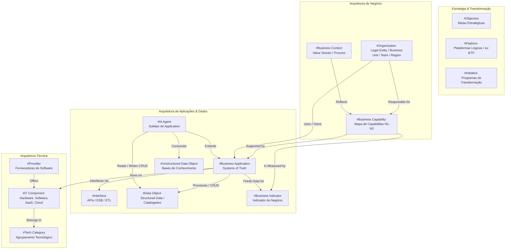

# PowerUp Open Knowledge Catalog (POKC)

O **PowerUp Open Knowledge Catalog (POKC)** é o repositório unificado e descentralizado de inteligência de arquitetura, governança de dados e indicadores de desempenho para empresas integradas de energia do **Setor Elétrico Brasileiro** [173, 174]. 

Esta base de conhecimento foi projetada para estabelecer a convergência definitiva entre as camadas de negócio, a tecnologia da informação (TI), a tecnologia da operação (TO) e as soluções de **Inteligência Artificial (IA)**, estruturando de forma integrada as regras operacionais, cadastros regulatórios, especificações técnicas, KPIs setoriais e fluxos de dados do setor [170, 176].

---

## 1. Diretrizes de Governança e Frameworks de Referência

O catálogo foi estruturado utilizando a convergência metodológica de três padrões de excelência corporativa e dados, adaptados de forma pioneira à regulação das agências do país (ANEEL, ONS e CCEE) [170]:

1.  **SAP LeanIX v4 Metamodel**: Mapeamento do ecossistema técnico-comercial através de Fact Sheets estáveis, divididos em quatro camadas estratégicas (Estratégia & Transformação, Arquitetura de Negócio, Arquitetura de Aplicações & Dados e Arquitetura Técnica) [418, 421].
2.  **Enterprise Data Catalog (EDC) do Google**: Metodologia avançada para a classificação de **Dados Mestres (Master Data)** e dados transacionais, garantindo a governança, a linhagem (*data lineage*) e a propriedade canônica da informação (*System of Truth*) [175, 539].
3.  **Open Knowledge Format (OKF v0.1)**: Formato de conhecimento descentralizado baseado em arquivos Markdown com YAML *frontmatter*, projetado para ser versionável em Git (*Git-friendly*), legível por seres humanos e perfeitamente interpretável por agentes de IA e pipelines de RAG [802, 803].

### Metamodelo de Relacionamentos do Setor Elétrico (LeanIX v4)



---

## 2. Estrutura do Repositório (Knowledge Bundle)

Seguindo a especificação técnica do padrão OKF, a base de conhecimento estruturada do **PowerUp OKC** está dividida nas seguintes pastas lógicas [804, 805]:

```text
powerup-okc/
├── README.md                       # Este arquivo (Progressive Disclosure do catálogo)
├── log.md                          # Histórico de revisões e auditoria física e lógica (ISO 8601)
│
├── 1-business-capabilities/        # Fact Sheets de Business Capabilities (Níveis 1 a 3)
│   └── index.md                    # Mapa de capacidades alinhado ao APQC PCF para Utilities e SAP
│
├── 2-organization/                 # Fact Sheets do tipo Organization (Metamodelo Who)
│   ├── index.md                    # Hierarquia de Legal Entities, Business Units e Teams
│   └── estrutura-posicoes.md       # Subscrições de Posições (55 cargos e papéis de governança)
│
├── 3-business-applications/        # Fact Sheets de Business Applications (Metamodelo How)
│   └── index.md                    # Inventário de Sistemas Especialistas e TIME Framework
│
├── 4-data-objects/                 # Catálogo de Objetos de Dados (Metamodelo What)
│   ├── index.md                    # Diretrizes Gerais de Governança de Dados
│   ├── structured/                 # Dados Estruturados (81 objetos na mesma aba do catálogo)
│   │   ├── clientes/               # Domínio de Clientes (Meter-to-Cash e CCEE Comercialização)
│   │   ├── ativos/                 # Domínio de Ativos (Rede, Campo, Operações, BDGD e SIN)
│   │   └── corporativo/            # Domínio Corporativo e Back-Office (Finanças, RH e TI)
│   └── unstructured/               # Dados Não Estruturados (23 bases de conhecimento para RAG)
│       ├── regulatorio/            # Leis, Resoluções ANEEL, PRODIST, PRORET, ONS, CCEE
│       ├── tecnico-operacional/    # Manuais de O&M, POPs de campo, RAPs, TDDs, DDA
│       └── juridico-contratual/    # PPAs, Contratos de Uso (CUST/CUSD), Project Finance, EIA/RIMA
│
├── 5-business-indicators/          # Indicadores de Negócio da Indústria (Técnico e Financeiro)
│   ├── index.md                    # Dicionário de Indicadores de Qualidade, Operação e Finanças
│   ├── qualidade-servico/          # Indicadores Regulatórios de Continuidade da Distribuição (DEC/FEC)
│   ├── qualidade-produto/          # Indicadores de Conformidade de Tensão de Rede (DRP/DRC)
│   ├── qualidade-comercial/        # Indicadores de Atendimento, Inadimplência e Reclamações
│   ├── operacional-ons/            # Desempenho de Usinas (TEIFa/TEIP) e Transmissão (CCAL/CCAT)
│   └── financeiro-ti/              # Métricas de PMSO Eficiente, OPEX e Retorno de TI (ROIT)
│
└── 6-ia-agents/                    # Fact Sheets do tipo Application (Subtipo: AI Agent)
    └── index.md                    # Catálogo de Agentes e Modelos de IA em Produção
```

---

## 3. Os 4 Catálogos Fundacionais de Arquitetura (TI/TO/Who/Indicadores)

O **PowerUp OKC** disponibiliza planilhas profissionais integradas para download no painel **Studio**, servindo como aceleradores diretos para a governança de TI/TO do setor elétrico:

### A. Catálogo de Data Objects (Estruturados & Não Estruturados)
*   **Nome dos Arquivos**: `catalogo_data_objects_setor_eletrico-v7.xlsx` & `catalogo_unstructured_data_setor_eletrico.xlsx`
*   **Descrição**: O catálogo estruturado (v7.0) foi consolidado em uma **aba única ("Catálogo de Objetos") contendo 81 objetos de dados**, integrando de forma inédita as estruturas regulatórias da **BDGD (Distribuição/ANEEL)**, do **SIN (Geração e Transmissão/ONS)** e da **CCEE (Comercialização)** [4, 629]. O catálogo não estruturado mapeia **23 bases de conhecimento** cruciais para a operação [787].
*   **Campos Chave**: Domínio, Subdomínio, Objeto de Dado, **Dado Mestre (sim/nao)**, Descrição, Atributos Chave, Sistemas Típicos, *System of Truth* (SOT) no LeanIX e Fonte Regulatória/Processo de Negócio [2, 172, 175].

### B. Catálogo de Business Applications (Sistemas Especialistas)
*   **Nome do Arquivo**: `catalogo_business_applications_setor_eletrico-v2.xlsx`
*   **Descrição**: Inventário das **14 principais aplicações especialistas de TI/TO** do setor de energia (CRM, CIS, MDM, WFM, GIS, EAM, ADMS, GMS, EMS, CCEE, ERP, TRM, HCM, BSM) [775].
*   **Recursos**: Mapeamento dos objetos em que cada aplicação atua como fonte autoritativa de escrita (*System of Truth*), as capacidades de Nível 3 suportadas, principais fornecedores de mercado (ex: SAP, Oracle, Siemens, Hitachi, Salesforce) e classificação de portfólio via **Gartner TIME Framework** [775, 777].

### C. Catálogo de Estrutura Organizacional & Posições (Who)
*   **Nome do Arquivo**: `catalogo_organizacao_setor_eletrico-v3.xlsx`
*   **Descrição**: Modelagem da holding controladora societária e suas subsidiárias de Distribuição, Geração/Transmissão e Comercialização [182, 783].
*   **Destaque**: Mapeia **42 Fact Sheets de Organizações** (Legal Entities, Business Units e Teams) e **55 Subscrições de Posições (cargos operacionais)**, definindo papéis de governança no LeanIX (ex: *Data Owner, Data Steward, Technical Contact*) e os sistemas consumidos por cada cadeira [782, 783].

### D. Catálogo de Indicadores de Negócio (Qualidade, TO e Finanças)
*   **Nome do Arquivo**: `Catalogo_indicadores_ativos_sin.xlsx`
*   **Descrição**: Inventário e dicionário técnico contendo as métricas de qualidade de fornecimento da ANEEL (indicadores de continuidade DEC/FEC e indicadores de tensão DRP/DRC), indicadores operativos do ONS (TEIFa, TEIP, CCAL, CCAT) e métricas financeiras de eficiência administrativa (PMSO eficiente e ROIT) [615, 712, 797].

---

## 4. Integração Prática e Casos de Uso de IA no Setor Elétrico

O **PowerUp OKC** atua como a fundação de metadados de negócio indispensável para o treinamento e operação segura de agentes de Inteligência Artificial no setor de energia. Abaixo, apresentamos os três cenários práticos de automação inteligente mapeados de forma integrada na base:

### Caso de Uso 1: CFO Insight Agent (Middle e Back-Office Comercial)
*   **Capacidade Relacionada**: *Trading de Energia e Gestão de Risco* e *Gestão de Risco de Preço* [39, 40].
*   **Aplicações Integradas**: ETRM (Energy Trading and Risk Management), Sistemas CCEE (DRI/SCL) e módulo de Finanças do ERP [221, 231, 338].
*   **Objetos de Dados Consumidos**: `Contas a Receber` [46], `Preço de Liquidação das Diferenças (PLD Horário)` [76] e `Resultados da Contabilização (CONREC / SUM001)` [284].
*   **Funcionamento**: O agente de IA consome de forma contínua os dados brutos de medição contábil (SMF) e as séries de preços horários do PLD do portal de dados abertos da CCEE [618, 620]. Ele cruza essas informações com a carteira de contratos bilaterais registrada no ETRM e simula em tempo real a exposição financeira da comercializadora no Mercado de Curto Prazo (MCP) [115, 122]. O agente gera automaticamente o **Aviso de Crédito/Débito** com as projeções de balanço mensal, salvando o resultado no contas a receber do ERP (SAP FI-AR/FI-CA) e alertando a mesa de riscos sobre necessidades de aportes adicionais de garantias financeiras [221, 285].

### Caso de Uso 2: Dispatcher FLISR Agent (Operação de Rede em TO/OT)
*   **Capacidade Relacionada**: *Operação da Rede de Distribuição* e *Gestão de Interrupções* [35].
*   **Aplicações Integradas**: ADMS (OMS/SCADA), GIS (Cadastro de Rede) e WFM (Despacho de Equipes de Campo) [35, 39, 48].
*   **Objetos de Dados Consumidos**: `Modelo Topológico da Rede` [12], `Evento de Interrupção (DEC/FEC)` [14] e `Status em Tempo Real (Chaves/Religadores)` [32].
*   **Funcionamento**: Integrado diretamente aos sistemas de supervisão física e controle, o agente de TO monitora em tempo real os alarmes de subestações e alimentadores via protocolo seguro DNP3 [31, 32]. Ao detectar uma falta na rede de média tensão, o agente analisa o **Modelo Topológico da Rede** (CIM XML) herdado do GIS e aciona automaticamente a lógica **FLISR (Fault Location, Isolation, and Service Restoration)** [32, 41]. Em menos de 60 segundos, o agente simula o fluxo de carga, emite comandos automatizados de abertura/fechamento de religadores para isolar o trecho defeituoso, reestabelece a energia para os consumidores do trecho saudável e despacha automaticamente a equipe de campo via WFM/FSM, iniciando a apuração do indicador de qualidade coletiva (DEC/FEC) no CIS [33, 40].

### Caso de Uso 3: Asset Capitalization Agent (Unitização e Gestão da BRR)
*   **Capacidade Relacionada**: *Controle Patrimonial (Unitização)* e *Apuração da Base de Remuneração Regulatória (BRR)* [3, 9, 31].
*   **Aplicações Integradas**: ERP (módulos SAP PS, PM e FI-AA) e sistema GIS [50, 56, 120].
*   **Objetos de Dados Consumidos**: `Projeto de Investimento / Elemento PEP` [29, 43], `Invoice (Nota Fiscal)` [45], `Ordem de Manutenção (OM)` [20] e `Unidade de Adição e Retirada (UAR)` [31, 62].
*   **Funcionamento**: Com o objetivo de otimizar o reconhecimento de ativos na BRR e evitar glosas contábeis em auditorias tarifárias da ANEEL, o agente de RAG atua de forma integrada no fechamento físico-financeiro [54, 157]. Quando o sistema de campo registra a conclusão técnica de uma obra (status "TECO" no SAP PM ou WFM) [122, 147], o agente analisa os desenhos "as-built" instalados no GIS [122, 148]. Ele realiza a reconciliação físico-financeira das notas fiscais de materiais e serviços (via SAP MM) associadas ao **Elemento PEP** no SAP PS [91, 101]. O agente traduz esses itens em **Unidades de Cadastro (UC)** e **Unidades de Adição e Retirada (UAR)** conforme as regras do Manual de Controle Patrimonial (MCPSE), gravando de forma paralela os valores de **Valor Novo de Reposição (VNR)** e **Quota de Reintegração Regulatória (QRR)** na área de avaliação regulatória do SAP FI-AA [75, 145, 146].

---

## 5. Arquitetura de Dados Pronta para RAG (Grounding de IA)

O **PowerUp OKC** foi concebido de forma que a base de conhecimento seja uma **malha de produtos de dados descentralizada (Data Mesh)** [563, 574]. Por estar armazenado em arquivos Markdown puros com formatação altamente estruturada e metadados no *frontmatter*, este repositório elimina as alucinações de modelos de IA através de duas disciplinas de arquitetura de dados [555, 749]:

1.  **Aterramento Semântico (Grounding)**: Agentes de IA Generativa são parametrizados para realizar buscas semânticas exclusivamente sobre este diretório via RAG. Isso garante que as respostas a consultas corporativas (como regras de conexão de microgeradores ou cálculo de penalidades da CCEE) estejam 100% ancoradas nas normativas regulatórias oficiais (PRODIST, PRORET, Procedimentos de Rede) e na documentação técnica curada da empresa [555, 749].
2.  **Linhagem e Relações via Hiperlinks (Cross-linking)**: Toda a conectividade lógica do ecossistema de TI/TO (ex: qual equipe de campo utiliza qual sistema, qual sistema provê qual dado mestre e quais capacidades são suportadas) é expressa através de **links Markdown relativos ou absolutos** no corpo das especificações [765]. Ao navegar pelas pastas, a IA consegue percorrer as conexões e dependências lógicas de forma nativa e sem necessidade de bancos de dados adicionais, facilitando análises de impacto robustas em tempo real [144, 755].

---
*Gerado pela célula de Arquitetura de IA da PowerUp | 2026-07-14 | Versão do Catálogo: 2.0*
