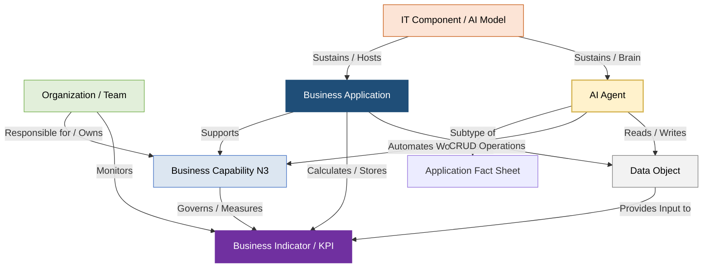

# PowerUp Open Knowledge Catalog (PowerUp OKC)
### Portal Mestre de Governança de Dados, Arquitetura Corporativa e IA Agêntica

Este repositório consolidado é a **espinha dorsal de governança de arquitetura empresarial e engenharia de conhecimento** da **PowerUp**, projetado sob as premissas estruturais do metamodelo **SAP LeanIX v4** e de portabilidade do padrão **Open Knowledge Format (OKF) v0.1** [15, 16, 24].

O objetivo da **PowerUp OKC** é unificar a representação conceitual de negócios (camada finalística), a estrutura física e departamental (camada organizacional), o inventário lógico de software (camada de aplicações) e o acervo semântico de informações (camada de dados estruturados e não estruturados), qualificando o desempenho global por meio do catálogo de indicadores regulatórios de utilidade pública (ANEEL, ONS e CCEE) [16].

Com a expansão da camada cognitiva, este portal integra oficialmente o **Catálogo de Agentes de IA (AI Agents)** da companhia, fornecendo o manual de governança de algoritmos, instruções do sistema, guardrails e linhagem transacional com os sistemas legados de registro [1, 42].

---

## 1. Mapa Conceitual do Metamodelo Integrado (SAP LeanIX v4)

A arquitetura do catálogo é completamente interconectada no padrão **Common Service Data Model (CSDM)**, garantindo o rastreamento síncrono de impactos entre TI e Tecnologia da Operação (TO) [17, 80]:



---

## 2. Taxonomia Física do Repositório (Estrutura de Pastas)

Seguindo o padrão de **progressive disclosure (revelação progressiva)** exigido pelo OKF v0.1, a estrutura de arquivos é autoexplicativa e modular [24, 363]. Cada diretório possui um arquivo `README.md` ou `index.md` dedicado (livre de frontmatter) que atua como sumário de navegação com links absolutos baseados no diretório-raiz [18, 362]:

```
powerup-okc/                            # Raiz da Base de Conhecimento (Bundle Root)
├── README.md                           # Este documento. Manual de Governança Mestre do Repositório.
├── log.md                              # Histórico de Alterações, Versões e Revisões de Metadados
│
├── business-capabilities/              # Fact Sheets de Capacidades de Negócio (3 Níveis) [348]
│   ├── index.md                        # Índice de Navegação do Mapa de Capabilities
│   ├── 1-corporativo-suporte/          # Nível 1: Corporativo e Suporte ao Negócio
│   ├── 2-engajamento-cliente/          # Nível 1: Engajamento com o Cliente (Comercial)
│   └── 3-operacoes-energia/            # Nível 1: Operações de Energia (G, T, D, C e Trading)
│
├── organizations/                      # Fact Sheets Organizacionais (Camada "Who") [350]
│   ├── index.md                        # Índice Mestre Organizacional
│   ├── legal-entities/                 # Subsidiárias com CNPJ (Holding, G&T, DIS, COM)
│   ├── business-units/                 # Diretorias e divisões executivas (BUs)
│   └── teams/                          # Equipes operacionais e regionais (Teams + Subscrições)
│
├── business-applications/              # Fact Sheets de Sistemas de Registro (Camada "How") [346]
│   ├── index.md                        # Índice Mestre de Sistemas e Aplicações
│   └── app-*.md                        # 16 Aplicações lógicas de mercado (ERP, CIS, etc.)
│
├── ai-agents/                          # Catálogo e Governança de Agentes de IA [1, 42]
│   ├── index.md                        # Índice Mestre de Força de Trabalho Digital [47]
│   └── agent-*.md                      # 71 Especificações de Agentes (IAA-001 a IAA-071) [1]
│
├── data-objects/                       # Catálogo e Linhagem de Dados (Camada "What") [350]
│   ├── index.md                        # Índice Mestre de Dados
│   ├── structured/                     # Dados Estruturados (IDs DO-101 a DO-181)
│   └── unstructured/                   # Dados Não Estruturados (IDs DO-201 a DO-223)
│
├── business-indicators/                # Catálogo de Indicadores de Negócio da Indústria [21]
│   ├── index.md                        # Índice de Métricas e KPIs (IDs IND-001 a IND-025)
│   ├── qualidade-servico/              # Continuidade e qualidade comercial (DEC, FEC, INS)
│   ├── qualidade-produto/              # Limites e conformidade de níveis de tensão (DRP, DRC)
│   └── operacional-confiabilidade/     # Disponibilidade física e carregamento do SIN (DISPF, TEIFa)
│
└── relations/                          # Modelagem de Relacionamentos Cruzados (Matrizes RACI/CRUD) [18]
    ├── index.md                        # Índice de matrizes relacionais
    ├── matriz-crud-dados.md            # Permissões de escrita (Provides) e leitura (Consumes)
    └── matriz-responsabilidade-teams.md# Associação de equipes funcionais a Capabilities e KPIs
```

---

## 3. Diretrizes de Governança de Agentes de IA (SAP LeanIX v4)

De acordo com as diretrizes oficiais de Enterprise Architecture para a modelagem de ativos de inteligência artificial na **SAP LeanIX v4 (AI Governance Extension)**, as organizações devem seguir rigorosamente as seguintes melhores práticas de inventário [35, 42, 44]:

### A. O Agente de IA como uma Aplicação Contratada ou Desenvolvida
*   **Fact Sheet Type:** Agentes de IA (A2A, Chat Agents ou Background Workers) são modelados sob o Fact Sheet de **Application** com o subtipo **AI Agent** [46, 66]. Eles contam ativamente para a cota de aplicações licenciadas no workspace [35].
*   **Desacoplamento Técnico (IT Components):** O "cérebro" do agente — ou seja, o modelo de fundação consumido (ex: *Gemini 3.5 Flash*, *Gemini 3.5 Pro*) — não deve ser acoplado no mesmo Fact Sheet do agente [36, 40]. Ele deve ser cadastrado como um Fact Sheet de **IT Component (Subtipo: AI Model)** e relacionado ao agente via link de infraestrutura [47, 54, 56]. Isso assegura flexibilidade caso o modelo subjacente seja atualizado ou substituído sem alterar a regra de negócio da aplicação [40].
*   **Atributos Obrigatórios do Subtipo AI Agent:** Cada especificação técnica deve preencher os campos nativos do metamodelo LeanIX [52, 64, 65]:
    *   *AI Agent Type:* Chat, A2A ou Background [66].
    *   *Autonomy Level:* Escala de autonomia regulada de execução [66].
    *   *Skills / A2A Capabilities:* A descrição detalhada das ferramentas e APIs autorizadas [64, 65].
    *   *MCP Server Support:* URL de endpoint e classificação de acesso de escrita/leitura do Model Context Protocol [65, 66].
    *   *AI Agent Business Value:* Estimativa de Redução de Riscos, Economia de Custos e Aumento de Receita por execução [52, 67, 68].

### B. Gestão de Fornecedores e Conectores
*   **Conectores de Terceiros (3P Connectors):** Conexões com repositórios externos (ex: *Salesforce*, *ServiceNow*, *Jira*, *SharePoint*) devem ser cadastradas de forma federada [321, 331, 340].
*   **Regra de Ouro de Subscrições:** Assim como nas aplicações de negócios, as posições organizacionais de TI/TO mapeadas no catálogo (como *Analista de Suporte*, *Operador do COD*) são associadas como subscrições (*subscriptions*) aos agentes, assumindo papéis de governança como *Application Owner* (Dono Técnico) ou *Data Steward* (Curador dos Dados de Grounding) [19, 446].

---

## 4. Catálogo Consolidado de Agentes de IA (IAA-001 a IAA-071)

A força de trabalho digital da **PowerUp** foi projetada de forma distribuída por áreas de atuação para automatizar processos transacionais e analíticos, todos expostos no portal de progressive disclosure do diretório `/ai-agents/index.md` [1]:

| ID | Nome do Agente | Tipo / Trigger | CRUD | Descrição Funcional de Negócio [1] | System of Truth (SOT) de Integração [1] |
| :--- | :--- | :--- | :--- | :--- | :--- |
| **IAA-001** | Consultor de Inventário de HW e SW | Chat Agent | R | Busca em linguagem natural do inventário ativo e licenças no CMDB. | ServiceNow (ITAM / CMDB) [1] |
| **IAA-002** | Lançador Automático de Chamados | Event-Driven | C | Triagem e abertura automática de incidentes N1 no ITSM. | ServiceNow ITSM [1] |
| **IAA-003** | Monitor de FinOps de Nuvem | Scheduled | R | Rastreia e emite alertas de custos e cotas de computação GCP. | Google Cloud Billing / BQ [1] |
| **IAA-004** | Reconciliador de Topologia de Rede | Scheduled | R/U | Batimento de ativos cadastrais georreferenciados (GIS) com CMDB. | ServiceNow CMDB / Esri GIS [1] |
| **IAA-005** | Assistente de Playbooks de Dados | Chat / RAG | R | RAG sobre playbooks de dados, arquitetura e conformidade LGPD. | SharePoint / Confluence [1] |
| **IAA-006** | Mapeador de Fact Sheets LeanIX | Event-Driven | C/U | Analisa códigos IaC e PDFs para sugerir novos Fact Sheets no LeanIX. | SAP LeanIX [1] |
| **IAA-007** | Gerador de APIs e Especificações | Chat Agent | C | Converte requisitos lógicos em documentação OpenAPI/Swagger. | Jira / Confluence [1] |
| **IAA-008** | Assistente de Auditoria de Código | Event-Driven | R | Varredura estática de segurança em repositórios de código (Git). | GitHub / GitLab / SonarQube [1] |
| **IAA-009** | Analisador de Causa Raiz de Logs | Event-Driven | R | Processa logs não estruturados do ERP/CIS para correlacionar falhas. | Dynatrace / Elasticsearch [1] |
| **IAA-010** | Triador de Chamados por Chat | Chat Agent | R | Interação por chatbot com colaboradores e triagem inicial de incidentes. | ServiceNow / Microsoft Teams [1] |
| **IAA-011** | Consultor Funcional SAP | Chat / RAG | R | Guia de transações SAP e apoio na migração para o S/4HANA (ACDOCA). | SAP S/4HANA [1] |
| **IAA-012** | Analisador de Código ABAP | Scheduled | R | Análise de código Z-programs ABAP em aderência ao Clean Core. | SAP S/4HANA (ABAP Stack) [1] |
| **IAA-013** | Gerador de Documentação de Sistemas | Chat Agent | C | Elabora dicionários de dados e diagramas a partir do código-fonte. | Jira / Confluence [1] |
| **IAA-014** | Gerador de Manuais de Usuários | Chat Agent | C | Traduz fluxos de processos técnicos de telas em guias passo a passo. | Confluence / ServiceNow KB [1] |
| **IAA-015** | Consultor de Cadastro de Pessoal | Chat Agent | R | Consulta instantânea em linguagem natural de informações de DP. | SAP SuccessFactors EC [1] |
| **IAA-016** | Revisor de Registro Admissional | Event-Driven | C | Cria e provisiona perfis de novos colaboradores no ERP de RH. | SAP SuccessFactors EC [1] |
| **IAA-017** | Atualizador de Certificados e NRs | Event-Driven | U | Sincroniza síncronamente as certificações técnicas (NR10/NR35) de campo. | SAP SuccessFactors Learning [1] |
| **IAA-018** | Conciliador de Registro de Ponto | Scheduled | R/U | Batimento de marcações de ponto com escalas e ordens FSM. | SAP SuccessFactors / WFM [1] |
| **IAA-019** | Assistente de Benefícios | Chat Agent | R | Consulta de elegibilidade de planos de saúde, previdência e reembolsos. | SAP SuccessFactors EC [1] |
| **IAA-020** | Otimizador de Descrições de Vagas | Chat Agent | C/U | Redação e padronização inclusiva de postagens de vagas no Recruiting. | SAP SuccessFactors Recruiting [1] |
| **IAA-021** | Triador de Currículos e Perfis | Scheduled | R | Extração via OCR e ranqueamento RICE de candidatos inscritos. | SAP SuccessFactors Recruiting [1] |
| **IAA-022** | Mentor de PDIs Dinâmicos | Scheduled | R/U | Elaboração de trilhas de treinamento baseadas em avaliações. | SAP SuccessFactors Learning [1] |
| **IAA-023** | Passaporte Digital de Segurança | Event-Driven | R | Visão computacional de EPIs antes do despacho de ordens de TO. | SAP PM / WFM Mobile [1] |
| **IAA-024** | Analisador de Acordos Trabalhistas | Chat / RAG | R | Busca semântica em convenções coletivas (CCT) e na CLT. | SuccessFactors / SharePoint Jurídico [1] |
| **IAA-025** | Analisador de Clima Organizacional | Scheduled | R | Análise de sentimento de comentários em texto livre de pesquisas. | SAP SuccessFactors / Survey App [1] |
| **IAA-026** | Consultor de Catálogo de Materiais | Chat Agent | R | Consulta de especificações e saldos de MRO em almoxarifados. | SAP S/4HANA (módulo MM) [1] |
| **IAA-027** | Assistente de Requisição de Compras | Chat Agent | C | Apoio de preenchimento e classificação de metadados técnicos de compras. | Coupa / ServiceNow [1] |
| **IAA-028** | Monitor de Saldo de Contratos | Scheduled | R | Alertas de estouro de saldo (>=90%) e vigência (<180 dias) no ERP. | SAP S/4HANA / Coupa [1] |
| **IAA-029** | Sincronizador de Fichas Cadastrais | Scheduled | C/U | Consulta de certidões negativas federais e regularidade via APIs. | SAP S/4HANA / Coupa [1] |
| **IAA-030** | Lançador de Recebimento Físico | Event-Driven | C/U | Lançamento automático de entradas MIGO no ERP após aceite técnico. | SAP S/4HANA (módulo MM) [1] |
| **IAA-031** | Conciliador de Faturas (3-Way Match) | Scheduled | R/U | Batimento automatizado entre XML da fatura, pedido de compra e MIGO. | SAP S/4HANA (FI-AP) [1] |
| **IAA-032** | Assistente de Editais de Sourcing | Chat Agent | C | Redação de minutas de RFP livres de direcionamentos de marcas. | Coupa / SAP Ariba [1] |
| **IAA-033** | Analisador de Cláusulas de Sourcing | Chat / RAG | R | Varredura de minutas de aquisição identificando Red Flags de SLAs. | SAP CLM / SharePoint Jurídico [1] |
| **IAA-034** | Validador de Pré-Qualificação SRM | Event-Driven | R | Extração via OCR/NLP de balanços e contratos de fornecedores. | SAP S/4HANA / SRM Portal [1] |
| **IAA-035** | Auditor de Riscos ESG de Parceiros | Scheduled | R | Varredura de notícias externas sobre sanções de fornecedores. | Portal SRM / ESG App [1] |
| **IAA-036** | Analisador de Disputas Comerciais | Chat Agent | R/U | Dossiê de desvios fiscais e divergências em notas de compras. | SAP S/4HANA (FI-AP) / Coupa [1] |
| **IAA-037** | Consultor de Metadados de Contratos | Chat Agent | R | Consulta em linguagem natural de vigências e valores no SAP CLM. | SAP CLM [1] |
| **IAA-038** | Sincronizador de Processos Judiciais | Scheduled | C/U | Ingestão automática de andamentos e citações no sistema de GRC. | ServiceNow GRC / SAP GRC [1] |
| **IAA-039** | Sincronizador de Procurações e Alçadas | Scheduled | C/U | Controle de vigências e limites de outorga de poderes de diretores. | SAP CLM [1] |
| **IAA-040** | Lançador de Depósitos Judiciais | Event-Driven | C | Geração síncrona de custas recursais e garantias no contas a pagar. | SAP FI-AP [1] |
| **IAA-041** | Monitor de Provisões e Contingências | Scheduled | R | Monitoramento contínuo de provisões de perdas em contencioso. | SAP FI-GL [1] |
| **IAA-042** | Conciliador de Timesheets Jurídicos | Scheduled | R/U | Batimento de despesas de escritórios parceiros com limites do ERP. | SAP FI-AP [1] |
| **IAA-043** | Assistente de Redação de Minutas | Chat / RAG | C | Elaboração de rascunhos de aditivos usando cláusulas padrão. | SAP CLM / SharePoint Jurídico [1] |
| **IAA-044** | Analisador de Riscos de Contratos | Chat / RAG | R | Identificação de riscos em cláusulas de arbitragem, take-or-pay. | SAP CLM [1] |
| **IAA-045** | Triador de Petições Iniciais | Event-Driven | R | Extração de pedidos e direcionamento de provas para técnicos. | SharePoint Jurídico / ServiceNow [1] |
| **IAA-046** | Auditor de Diários Oficiais ANEEL | Scheduled | R | Rastreamento síncrono de novas resoluções normativas setoriais. | Biblioteca ANEEL / GED Regulatório [1] |
| **IAA-047** | Monitor de Prazos de Contratos | Scheduled | R | Extração de obrigações de fazer e condicionantes técnicas no CLM. | SAP CLM / ServiceNow [1] |
| **IAA-048** | Analisador de Êxito de Sentenças | Scheduled | R | Avaliação estatística de perda de recursos e tese de acordos. | SharePoint Jurídico / ServiceNow [1] |
| **IAA-049** | Consultor do Razão (ACDOCA) | Chat Agent | R | Acesso ágil e conversacional (Text-to-SQL) ao Diário Universal. | SAP S/4HANA (FI-GL) [1] |
| **IAA-050** | Lançador Contábil de Contas a Pagar | Scheduled | C/U | Inserção automática de lançamentos contábeis de faturas validadas. | SAP S/4HANA (FI-AP) [1] |
| **IAA-051** | Lançador de Provisões de Fechamento | Scheduled | C | Geração de acréscimos e depreciações recorrentes de encerramento. | SAP S/4HANA (FI-GL) [1] |
| **IAA-052** | Conciliador de Extratos Bancários | Scheduled | U | Batimento estatístico de arquivos de extrato com sub-razão. | SAP S/4HANA (FI-CA) [1] |
| **IAA-053** | Monitor de Liquidez de Caixa | Scheduled | R | Monitoramento de saldos de contas e limites corporativos mínimos. | SAP S/4HANA (FI) / SAP TRM [1] |
| **IAA-054** | Sincronizador de Ativos Imobilizados | Event-Driven | C/U | Registro automático de novos ativos no FI-AA após unitização física. | SAP S/4HANA (FI-AA) [1] |
| **IAA-055** | Triador de Faturas Recebidas (PDF) | Event-Driven | R | Extração via OCR/NLP de metadados de notas no e-mail de contas. | SAP S/4HANA (FI-AP) [1] |
| **IAA-056** | Analisador de Covenants Financeiros | Scheduled | R | Varredura de relatórios contábeis contra limites contratuais de dívida. | SAP CLM / SAP S/4HANA (FI/CO) [1] |
| **IAA-057** | Orquestrador de Unitização (BRR) | Chat / RAG | R | RAG sobre o Manual do MCPSE da ANEEL para capitalização de obras. | SAP S/4HANA (FI-AA/PS) / Looker [1] |
| **IAA-058** | Consultor Conversacional DRE/RI | Chat Agent | R | Análise conversacional de demonstrativos para suporte a investidores. | S/4HANA / Looker / BigQuery [1] |
| **IAA-059** | Preditor de Caixa e PLD Horário | Scheduled | R | Projeção preditiva de caixa cruzando o SAP com feed do PLD síncrono. | SAP TRM / CCEE Portal / BigQuery [1] |
| **IAA-060** | Simulador de Risco Cambial (Hedge) | Scheduled | R | Simulações Monte Carlo para recomendações de derivativos (Hedge). | SAP TRM / Bloomberg Feed [1] |
| **IAA-061** | Consultor de Consumo e Faturas CIS | Chat Agent | R | Consulta instantânea do histórico de injeção e consumo de UCs. | SAP IS-U (CIS) [1] |
| **IAA-062** | Sincronizador de Oportunidades CRM | Event-Driven | C/U | Registro de interações e alteração de estágio no funil de vendas. | Salesforce CRM [1] |
| **IAA-063** | Monitor de Conversão de Vendas ACL | Scheduled | R | Rastreamento do tempo de permanência de leads comerciais no funil. | Salesforce CRM [1] |
| **IAA-064** | Calculador de Risco de Churn | Scheduled | R/U | Gravação de scorecards de risco de evasão do cliente no CRM. | Salesforce CRM / Looker [1] |
| **IAA-065** | Sincronizador de Contratos de Vendas | Event-Driven | C/U | Registro síncrono de contratos de adesão ao mercado livre (ACL). | SAP IS-U / CCEE Portal [1] |
| **IAA-066** | Gerador de Conteúdo e Campanhas | Chat Agent | C | Elaboração de e-mails de engajamento baseados nas marcas da utility. | Salesforce CRM / SharePoint [1] |
| **IAA-067** | Analisador de Sentimento de Ouvidoria | Scheduled | R | Processamento de áudios e transcrições de tickets de faturamento. | Salesforce CRM / Looker [1] |
| **IAA-068** | Simulador de Migração Tarifária (ACL) | Chat / RAG | R | Elaboração de relatórios comparando tarifas cativas vs. economia ACL. | SharePoint / Confluence [1] |
| **IAA-069** | Gerador de Layouts Publicitários | Chat Agent | C | Geração de banners estéticos baseados no manual de identidade visual. | Adobe Experience / SharePoint [1] |
| **IAA-070** | Consultor de Portfólio de EaaS e VE | Chat / RAG | R | Suporte comercial sobre eficiência energética e eletromobilidade. | Confluence / Salesforce CRM [1] |
| **IAA-071** | Auditor de Peças de Marketing | Scheduled | R | Validação de criativos contra resoluções ANEEL e regras do CONAR. | SharePoint / ServiceNow GRC [1] |

---

## 5. Integração Prática de TI/OT e IA Agêntica (Jornadas do Negócio)

A verdadeira inteligência operacional da **PowerUp OKC** é ativada quando as três camadas do metamodelo (Dados, Sistemas Tradicionais e Agentes de IA) convergem para resolver gargalos transacionais em tempo real:

### Jornada A: Batimento Técnico e Sincronização GIS-SCADA-CMDB (TI/OT)
```text
  [Esri GIS (AP-015)] ----(Contém DO-102: Modelo Topológico)----> [Reconciliador: IAA-004]
                                                                          |
                                                                   (Validação síncrona)
                                                                          |
                                                                          v
  [Siemens ADMS (AP-013)] <---(Alerta de Divergência Técnico)--- [ServiceNow: AP-007]
```
1.  **Divergência Cadastral:** Quando uma nova extensão de rede de média tensão é executada, as coordenadas e o modelo topológico (`DO-102`) são digitalizados no **Esri GIS (AP-015)** [2, 146, 345].
2.  **Validação Inteligente:** O agente **`Reconciliador: IAA-004`** roda um job agendado, realizando uma busca síncrona para confrontar as topologias físicas do GIS contra a árvore lógica de CIs (Itens de Configuração) no **ServiceNow CMDB (AP-007)** [1, 80, 345].
3.  **Remediação de Impacto:** Ao encontrar uma discrepância (ex: transformador de poste instalado fisicamente em campo mas ausente no monitor do SCADA), o agente abre automaticamente um ticket de mudança técnica (`DO-179`) no ServiceNow, alertando o Centro de Operações (COD) e o Arquiteto de Redes, minimizando riscos de erros de segurança ou apuração errônea de indicadores DEC/FEC [1, 80, 342, 345, 429].

---

### Jornada B: RAG Regulatório, Auditoria Tarifária e Unitização (CAPEX/BRR)
```text
  [Diário Oficial da União] --(Inge síncrono)--> [Monitor: IAA-046] --(Alerta de Mudança Tarifária)
                                                                             |
                                                                      (Tradução semântica)
                                                                             |
                                                                             v
  [SAP FI-AA (AP-011)] <----(Unitização Segura sem Glosas)------ [Orquestrador: IAA-057]
```
1.  **Mudança de Normativa:** Quando a ANEEL publica uma alteração síncrona de metas de qualidade do PRODIST Módulo 8 ou nas regras do PRORET, o agente **`Auditor: IAA-046`** extrai a alteração no DOU e resume seus impactos regulatórios diretos [1, 342].
2.  **Apoio na Capitalização de Obras:** Em paralelo, ao final de uma obra de subestação programada no SAP PS (`DO-164`), o agente **`Orquestrador: IAA-057`** realiza uma busca semântica (RAG) no Manual do MCPSE da ANEEL para correlacionar os Elementos PEP (`DO-163`) às Unidades de Adição (UAR) corretas [1, 2, 345].
3.  **Unitização e BRR:** O agente mapeia as contas no módulo **SAP FI-AA (AP-011)** e valida síncronamente o cadastro de imobilizados regulatórios (`DO-152`), assegurando que a distribuidora incorpore o CAPEX eficiente na Base de Remuneração Regulatória (BRR) sem riscos de glosas em auditorias tarifárias perante a agência [1, 2, 345, 414].

---

## 6. Governança e Compliance de Dados (LGPD)

O controle de conformidade e privacidade da informação dos nossos 71 agentes de IA segue o estrito zoneamento de segurança da informação adotado no catálogo de Data Objects [1, 25]:

*   🔒 **CONFIDENCIAL (Risco Crítico / Segurança Nacional):** Agentes com acesso de leitura ou escrita síncrona a redes industriais operativas (TO) e andamentos de infraestrutura física do SIN.
    *   *Exemplos:* `IAA-004` (Topologia de Rede), `IAA-008` (Auditoria de Código), `IAA-023` (EPIs de campo SCADA) [1].
*   🛡 **RESTRITO (Risco Alto / Protegido pela LGPD):** Agentes que processam informações pessoais de identificação (PII), históricos de faturamento corporativo ou dados de consumo individual do cliente.
    *   *Exemplos:* `IAA-015` (Cadastro de Pessoal), `IAA-016` (Admissional), `IAA-061` (Consumo do Cliente), `IAA-067` (Ouvidoria) [1].
*   💼 **INTERNO (Risco Médio / Uso Corporativo):** Agentes que manipulam manuais de equipamentos, dicionários técnicos de rede BDGD, ou playbooks de arquitetura interna.
    *   *Exemplos:* `IAA-005` (Playbooks de Dados), `IAA-026` (Catálogo de Materiais), `IAA-070` (Portfólio de EaaS) [1].
*   🌐 **PÚBLICO (Risco Baixo / Informação Liberada):** Agentes focados na consolidação de leis federais, jurisprudências de tribunais, ou apurações de índices de PLD e clima.
    *   *Exemplos:* `IAA-046` (Normas ANEEL), `IAA-059` (Previsão de PLD/Clima) [1].

---

## 7. Conformidade ao Padrão de Portabilidade OKF v0.1

Esta base de conhecimento declara estrita conformidade às especificações de portabilidade do padrão **Open Knowledge Format (OKF) v0.1** [24, 360]:
1.  **Estrutura de Metadados (YAML):** Cada especificação individual de aplicação tradicional (`app-*.md`), indicador (`ind-*.md`), organização (`org-*.md`), dados (`do-*.md`) e agente de IA (`agent-*.md`) inicia com um cabeçalho delimitado por `---` [24, 362].
2.  **Caminhos de Navegação Estáveis:** Relacionamentos, dependências e heranças organizacionais utilizam caminhos e links absolutos em Markdown baseados no diretório-raiz para assegurar compatibilidade em pipelines Git automatizados e portabilidade temporal [18, 24, 362].
3.  **Portal Mestre Baseado em Progressive Disclosure:** O repositório emprega arquivos agregadores (`index.md`) livres de frontmatter para prover navegação lógica limpa aos agentes leitores [24, 363].

---

### # Citações e Fontes Regulatórias
1.  **Manual de Controle Patrimonial do Setor Elétrico (MCPSE - ANEEL):** Dispõe sobre a apropriação física e financeira de obras de rede e unitização na BRR.
2.  **Procedimentos de Distribuição da ANEEL (PRODIST Módulos 3, 5, 8):** Regras setoriais de conexão de microgeradores, medição inteligente e índices DEC/FEC.
3.  **SAP LeanIX Best Practice Architecture Metamodel v4:** Diretrizes oficiais de modelagem lógica de negócios, aplicações tradicionais, componentes de TI, e extensões cognitivas de IA.
