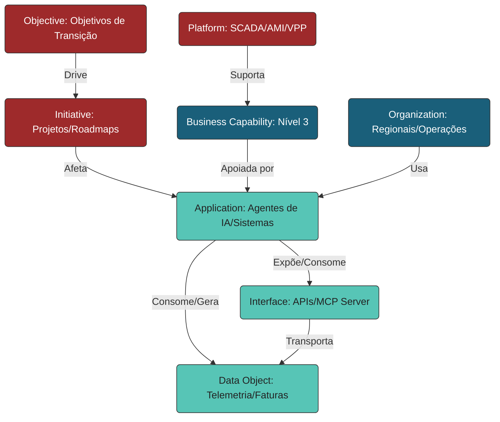

# PowerUp Open Knowledge Catalog (PowerupOKC)

Este repositório centraliza e organiza a base de conhecimento de **Arquitetura Corporativa (EA)** da iniciativa **PowerUp**, focada no mapeamento, governança e catálogo de soluções de **Inteligência Artificial (IA)** aplicadas ao **Setor Elétrico Brasileiro** [173, 174].

O catálogo é estruturado seguindo rigorosamente a taxonomia de metadados do **Open Knowledge Format (OKF v0.1)** [656], garantindo portabilidade, versionamento como código e legibilidade tanto por humanos quanto por agentes inteligentes de IA [659, 670]. Toda a arquitetura da informação está alinhada às melhores práticas de modelagem do metamodelo v4 da **SAP LeanIX** [26], permitindo rastrear como as soluções tecnológicas suportam a estratégia de transição energética da indústria (os **"3Ds"**: Descarbonização, Descentralização e Digitalização) [173, 249].

---

## 🗺️ Visão Geral da Arquitetura do Repositório

A estrutura de diretórios foi projetada de forma modular e hierárquica [43, 44]. Cada pasta principal corresponde a um **Fact Sheet** específico do metamodelo v4 do LeanIX [30], criando um ecossistema autoexplicativo e interconectado de documentos conceituais [659]:

```text
powerup-open-knowledge-catalog/
├── index.md                      <-- Índice raiz e okf_version do repositório
├── log.md                        <-- Changelog e histórico cronológico (ISO 8601)
├── business-capabilities/        <-- SAP LeanIX Business Capabilities (Pastas hierárquicas N1/N2/N3)
├── applications/                 <-- Catálogo de Aplicações de IA e Softwares de Suporte
├── data-objects/                 <-- Modelos de Dados e Entidades de TI e TO (Tecnologia da Operação)
├── interfaces/                   <-- Catálogo de APIs, barramentos de mensageria e contratos de dados
├── organizations/                <-- Estrutura organizacional (Geradoras, Transmissoras, Distribuidoras, etc.)
├── platforms/                    <-- Plataformas tecnológicas habilitadoras (SCADA, AMI, GIS)
├── initiatives/                  <-- Portfólio de projetos, transformações e roadmaps de transição
└── references/                   <-- Manuais, legislações de agências (ANEEL, ONS, CCEE) e políticas
```

---

## 🗂️ Detalhamento dos Diretórios e Fact Sheets

| Diretório | Fact Sheet LeanIX [30] | Descrição e Papel no Setor de Energia | Tipos de Documentos e Inputs Associados |
| :--- | :--- | :--- | :--- |
| `business-capabilities/` | **Business Capability** | Mapeia "o que" o negócio faz de forma abstrata em 3 níveis de profundidade, dividindo-se entre áreas Estratégicas, Operacionais (Geração, Transmissão, Distribuição, Trading) e de Suporte [179, 180, 182]. | Planos de Negócios, Metas ESG e Resoluções Normativas da ANEEL [82, 352]. |
| `organizations/` | **Organization** | Mapeia as unidades de negócio, regionais geográficas, subsidiárias e equipes técnicas de campo (squads) que usam ou operam as soluções [84]. | Estruturas de Regionais, Matrizes de Atribuição (RACI) e Organogramas da Holding [549]. |
| `platforms/` | **Platform** | Grupos estratégicos de tecnologia e negócios que provêm capacidades estruturais transversais (ex: Usinas Virtuais - VPPs, Infraestrutura AMI) [33]. | Manuais de Plataforma, Arquiteturas de Soluções de Referência [188, 221]. |
| `applications/` | **Application** | Sistemas de TI tradicionais (ERP, CIS, CRM) e as **Aplicações de IA** (Modelos, Agentes de IA, Microserviços) homologados [48, 50]. | Documentos de Requisitos de Produto (PRD), Códigos-fonte e Instruções de Prompts [13, 607]. |
| `data-objects/` | **Data Object** | Entidades de dados de negócio manipuladas pelas aplicações (ex: curvas de carga de medidores, logs de cibersegurança) [35, 70]. | Schemas XML, JSON payloads, e dicionários de dados de bancos canônicos [600, 609]. |
| `interfaces/` | **Interface** | Conexões físicas e lógicas (APIs, conexões gRPC, servidores MCP) responsáveis pelo fluxo bidirecional de dados entre sistemas [76, 125, 150]. | Documentação de APIs (Swagger), Contratos de Dados (Data Contracts) [291]. |
| `initiatives/` | **Initiative** | Projetos, roadmaps de transformação de rede, migrações para nuvem e implantações de pilotos físicos de campo [34, 137, 161]. | Cronogramas físicos, termos de abertura (SOW) e relatórios de status [558, 560]. |

---

## 🔗 Relacionamentos entre Elementos (Metamodelo LeanIX v4)

No modelo da base de conhecimento, nenhum elemento está isolado [32]. O diagrama abaixo demonstra como os diferentes Fact Sheets se relacionam na prática operacional:



---

## 🛠️ Diretrizes de Conformidade do Catálogo (Padrão OKF)

Todo arquivo conceitual inserido nas pastas de elementos (ex: `/applications/detector-falhas-preditivas.md`) deve ser um arquivo em Markdown contendo duas seções obrigatórias para conformidade regulatória do catálogo [661]:

### 1. YAML Frontmatter (Metadados do Fact Sheet)
Delimitado no topo do arquivo por `---`. Contém propriedades padronizadas do LeanIX para indexação automática de portfólio [146, 661]:
*   `type`: O tipo de Fact Sheet (ex: `Application`, `Business Capability`) [662].
*   `title`: Nome amigável de exibição [662].
*   `description`: Sentença curta e objetiva definindo o recurso [662].
*   `resource`: URI exclusiva de vinculação física com o sistema [662].
*   `tags`: Lista de marcadores para categorização cruzada [662].
*   `timestamp`: Data/Hora da última atualização estrutural [662].

### 2. Markdown Body (Especificação Técnica)
Deve priorizar elementos estruturados (código, tabelas e listas) para otimizar as buscas analíticas de outros agentes inteligentes e de engenheiros de software [663]:
*   **Seção `# Schema`**: Mapeamento estruturado das tabelas, variáveis e barramentos consumidos ou gerados.
*   **Seção `# Examples`**: Exemplos práticos de uso e payloads estruturados em formato JSON/XML.
*   **Seção `# Citations`**: Referências aos manuais técnicos originais de fabricantes, runbooks operacionais de campo, ou resoluções de órgãos setoriais (como a ANEEL) [667].

---

## 💡 Exemplos Práticos de Agentes de IA no Catálogo

Para facilitar a compreensão do time de desenvolvimento, o catálogo mapeia e hospeda as especificações técnicas de agentes que transformam as capacidades operacionais tradicionais:

### **A. Manutenção Preditiva (Capacidade 42)**
*   **Agente Associado**: `Detector de Falhas Preditivas (Gêmeos Digitais)` (ADK Agent)
*   **Base de Conhecimento:** Sensores IoT de vibração mecânica de turbinas, telemetria térmica de óleo de transformadores do sistema SCADA e runbooks técnicos de manutenção de fabricantes.
*   **Saída do Agente:** Relatório estruturado de probabilidade de quebra de componentes industriais com geração automática de ordens de serviço (OS) de manutenção preventiva.

### **B. Processamento de Faturas (Capacidade 27)**
*   **Agente Associado**: `Calculador e Conciliador de Créditos de Geração Distribuída` (Data Agent)
*   **Base de Conhecimento:** Leituras históricas bidirecionais de medidores inteligentes (AMI), regras de faturamento do Sistema de Compensação de Energia Elétrica da distribuidora (ANEEL ReN 1.000) e tabelas tarifárias vigentes.
*   **Saída do Agente:** Memória de cálculo precisa de créditos de energia de prossumidores e faturas consolidadas de compensação de crédito prontas para envio ao CIS (Customer Information System).

### **C. Segurança Cibernética TI/OT (Capacidade 12)**
*   **Agente Associado**: `SIEM Alert Triage & Defender TI/OT` (ADK Agent)
*   **Base de Conhecimento:** Logs consolidados de tráfego de redes corporativas de TI, tráfego de switches industriais de subestações de transmissão, políticas de cibersegurança corporativas e alertas do SOC.
*   **Saída do Agente:** Isolamento preventivo de portas de rede em caso de suspeita de intrusão cibernética em infraestruturas críticas (atendendo à resolução de segurança cibernética do ONS).

---

## 📈 Contribuindo com a Base de Conhecimento

1.  **Mapeie o Elemento**: Verifique se o elemento está classificado corretamente na hierarquia do Mapa de Capacidades do Setor de Energia.
2.  **Crie a Especificação**: Adicione o arquivo `.md` na pasta correspondente com os metadados YAML adequados.
3.  **Atualize o Histórico**: Registre a alteração cronológica no arquivo `/log.md` na raiz da base, utilizando a data no formato ISO 8601 (YYYY-MM-DD).

---

*Gerado pela célula de Arquitetura Corporativa de IA da PowerUp | Versão do Catálogo: 1.0*
