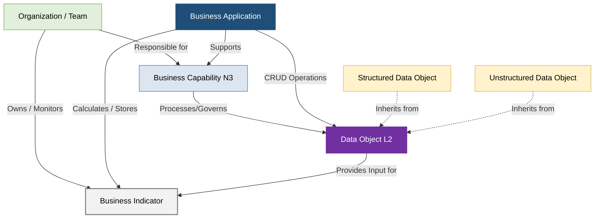

# PowerUp Open Knowledge Catalog (PowerUp OKC)
## Portal Mestre de Governança de Dados, Arquitetura Corporativa e IA Agêntica

Este repositório consolidado é a **espinha dorsal de governança de arquitetura empresarial e engenharia de conhecimento** da **PowerUp**, projetado sob as premissas estruturais do metamodelo **SAP LeanIX v4** e de portabilidade do padrão **Open Knowledge Format (OKF) v0.1**.

O objetivo da **PowerUp OKC** é unificar a representação conceitual de negócios (camada finalística), a estrutura física e departamental (camada organizacional), o inventário lógico de software (camada de aplicações) e o acervo semântico de informações (camada de dados estruturados e não estruturados), qualificando o desempenho global por meio do catálogo de indicadores regulatórios de utilidade pública (ANEEL, ONS e CCEE).

---

## 1. Mapa Conceitual do Metamodelo (SAP LeanIX v4)

A arquitetura do catálogo é completamente interconectada. Para garantir o rastreamento síncrono de impactos (ex: qual o risco operacional no faturamento se um sistema SCADA falhar?), as entidades lógicas (*Fact Sheets*) relacionam-se no padrão **Common Service Data Model (CSDM)** conforme ilustrado abaixo:



---

## 2. Taxonomia Física do Repositório (Estrutura de Pastas)

Seguindo o padrão de **progressive disclosure (revelação progressiva)** exigido pelo OKF v0.1, a estrutura de arquivos é autoexplicativa e modular. Cada diretório possui um arquivo `index.md` dedicado (livre de frontmatter) que atua como sumário de navegação com links absolutos baseados no diretório-raiz:

```text
powerup-okc/                            # Raiz da Base de Conhecimento (Bundle Root)
├── README.md                           # Este documento. Manual de Governança Mestre do Repositório.
├── log.md                              # Histórico de Alterações, Versões e Revisões de Metadados
│
├── business-capabilities/              # Fact Sheets de Capacidades de Negócio (3 Níveis)
│   ├── index.md                        # Índice de Navegação do Mapa de Capabilities
│   ├── 1-corporativo-suporte/          # Nível 1: Corporativo e Suporte ao Negócio
│   ├── 2-engajamento-cliente/          # Nível 1: Engajamento com o Cliente (Comercial)
│   └── 3-operacoes-energia/            # Nível 1: Operações de Energia (G, T, D, C e Trading)
│
├── organizations/                      # Fact Sheets Organizacionais (Camada "Who")
│   ├── index.md                        # Índice Mestre Organizacional
│   ├── legal-entities/                 # Subsidiárias com CNPJ (Holding, G&T, DIS, COM)
│   ├── business-units/                 # Diretorias e divisões executivas (BUs)
│   └── teams/                          # Equipes operacionais e regionais (Teams + Subscrições)
│
├── business-applications/              # Fact Sheets de Sistemas de Registro (Camada "How")
│   ├── index.md                        # Índice Mestre de Sistemas e Aplicações
│   └── app-*.md                        # 16 Aplicações lógicas normalizadas de mercado (ERP, CIS, etc.)
│
├── data-objects/                       # Catálogo e Linhagem de Dados (Camada "What")
│   ├── index.md                        # Índice Mestre de Dados
│   ├── structured/                     # Dicionário de Dados Estruturados (IDs DO-101 a DO-181)
│   └── unstructured/                   # Dicionário de Dados Não Estruturados (IDs DO-201 a DO-223)
│
├── business-indicators/                # Catálogo de Indicadores de Negócio da Indústria
│   ├── index.md                        # Índice de Métricas e KPIs (IDs IND-001 a IND-025)
│   ├── qualidade-servico/              # Continuidade e qualidade comercial (DEC, FEC, INS)
│   ├── qualidade-produto/              # Limites e conformidade de níveis de tensão (DRP, DRC)
│   └── operacional-confiabilidade/     # Disponibilidade física e carregamento do SIN (DISPF, TEIFa)
│
└── relations/                          # Modelagem de Relacionamentos Cruzados (Matrizes RACI/CRUD)
    ├── index.md                        # Índice de matrizes relacionais
    ├── matriz-crud-dados.md            # Permissões de escrita (Provides) e leitura (Consumes)
    └── matriz-responsabilidade-teams.md# Associação de equipes funcionais a Capabilities e KPIs
```

---

## 3. Os Seis Pilares da Base de Conhecimento

### A. Business Capabilities (43 Capacidades de Nível 3)
Mapeia de forma exaustiva "o que" a companhia executa para gerar valor de mercado, estruturada em 3 macro-áreas:
1.  **Corporativo e Suporte (16 Capabilities):** Governança estratégica, gestão financeira, GRC, TI/OT convergente e sourcing de materiais.
2.  **Engajamento com o Cliente (12 Capabilities):** Jornada de faturamento Meter-to-Cash, atração e onboarding B2B/B2C, programas de relacionamento e cobrança.
3.  **Operações de Energia (15 Capabilities):** Despacho de geração hídrica/térmica/renovável, supervisão ativa de Rede Básica de transmissão, operação de distribuição, e trading de curto prazo (mesa de operações).
*   *Ativo de Navegação:* `[tabela-business-capabilities.md]`

### B. Estrutura Organizacional (42 Organizações e 62 Posições Típicas)
Mapeia quem são as pessoas e equipes responsáveis pelas capacidades e sistemas de tecnologia da companhia (Camada "Who"):
*   **Regra de Ouro (Subscriptions):** Para mitigar a inflação de inventário no LeanIX, cargos e indivíduos não ganham Fact Sheets separados, sendo modelados como **Subscrições (Subscriptions)** vinculadas aos arquivos de suas equipes (*Teams*), herdando papéis lógicos (*Application Owner, Technical Contact, Data Steward*).
*   *Ativo de Navegação:* `[index-estrutura-organizacional.md]` e `[readme-organizations.md]`

### C. Business Applications (16 Aplicações Core)
O portfólio de software lógico normalizado por suas funções na indústria de utilidades (desacoplado de fornecedores comerciais físicos):
*   **Segmentação:** Organiza sistemas core como o **CIS** (Faturamento Comercial), **MDM** (Gestão de Medição), **ADMS** (Operações de Distribuição), **GMS/EMS** (Operações de G&T), **EAM** (Manutenção de Ativos), **ETRM** (Mesa de Trading) e os módulos de retaguarda **ERP, BSM, HCM, GRC**.
*   *Ativo de Navegação:* `[readme-business-applications-v2.md]`

### D. Dados Estruturados (81 Objetos de Dados - `DO-101` a `DO-181`)
Dicionários lógicos de dados e esquemas de payloads lógicos de barramentos que descrevem as transações contábeis, comerciais e técnicas de campo (Padrão CIM / BDGD).
*   *Ativo de Navegação:* `[README-DADOS-ESTRUTURADOS.md]`

### E. Dados Não Estruturados (23 Acervos e Bases de Conhecimento - `DO-201` a `DO-223`)
Mapeamento de manuais operacionais, runbooks de TI/OT, leis federais, resoluções normativas (PRODIST / PRORET) e contratos estratégicos complexos que servem de base semântica de alta qualidade para motores de buscas RAG e agentes cognitivos.
*   *Ativo de Navegação:* `[README-DADOS-NAO-ESTRUTURADOS.md]`

### F. Indicadores de Desempenho (25 KPIs Regulatórios - `IND-001` a `IND-025`)
Consolidação unificada das métricas técnicas de qualidade de fornecimento (DEC, FEC, DIC, FIC, DRP, DRC, DTT95%), confiabilidade operativa do SIN (DISPF, TEIFa, TEIP, CCAT) e eficiência comercial (Perdas não técnicas, inadimplência) exigidas pela ANEEL, ONS e CCEE.
*   *Ativo de Navegação:* `[catalogo-indicadores-desempenho.md]`

---

## 4. Integração Prática de TI/OT (Casos de Sucesso)

O valor analítico da base OKC reside no cruzamento síncrono das camadas do metamodelo em jornadas elétricas reais:

### I. Jornada Comercial Meter-to-Cash (M2C)
As curvas de carga de medidores inteligentes de prossumidores GD (`DO-145`) chegam de campo via sistemas Head-End, sendo tratadas e limpas pelas regras e estimativas do motor VEE no **MDM (AP-012)**. Após a finalização do dado faturável, a leitura é integrada ao faturador **CIS (AP-011)** que aplica as estruturas tarifárias (TUSD/TE), bandeiras e rateio de créditos de geração regulados pela ANEEL, emitindo a Fatura de Energia (`DO-144`) lançada na sub-razão financeira SAP FI-CA. Os débitos vencidos tornam-se Itens em Aberto (`DO-157`), disparando avisos de cobrança e ordens de corte físicas, enquanto o saldo de créditos e faturas históricas são espelhados de forma síncrona na tela de Caso (`DO-129`) do **CRM Salesforce (AP-010)** para suporte omnichannel imediato.

### II. Manutenção Preditiva e Restabelecimento Técnico (TI/OT)
Sensores de Internet das Coisas (IoT) de subestações enviam telemetrias físicas em tempo real de gases e vibração de transformadores (`DO-111` e `DO-122`) ao barramento de manutenção preditiva (SAP APM). Modelos avançados de machine learning detectam anomalias térmicas e geram automaticamente Alertas de Saúde convertidos em Ordens de Manutenção Preditiva (`DO-125`) no **EAM SAP PM (AP-014)**. A ordem efetua síncronamente a reserva de isoladores de passagem verificando o nível de materiais no **WMS MRO (AP-009)**. O ServiceNow converte o alerta em incidente técnico e despacha a equipe local via aplicativo móvel do **WFM (AP-013)**, contendo as coordenadas físicas exatas as-built extraídas do sistema **GIS (AP-015)**.

---

## 5. Diretrizes de Governança de Arquitetura (Gartner TIME)

A tomada de decisão estratégica de racionalização de sistemas e dados do portfólio da PowerUp é norteada pelas quatro quadrantes da matriz **Gartner TIME (Tolerate, Invest, Migrate, Eliminate)**, cruzando o valor de negócio das capabilities com a saúde técnica e custos das aplicações:

1.  **INVEST (Investir):** Sistemas e dados mestre core finalísticos de alta relevância que sustentam capabilities críticas (ex: automação do ADMS, motores VEE do MDM, orquestradores de onboarding). Recebem alocações orçamentárias prioritárias de modernização tecnológica.
2.  **TOLERATE (Tolerar):** Aplicações com valor estável, baixo custo de suporte de TI e que operam em conformidade com as regras de negócio. São mantidas sem modificações arquiteturais complexas.
3.  **MIGRATE (Migrar):** Sistemas operacionais importantes que expõem a concessionária a riscos técnicos ou obsolescência (ex: faturamento on-premises legado ou ERPs antigos). São mapeados para migração sistêmica para novas plataformas ou arquitetura moderna em nuvem (SaaS).
4.  **ELIMINATE (Eliminar):** Aplicações e conjuntos de dados redundantes, duplicados, desprovidos de SOT unificado ou que causem inconsistências em auditorias da ANEEL. São eliminados ou desativados de forma segura, consolidando o controle de dados no barramento de integração.

---

## 6. Conformance ao OKF v0.1

Esta base de conhecimento declara conformidade ao padrão **Open Knowledge Format (OKF) v0.1**:
*   Cada arquivo de Fact Sheet técnico individual (`.md`) inicia obrigatoriamente com o bloco delimitador em YAML frontmatter (definindo ID, nome, tipo, ciclo de vida, criticidade de negócio e classificação de privacidade de dados/LGPD), seguido do detalhamento analítico em Markdown estruturado.
*   Todos os arquivos agregadores de diretório (`index.md`) são livres de cabeçalho YAML frontmatter e estruturados unicamente para navegação de progressive disclosure por agentes de IA e humanos.

---

### # Citações e Referências Normativas
1.  **Procedimentos de Distribuição da ANEEL (PRODIST Módulos 3, 5, 6, 7 e 8):** Padrões regulatórios e metodologias oficiais para conexão, medição, faturamento, perdas e apuração de indicadores técnicos e comerciais de fornecimento.
2.  **Procedimentos de Rede do ONS (Submódulos de Planejamento e Operação):** Regras de programação, estudos de estabilidade, limites térmicos de transformadores de potência e regras de intercâmbio de dados síncronos de TO.
3.  **SAP LeanIX Best Practice Reference Model v4:** Diretrizes oficiais de Enterprise Architecture para modelagem lógica de negócios, TI/OT, sistemas lógicos, organizações federadas e linhagem conceitual de dados.
