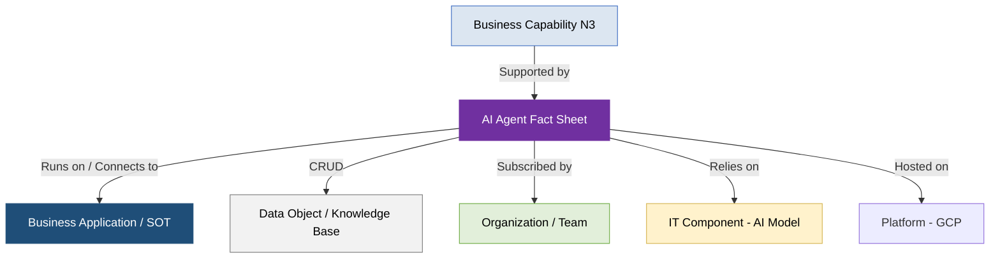

# Guia de Governança e Catálogo de Agentes de IA - PowerUp OKC

Este documento descreve as diretrizes de governança, padrões de modelagem e o inventário consolidado de **Agentes de Inteligência Artificial (AI Agents)** da **PowerUp Open Knowledge Catalog (PowerupOKC)**, estruturado de acordo com as especificações do padrão **Open Knowledge Format (OKF) v0.1** e as melhores práticas do metamodelo v4 da **SAP LeanIX**.

O objetivo deste catálogo é governar a transição cognitiva do setor de utilidades elétricas, integrando os **71 agentes de IA** (de `IAA-001` a `IAA-071`) mapeados nas operações e retaguarda das subsidiárias e da holding do grupo.

---

## 1. Princípios de Modelagem de Agentes de IA (SAP LeanIX v4)

Em conformidade com a extensão oficial de **AI Governance** da SAP LeanIX v4, a modelagem de agentes cognitivos atende às seguintes regras arquiteturais:

*   **Subtipo de Aplicação (Application Subtype):** Agentes de IA (Copilotos, Agentes autônomos ou automatizadores de workflows) não são modelados como "Componentes de TI" ou "Modelos de LLM". Eles são representados como Fact Sheets do tipo **Application (Subtipo: AI Agent)**, pois entregam valor de negócio diretamente, consomem dados e suportam capacidades.
*   **Apoio a Aplicações Core (Supported Applications):** Agentes de IA raramente operam no vácuo; eles se apoiam em sistemas tradicionais core de registro (*Systems of Record / Systems of Truth - SOT*). O metamodelo LeanIX v4 mapeia essa relação de forma síncrona (ex: o *Consultor Funcional SAP (IAA-011)* apoia diretamente o *SAP ERP (AP-001)*).
*   **Relações de Metamodelo Integradas (Who/What/How):**
    *   **Business Capabilities (N3):** Vinculação direta com as capacidades de Nível 3 que o agente otimiza.
    *   **Data Objects (What):** Mapeia quais objetos lógicos estruturados ou não estruturados o agente lê (*Consumes*) ou grava (*Provides*).
    *   **Organizations (Who):** Associa a equipe funcional (*Team*) que subscreve o agente como usuária ou dona do ativo.
    *   **IT Components (Infrastructure):** Conecta o agente de IA ao modelo de linguagem de fundação (ex: *Gemini 3.5 Flash / Pro* - modelados como IT Components de subtipo *AI Model*) e à plataforma de nuvem (*GCP*).



---

## 2. Visão Geral dos 71 Agentes de IA por Domínio Técnico

Os 71 agentes do catálogo estão divididos de forma balanceada entre os departamentos lógicos da companhia, garantindo conformidade regulatória, compliance societário e eficiência técnica:

### A. Tecnologia da Informação (TI) (IDs `IAA-001` a `IAA-014`)
Focado na sustentação de sistemas em alta disponibilidade, FinOps em nuvem pública, automação de chamados de suporte (ITSM/ITOM), engenharia de software ágil (ABAP/Clean Core) e mapeamento automático de dependências da arquitetura corporativa.
*   *System of Truth (SOT) de Apoio:* ServiceNow (ITSM/ITOM/CMDB), Confluence, Jira, GitHub/GitLab.
*   *Agentes de Destaque:*
    *   `IAA-001: Consultor de Inventário de Hardware e Software` (ITAM/ServiceNow)
    *   `IAA-004: Reconciliador de Topologia de Rede e Ativos` (Reconciliação GIS/SCADA)
    *   `IAA-008: Assistente de Auditoria de Código e Segurança` (DevSecOps)
    *   `IAA-013: Gerador de Documentação de Sistemas` (OpenAPI/Swagger)

### B. Recursos Humanos, Saúde e Segurança (IDs `IAA-015` a `IAA-025`)
Gerencia o ciclo de vida do pessoal (*Hire-to-Retire*), automatização de registro admissional, conferência e controle de escalas de turno, e conformidade de saúde ocupacional e segurança física de campo obrigatórias pela ANEEL e MTE (NR-10, NR-35).
*   *System of Truth (SOT) de Apoio:* SAP SuccessFactors (Employee Central/Learning/Recruiting).
*   *Agentes de Destaque:*
    *   `IAA-016: Revisor de Registro Admissional` (DP / DP onboarding)
    *   `IAA-017: Atualizador de Certificações e NRs` (Controle de conformidade LMS)
    *   `IAA-021: Triador de Currículos e Perfis` (Recruiting / OCR)
    *   `IAA-023: Passaporte Digital de Segurança` (Visão computacional Edge AI para EPIs de campo)

### C. Suprimentos e Logística (Procurement) (IDs `IAA-026` a `IAA-036`)
Automatiza frentes do ciclo *Procure-to-Pay* (P2P), consulta inteligente de mestre de materiais e saldos MRO, lançamentos automáticos de recebimentos físicos (MIGO) no ERP, conciliações de notas fiscais (3-Way Matching) e scorecards de riscos socioambientais de terceiros.
*   *System of Truth (SOT) de Apoio:* Coupa Spend Management, SAP S/4HANA (módulos MM/FI).
*   *Agentes de Destaque:*
    *   `IAA-026: Consultor de Catálogo e Saldo de Materiais` (Estoque MRO)
    *   `IAA-031: Conciliador Transacional de Faturas` (3-Way Matching de faturamento fiscal)
    *   `IAA-032: Assistente de Elaboração de Editais de Sourcing` (RFI/RFP inteligentes)
    *   `IAA-035: Auditor de Riscos ESG de Fornecedores` (Web Scraping de riscos setoriais)

### D. Jurídico, Contratos e Regulação (IDs `IAA-037` a `IAA-048`)
Centraliza o andamento de processos de contencioso cível e regulatório, monitora prazos processuais e publicações de diários oficiais, extrai metadados do SAP CLM, audita minutas de novos aditivos e reajustes e analisa as novas resoluções normativas da ANEEL (PRODIST/PRORET).
*   *System of Truth (SOT) de Apoio:* SAP CLM, Lex, ServiceNow GRC / SAP GRC.
*   *Agentes de Destaque:*
    *   `IAA-037: Consultor de Metadados de Contratos` (SAP CLM)
    *   `IAA-041: Monitor de Provisões e Garantias` (Contencioso / Provisões de perdas)
    *   `IAA-044: Analisador de Cláusulas e Riscos` (Identificação de Red Flags contratuais)
    *   `IAA-046: Auditor de Normas e Jurisprudência` (Monitor de mudanças regulatórias ANEEL)

### E. Financeiro, Controladoria e Tesouraria (IDs `IAA-049` a `IAA-060`)
Suporta as atividades contábeis do Razão e do Diário Universal (ACDOCA), automatiza baixas de contas a pagar, executa conciliações bancárias complexas, monitora limites e saldos mínimos de caixa e orquestra a apropriação patrimonial regulatória (Unitização de Ativos).
*   *System of Truth (SOT) de Apoio:* SAP S/4HANA (FI/CO/FI-AA/PS), SAP TRM, Looker/BigQuery.
*   *Agentes de Destaque:*
    *   `IAA-049: Consultor de Lançamentos e Saldos Contábeis` (Queries de lançamentos gerais)
    *   `IAA-053: Monitor de Saldos e Limites de Caixa` (Tesouraria / Cash Flow)
    *   `IAA-057: Orquestrador de Unitização e BRR` (RAG para Manual de MCPSE da ANEEL)
    *   `IAA-059: Preditor de Fluxo de Caixa e Cotações do Setor` (Integração com feeds CCEE / PLD)

### F. Marketing, Vendas e Relacionamento (CRM) (IDs `IAA-061` a `IAA-071`)
Otimiza a experiência comercial omnichannel de clientes cativos e livres (B2B/B2C), realiza predições de Churn e risco de inadimplência, automatiza a sincronização de campanhas, apoia consultores em simulações tarifárias para migração ao ACL e audita peças publicitárias de eficiência.
*   *System of Truth (SOT) de Apoio:* Salesforce Energy & Utilities Cloud, SAP IS-U (CIS), Looker.
*   *Agentes de Destaque:*
    *   `IAA-061: Consultor de Consumo e Perfil do Cliente` (Queries de telemetria AMI no CIS)
    *   `IAA-064: Calculador de Churn e Risco de Evasão` (Analytics de cancelamentos)
    *   `IAA-067: Analisador de Sentimento e Interações de Clientes` (Ouvidoria / Transcrições de SAC)
    *   `IAA-071: Auditor de Conformidade de Peças Publicitárias` (Compliance CONAR/ANEEL)

---

## 3. Mapeamento de Casos de Uso Críticos e Integração Síncrona

Abaixo estão detalhados três fluxos práticos transversais que demonstram como os novos agentes de IA interagem com a infraestrutura core tradicional e de campo:

### Caso 1: Sincronização e Auditoria Técnica de Dados de Rede (GIS / SCADA)
Este fluxo automatiza a conciliação entre o modelo técnico georreferenciado da distribuidora e a rede operativa de campo, reduzindo o tempo de atualização cadastral de novas extensões de rede de semanas para minutos:
1.  **Ingestão de Novos Ativos:** O time de campo conclui a construção física de uma nova linha de média tensão, registrando os postes e condutores no **GIS (`DO-002`)**.
2.  **Mapeamento de Dependências:** O **`agent-reconciliador-de-topologia-de-rede-e-ativos (IAA-004)`** varre síncronamente o banco geográfico (ArcGIS) e o CMDB do ServiceNow para verificar se o transformador e os religadores de proteção criados possuem representações digitais corretas e consistentes (relação de paridade e conectividade topológica).
3.  **Auditoria Operacional:** O agente de IA cruza os dados cadastrais com os logs e status vindos do sistema **SCADA (`DO-003`)**, identificando se há inconsistências de nomenclatura ou tags lógicas de religadores de TO, corrigindo a topologia mestre de forma semiautônoma (human-in-the-loop).

### Caso 2: Auditoria de Segurança Física em Manutenções de Alto Risco (Edge AI)
A segurança física das equipes de eletricistas de campo é automatizada e monitorada de forma ativa no início de cada turno de trabalho:
1.  **Abertura da Ordem de Serviço:** O coordenador de manutenção despacha uma ordem de manutenção corretiva de urgência (`DO-125`) para um transformador estourado via aplicativo **WFM**.
2.  **Validação Preventiva de Segurança:** Antes de iniciar a atividade física no poste, a equipe local captura uma foto de sua vestimenta e equipamentos utilizando o aplicativo móvel integrado ao **`agent-passaporte-digital-de-seguranca (IAA-023)`**.
3.  **Auditoria em Borda (Edge AI):** O agente de IA, rodando de forma offline-first na borda, processa a imagem via visão computacional para verificar se todos os técnicos estão utilizando de forma adequada os óculos de proteção, luvas de isolamento de MT, cintos de segurança (NR-35) e se o aterramento temporário foi efetuado (regras de ouro de EHS).
4.  **Liberação Operacional:** Se o compliance for nota 100%, o agente aprova síncronamente a liberação física no **SAP PM** e notifica o Centro de Operações da Distribuição (**COD**). Em caso de violações, o despacho é bloqueado e uma notificação de risco é registrada no sistema de segurança **EHS**.

### Caso 3: Unitização de Ativos e Capitalização Regulatória de Obras (Manual do MCPSE / ANEEL)
Este fluxo garante o compliance regulatório da distribuidora, traduzindo instruções normativas complexas para evitar glosas financeiras no repasse tarifário da Base de Remuneração Regulatória (BRR):
1.  **Finalização de Obra Física:** O time de engenharia encerra o comissionamento técnico de uma nova subestação rebaixadora, convertendo o projeto de capital (SAP PS) em um ativo imobilizado em andamento (AuC).
2.  **Classificação Patrimonial Automática:** O **`agent-orquestrador-de-unitizacao-e-brr (IAA-057)`** varre a documentação técnica (memoriais e plantas - `DO-216`) e as ordens do SAP PM, cruzando os dados de forma síncrona com o **Manual de Contabilidade do Setor Elétrico (MCSE)** da ANEEL (`DO-203`).
3.  **Mapeamento de Unidades de Adição (UAR):** O agente de IA lê a descrição técnica dos transformadores instalados e sugere síncronamente quais os códigos de Unidade de Adição e Retirada (UAR) corretos e qual a vida útil regulatória aplicável de acordo com as diretrizes da agência reguladora, reduzindo drasticamente o retrabalho e o risco de erros de parametrização fiscal no módulo **SAP FI-AA**.

---

## 4. Classificação de Segurança, Acessos e Compliance (LGPD)

O Catálogo de Agentes de IA opera sob um rígido modelo de permissões e controle de privacidade de dados lógicos estabelecidos pelo encarregado de governança e segurança do grupo:

```text
    [Classe: CONFIDENCIAL]
    Agentes com acesso síncrono a comandos de Tecnologia da Operação (TO) ou logs cibernéticos industriais (SOC).
    Requisitos: MFA corporativo obrigatório, logs de auditoria detalhados e controle de windowing de acesso por IP.
    Exemplos: IAA-004 (Reconciliador), IAA-008 (Auditoria de Código), IAA-023 (Passaporte de Campo).

    [Classe: RESTRITO (LGPD)]
    Agentes que processam informações pessoais identificáveis (PII) de colaboradores ou dados de faturamento e consumo de consumidores residenciais.
    Requisitos: Criptografia ponta a ponta (AES-256), termos de consentimento ativos e regras restritivas de anonimização (RAG).
    Exemplos: IAA-015 (Consultor de Pessoal), IAA-019 (Assistente de Benefícios), IAA-061 (Consultor de Consumo).

    [Classe: INTERNO]
    Agentes focados em dados de engenharia proprietária, manuais, guias e catálogos operacionais de materiais e almoxarifados.
    Requisitos: Controle básico de acessos baseado em perfis (RBAC) do Microsoft Entra ID.
    Exemplos: IAA-026 (Consultor de Estoques MRO), IAA-043 (Elaboração de Minutas), IAA-070 (Eficiência Energética).

    [Classe: PÚBLICO]
    Agentes encarregados de processar documentos normativos abertos, diários oficiais federais e tarifas reguladas homologadas pela ANEEL.
    Requisitos: Acesso livre sem controle restritivo de conformidade interna de sigilo.
    Exemplos: IAA-046 (Auditor de Normas ANEEL), IAA-068 (Assistente de Prospecção / Tarifas Concorrentes).
```

---

## 5. Referências e Padrões Técnicos

1.  **SAP LeanIX AI Governance Extension (2025):** Guia oficial de melhores práticas de modelagem de arquitetura corporativa para a governança descentralizada de robôs de IA, agentes autônomos e IT Components de LLMs de linguagem de fundação.
2.  **Resolução Normativa ANEEL nº 1.000/2021:** Estabelece as condições gerais de fornecimento de eletricidade e prazos técnicos e comerciais regulados aplicados aos roteiros de atendimento e faturamento.
3.  **Lei Geral de Proteção de Dados (LGPD - Lei nº 13.709/2018):** Dispõe sobre o tratamento de informações cadastrais e de consumo individuais manipuladas síncronamente em canais analíticos e operacionais do grupo.
