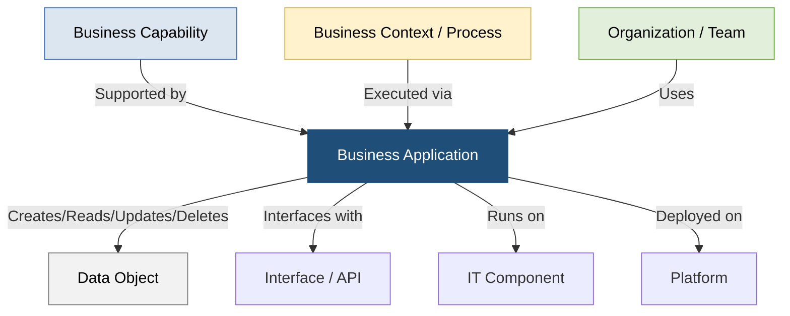

# Guia de Governança de Business Applications - Setor Elétrico (PowerUp OKC)

Este documento descreve o catálogo estruturado de **Business Applications (Sistemas Transacionais Core)** da **PowerUp Open Knowledge Catalog (PowerupOKC)**, modelado sob as diretrizes globais da **SAP LeanIX v4** e as particularidades regulatórias e operacionais do Setor Elétrico Brasileiro.

O objetivo deste guia é fornecer ao time de Arquitetura Corporativa, Governança de TI e Liderança de Negócios uma visão clara de como os sistemas de software (*Systems of Record & Systems of Operation*) se acoplam às capacidades organizacionais e suportam a transição para redes de energia inteligentes, descentralizadas e digitais (os **3Ds**).

---

## 1. Princípios de Modelagem do Metamodelo SAP LeanIX v4

Seguindo estritamente as melhores práticas de Enterprise Architecture, o catálogo de Business Applications adota os seguintes padrões de modelagem:

*   **Desacoplamento de Fornecedor (Standard-to-Product Decoupling):** As aplicações são cadastradas pelo seu **Nome Funcional/Padrão de Mercado** (ex: *CRM*, *ERP*, *GIS*, *ADMS*, *MDM*, *ETRM*) e não pelo nome comercial da solução contratada. Os fornecedores de tecnologia específicos são documentados em campos de atributos secundários (*Market Examples*) e integrados à camada física de **IT Components**. Isso garante a estabilidade a longo prazo do catálogo caso haja substituição de fornecedores.
*   **Abordagem Centrada em Aplicação (Application-Centric):** A aplicação é o elo central que conecta as necessidades de negócio (**Business Capabilities** e **Business Contexts**) à infraestrutura técnica (**IT Components** e **Platforms**), além de demonstrar quem consome a informação (**Organizations**) e quais dados são processados (**Data Objects**).
*   **Segmentação de Subtypes:** Isolamos completamente os sistemas transacionais core (`Business Application`) das novas ferramentas inteligentes e copilotos de produtividade (`AI Agent`), permitindo que a governança de TI rastreie licenças, TCO e custos de nuvem de forma segregada.



---

## 2. Inventário de Business Applications

O portfólio consolida as **19 Business Applications tradicionais** que regem o ecossistema de TI corporativo e TO de campo na companhia, mapeadas em relação às suas capacidades correspondentes:

| ID | Business Application (Nome Funcional) | Domínio Principal (LeanIX Level 1) | Grupo de Trabalho (LeanIX Level 2) | Descrição do Escopo Operacional | Exemplos de Tecnologias de Mercado | Criticalidade |
| :--- | :--- | :--- | :--- | :--- | :--- | :--- |
| **AP-001** | ERP - Gestão Financeira, Contábil e Controladoria | Suporte Corporativo | Gestão Estratégica e Financeira | Rege os lançamentos contábeis mestre, fechamento fiscal, contabilidade de custos e gestão financeira do balanço patrimonial. | SAP S/4HANA (FI/CO), Oracle ERP Cloud, Microsoft Dynamics 365 | `Mission Critical` |
| **AP-002** | ERP - Gestão de Tesouraria e Riscos | Suporte Corporativo | Gestão Estratégica e Financeira | Módulo de tesouraria responsável pelo controle de liquidez, posições financeiras diárias e hedge de volatilidade cambial e de energia. | SAP S/4HANA (TRM), Kyriba Cash Management, Oracle Treasury | `Mission Critical` |
| **AP-003** | HRIS - Informações de Recursos Humanos | Suporte Corporativo | Gestão de Pessoas e Cultura | Sistema de RH focado na folha de pagamento, ciclos de desempenho, L&D e certificações mandatórias (ex: NR10 de campo). | SAP SuccessFactors, Workday HCM, Oracle Fusion HCM | `Business Critical` |
| **AP-004** | CLM - Gestão do Ciclo de Vida de Contratos | Suporte Corporativo | Gestão Jurídica e de Compliance | Orquestra a negociação, workflows de assinatura, repositório de minutas e fiscalização de prazos contratuais de suprimentos e EPC. | SAP CLM, Icertis CLM, DocuSign CLM | `Operational` |
| **AP-005** | GRC - Governança, Riscos e Conformidade | Suporte Corporativo | Gestão Jurídica e de Compliance | Consolida o inventário de riscos estratégicos, matrizes de controles internos (SOX) e acompanhamento de auditoria. | SAP GRC, ServiceNow GRC, Diligent | `Business Critical` |
| **AP-006** | EHS - Gestão de Saúde, Segurança e Ambiente | Suporte Corporativo | Gestão Jurídica e de Compliance | Controla o registro de acidentes e quase acidentes, permissões de trabalho (PT) de eletricistas e condicionantes de licenças ambientais. | SAP S/4HANA EHS, Intelex Environmental, Cority EHS | `Business Critical` |
| **AP-007** | ITSM/ITOM - Gestão de Serviços de TI | Suporte Corporativo | Gestão de TI e Telecomunicações | Plataforma de gestão de incidentes, requisições de mudanças e mapeamento do CMDB convergente entre ativos de TI e de TO (Purdue Model). | ServiceNow (ITSM/ITOM), Jira Service Management | `Business Critical` |
| **AP-008** | SRM - Gestão de Compras e Sourcing | Suporte Corporativo | Gestão da Cadeia de Suprimentos | Coordena o fluxo de requisição, cotações com fornecedores, equalização comercial de propostas e aprovação de pedidos de compras. | Coupa Procurement, SAP Ariba, Oracle Procurement | `Operational` |
| **AP-009** | WMS/MRO - Gestão de Estoques de Campo | Suporte Corporativo | Gestão da Cadeia de Suprimentos | Responsável pelo controle de níveis, almoxarifado físico, movimentação e reserva de componentes sobressalentes MRO de subestações. | SAP S/4HANA (MM/EWM), Oracle WMS Cloud, Infor WMS | `Operational` |
| **AP-010** | CRM - Atendimento e Cadastro de Cliente | Engajamento com o Cliente | Gestão do Relacionamento com o Cliente | Central de relacionamento omnichannel responsável pelo cadastro de contas B2B/B2C, registro de chamados de ouvidoria e canais. | Salesforce Service Cloud, Zendesk Suite, Oracle CX Cloud | `Business Critical` |
| **AP-011** | CIS - Sistema de Faturamento Comercial | Engajamento com o Cliente | Faturamento e Cobrança | Core comercial que executa o cálculo de faturas elétricas reguladas, tarifas da ANEEL (TUSD/TE), impostos e regras de compensação GD. | SAP S/4HANA Utilities (IS-U), Oracle Utilities Customer Cloud | `Mission Critical` |
| **AP-012** | MDM - Gestão de Dados de Medição | Engajamento com o Cliente | Faturamento e Cobrança | Motor analítico de telemetria AMI que limpa, valida (VEE) e consolida os dados de curvas de carga de medidores inteligentes de campo. | Oracle Utilities MDM, Siemens EnergyIP, Landis+Gyr | `Mission Critical` |
| **AP-013** | Sub-razão de Contabilidade de Clientes | Engajamento com o Cliente | Faturamento e Cobrança | Sub-razão auxiliar que gerencia as contas a receber, faturas em aberto e workflows de réguas de cobrança e comandos de corte. | SAP S/4HANA (FI-CA), Oracle Utilities Billing | `Business Critical` |
| **AP-014** | SCADA - Supervisão e Controle de Usinas | Operações de Energia | Geração de Energia | Tecnologia da Operação (TO) focada na aquisição de dados e controle remoto de subestações de usinas e despacho físico. | Hitachi Energy Spectrum, Siemens Spectrum Power, Elipse SCADA | `Mission Critical` |
| **AP-015** | EMS/SCADA - Operação de Transmissão | Operações de Energia | Transmissão de Energia | Sistema de TO de tempo real focado em Estimação de Estado, Análise de Contingências de Malha e Controle Automático de Geração (AGC). | Hitachi Network Manager EMS, GE e-terraplatform, Siemens | `Mission Critical` |
| **AP-016** | ADMS/OMS - Operação de Distribuição | Operações de Energia | Distribuição de Energia | Sistema de TO para redes de média/baixa tensão, orquestrando recomposição automática de redes (FLISR) e controle de tensão (VVO). | Siemens ADMS, Schneider Electric EcoStruxure ADMS, GE e-terra | `Mission Critical` |
| **AP-017** | ETRM - Gestão de Trading e Comercialização | Operações de Energia | Trading de Energia e Gestão de Risco | Controla contratos bilaterais e derivativos de energia, monitorando o Value at Risk (VaR) de mercado e faturamentos da CCEE. | Thunders ETRM, Allegro Development ETRM, OpenLink Endur | `Business Critical` |
| **AP-018** | EAM - Engenharia e Gestão de Ativos Físicos | Gestão de Ativos e Rede | Execução do Ciclo de Vida do Ativo | Controla o cadastro físico e histórico de ordens de manutenção (PM), custos reais de reparo e ciclo de vida útil de transformadores. | SAP S/4HANA Asset Management (PM), IBM Maximo, Infor EAM | `Mission Critical` |
| **AP-019** | GIS - Sistema Geográfico de Redes | Gestão de Ativos e Rede | Gestão de Dados da Rede | Cadastro georreferenciado e espacial dos ativos de rede (cabos, postes, transformadores), servindo como base mestre topológica. | Esri ArcGIS Utility Network, GE Smallworld GIS, Intergraph | `Mission Critical` |

---

## 3. Fluxos de Processo e Reconciliação de Dados (Casos Práticos)

Para assegurar a coerência e a integridade da arquitetura de integração de dados, as Business Applications comunicam-se através de fluxos de ponta a ponta bem estabelecidos. Abaixo estão detalhados os três cenários operacionais mais críticos do setor:

### A. Fluxo Comercial "Meter-to-Cash" (Medição ao Faturamento)

Este processo descreve como o consumo de energia é registrado na borda, purificado de anomalias, faturado de acordo com as tarifas reguladas da ANEEL e reconciliado financeiramente:

```text
  [Medidor AMI] --(Leituras Brutas)--> [MDM (AP-012)] --(Processo VEE)--> [Leituras Validadas]
                                                                                |
                                                                                v
  [CRM (AP-010)] <--(Integração API)-------------------------------------- [CIS (AP-011)]
        |                                                                       |
  (Gestão de Casos)                                                      (Geração de Fatura)
        |                                                                       |
        v                                                                       v
  [Equipes de Campo] <--(Comando de Corte)-- [Sub-razão FI-CA (AP-013)] <--- (Inadimplência)
```

1.  **Ingestão de Dados:** Bilhões de leituras de telemetria bruta de medidores inteligentes (AMI) são ingeridas continuamente pelo **MDM (AP-012)**.
2.  **Validação Técnica (VEE):** O MDM executa regras de *Validation, Estimation, and Editing* (VEE) para expurgar picos artificiais de leitura ou estimar lacunas decorrentes de falhas de comunicação de telecomunicações.
3.  **Faturamento Regulado:** As leituras limpas e validadas são transferidas via API estruturada para o **CIS (AP-011)**, que cruza o volume com a tarifa vigente do cliente (ex: Tarifa Branca ou Grupo B) e emite a fatura. Para clientes prossumidores (Geração Distribuída), o faturamento executa as regras fiscais de compensação de créditos de energia (*net metering*).
4.  **Integração com Contabilidade Auxiliar:** Os débitos faturados são lançados na sub-razão de contas a receber **FI-CA (AP-013)**. Caso ocorra inadimplência após a execução de réguas amigáveis de cobrança (*dunning*), o sistema emite automaticamente uma ordem técnica de suspensão de fornecimento de energia (ordem de corte) para os sistemas de campo.
5.  **Atendimento Omnichannel:** O faturamento, o histórico de consumo e os status das ordens de campo são espelhados em tempo real na tela do atendente no **CRM (AP-010)**, garantindo que as reclamações de faturamento sejam resolvidas síncronamente.

### B. Manutenção de Campo Preditiva e Corretiva baseada em Ocorrências de Rede (TI/OT)

Este fluxo descreve a convergência operacional onde incidentes de rede física disparam automaticamente equipes de engenharia de campo e provisionam almoxarifados de componentes técnicos sobressalentes:

```text
  [Sensores IoT/Rede] --> [ADMS (AP-016)] --(Alerta de Outage/Falha)--> [ITSM ServiceNow (AP-007)]
                                                                                |
                                                                                v
  [Estoque MRO (AP-009)] <--(Reserva de Peça)-- [EAM SAP PM (AP-018)] <--(Criação de Ordem PM)
                                                      |
                                                      v
  [Equipes de Campo] <--(Despacho de Serviço)-- [FSM ServiceNow (AP-007)]
```

1.  **Detecção de Eventos:** Em caso de queda de energia (Outage) ou identificação de falha térmica iminente em transformadores via sensores IoT, os sistemas de Tecnologia da Operação (**ADMS (AP-016)** ou **SCADA (AP-014)**) geram um alarme na rede de campo.
2.  **Roteamento Integrado de Serviços:** O evento físico dispara uma ocorrência no barramento unificado de serviços corporativos **ITSM (AP-007)**, permitindo uma análise rápida de impacto sistêmico no CMDB.
3.  **Planejamento de Manutenção:** O incidente de Nível 0 é convertido em uma **Nota de Manutenção** e sequencialmente em uma **Ordem de Manutenção** dentro do **EAM SAP PM (AP-018)**.
4.  **Consumo de Insumos Logísticos:** A ordem de manutenção preditiva ou corretiva realiza de forma síncrona a verificação e reserva de componentes técnicos sobressalentes (como fusíveis, chaves ou transformadores MRO) no **WMS/MRO (AP-009)**. Caso o item esteja abaixo do ponto de reabastecimento mínimo, uma requisição automática de compra é disparada no sistema de **Procurement (AP-008)**.
5.  **Despacho e Conclusão:** O serviço técnico detalhado (diagrama unifilar, rotas e runbooks extraídos do **GIS (AP-019)**) é enviado para o aplicativo móvel do eletricista no sistema de **Field Service Management (FSM)**. Ao concluir o reparo, os dados mestre do ativo e os custos logísticos e de mão de obra são liquidados contra o centro de custo correspondente no ERP.

### C. Gestão Financeira, Planejamento de Projetos e Fechamento de CAPEX elétrico

Este fluxo mapeia a governança financeira e de controladoria envolvida nos projetos de investimento em capital de infraestrutura de rede básica:

1.  **Planejamento e PEP:** Novos ativos de transmissão ou subestações de distribuição de alta complexidade são planejados através de um **Plano de Investimentos** no **ERP de Projetos (SAP PS)**, estruturando-se os orçamentos em uma árvore de **Elementos PEP** (Estrutura Analítica do Projeto).
2.  **Workflows de Compras:** Com base no Elemento PEP liberado, o time de engenharia emite requisições de compras para contratação de empresas EPC e aquisição de materiais pesados no **SRM (AP-008)**, garantindo conformidade contratual com o **CLM (AP-004)**.
3.  **Contabilização e Fechamento:** À medida que as medições de serviço são atestadas e as notas fiscais integradas no contas a pagar, os custos reais são debitados contra as ordens de investimento do projeto elétrico correspondente no **ERP (AP-001)**.
4.  **Capitalização de Ativos Fixos:** No momento do comissionamento técnico do ativo e energização da subestação, o Elemento PEP correspondente é encerrado. Os custos do projeto acumulados em andamento são integralmente transferidos (capitalizados) para a contabilidade de **Ativos Fixos (SAP FI-AA)** como uma nova classe de ativo imobilizado físico em operação de rede, dando início ao ciclo regulatório de depreciação e retorno de capital garantido pela tarifa da ANEEL.

---

## 4. Avaliação de Ciclo de Vida e Modernização (TIME Framework)

Como diretriz de governança para o comitê de tecnologia da companhia, as Business Applications devem ser gerenciadas sob o framework de racionalização de portfólio **TIME (Tolerate, Invest, Migrate, Eliminate)**, alinhando a eficiência de custos à resiliência operacional:

```text
    Alta  |----------------------------------------------------|
          |                 TOLERATE (Tolerar)                 |                  INVEST (Investir)                 |
          |  Sistemas estáveis e maduros com baixo custo.      |  Aplicações estratégicas e inovadoras.             |
          |  Ex: Sistemas de simulação offline (PSS/E).        |  Ex: GIS (AP-019) e MDM (AP-012) integrado.        |
  Valor   |----------------------------------------------------|----------------------------------------------------|
  para o  |                 ELIMINATE (Eliminar)               |                  MIGRATE (Migrar)                  |
  Negócio |  Sistemas obsoletos ou redundâncias funcionais.    |  Aplicações legadas críticas de TI/TO em ambiente  |
          |  Devem ser consolidados no ERP principal.          |  on-premises que exigem transformação para nuvem.  |
          |  Ex: Bancos de dados em silos desvinculados.       |  Ex: ERP e CIS legados on-prem para S/4HANA Cloud. |
    Baixa |----------------------------------------------------|----------------------------------------------------|
                                       Baixa                                                                     Alta
                                                     Saúde Técnica e Flexibilidade Arquitetural
```

Esta matriz orienta de forma segura a tomada de decisões corporativas, garantindo que os orçamentos de tecnologia estejam alinhados às prioridades de digitalização e modernização de rede exigidas pela nova era do setor elétrico.
