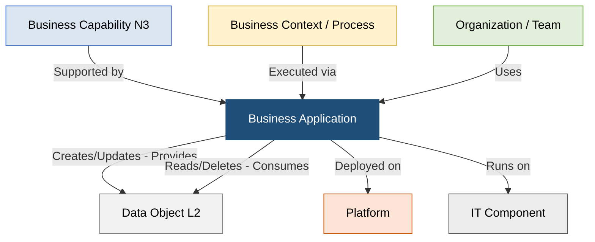

# Guia de Governança de Business Applications - Setor Elétrico (PowerUp OKC)

Este documento estabelece o guia oficial de governança, arquitetura e integração do catálogo de **Business Applications (Sistemas Transacionais Core de Registro e de Operação)** do ecossistema **PowerUp OKC (Open Knowledge Catalog)** [478, 480]. 

O objetivo deste guia é fornecer ao time de Arquitetura Corporativa, Engenharia de Dados, Segurança da Informação e Gestão de TI/TO uma visão clara de como os sistemas de software lógicos se acoplam às capacidades organizacionais e suportam as macrotendências da indústria de utilidades elétricas (os **3Ds**: Descarbonização, Descentralização e Digitalização) [16, 191].

---

## 1. Princípios de Modelagem no Metamodelo SAP LeanIX v4

Seguindo estritamente os padrões de Enterprise Architecture estabelecidos pela **SAP LeanIX v4**, a modelagem do portfólio de Business Applications adota os seguintes pilares conceituais de governança [6, 7]:

### A. Desacoplamento de Fornecedor (Standard-to-Product Decoupling)
As aplicações são cadastradas pelo seu **Nome Funcional/Padrão de Mercado** (ex: *ERP*, *CIS*, *CRM*, *SCADA*, *GIS*, *EAM*, *ETRM*) e não pela marca comercial específica da solução contratada [15, 16, 21, 54, 55, 63, 67, 71]. Os fornecedores específicos de software e pacotes comerciais (ex: *SAP S/4HANA*, *Salesforce Energy Cloud*, *Oracle Utilities Customer Cloud*) são modelados na camada física como **IT Components** [16, 27, 61, 64]. Isso garante a estabilidade de longo prazo do catálogo de negócios, permitindo que a empresa substitua fornecedores de tecnologia sem quebrar a linhagem conceitual das capacidades de negócio [2, 11, 21].

### B. Propriedade do Dado Mestre e Sistema da Verdade (System of Truth - SOT)
Para garantir a governança do dado mestre de acordo com as diretrizes do LeanIX v4, cada objeto de dados corporativo importante (Data Object) deve possuir uma única aplicação canônica de origem mapeada, com a relação de fornecimento ou criação (**Provides/Writes**) [2, 10, 38, 39]. As demais aplicações que apenas consomem ou leem essas informações são associadas pela relação de consumo (**Consumes/Reads**) [2, 38, 39, 481]. 

### C. Isolamento de Camadas e Subtypes de Aplicação
O LeanIX v4 segmenta as soluções de software em quatro subtipos principais [18]:
*   `Business Application`: Usado para distinguir sistemas transacionais core lógicos das soluções de nicho, servindo como o elo de conexão com a camada de capacidades de negócio [18].
*   `AI Agent`: Usado de forma segregada para mapear assistentes inteligentes, modelos cognitivos e copilotos, permitindo a governança de licenças, privacidade e monitoramento de custos de nuvem de forma separada [18, 74, 75].
*   `Extension`: Representa customizações, aplicativos Fiori ou desenvolvimentos de plataforma (como SAP BTP) que estendem o sistema de host tradicional sem poluir o catálogo de sistemas core [18, 20, 80].

### D. Governança de Ambientes (Production-Only)
Como regra de ouro de modelagem enxuta, apenas as instâncias em ambiente de **Produção (Prod)** com impacto real de negócios devem ser mantidas como aplicações no catálogo principal do LeanIX [55]. Ambientes de desenvolvimento (*Dev*), testes (*Test*) ou qualidade (*QA*) são geridos na camada física de componentes técnicos ou como atributos de ciclo de vida, evitando a inflação do inventário e poluição visual dos relatórios [55].

---

## 2. Diagrama de Relacionamento do Metamodelo

O ecossistema da PowerUp OKC conecta as dimensões de negócio e de tecnologia de forma estruturada. O diagrama a seguir ilustra as relações síncronas entre os elementos da arquitetura (Who, What, How, Where) no padrão LeanIX v4 [9, 10, 12]:



---

## 3. Inventário Core de Business Applications (As 14 Aplicações Chave)

O portfólio consolida as **14 Business Applications tradicionais** que regem o ecossistema de TI corporativo e TO de campo na companhia, mapeadas em relação às suas capacidades correspondentes, dados mestre e exemplos de mercado [479, 480]:

| Sigla | Business Application (Nome Funcional) | Domínio Principal | Descrição Funcional de Negócio | Exemplos de Tecnologias de Mercado | Capabilities N3 Suportadas | Data Objects Gerenciados (SOT) |
| :--- | :--- | :--- | :--- | :--- | :--- | :--- |
| **CRM** | Customer Relationship Management | Clientes | Gerencia as interações de front-office com clientes, captação de leads de mercado livre (ACL), marketing digital e suporte comercial omnichannel [479]. | Salesforce Energy & Utilities Cloud, Microsoft Dynamics 365, Oracle CX, SAP CRM/C4HANA [479] | • Atendimento ao Cliente Multicanal<br>• Gestão de Leads e Oportunidades<br>• Marketing Digital<br>• Gestão de Reclamações<br>• Programas de Fidelidade [479] | • Cliente (Parceiro de Negócio)<br>• Reclamação de Cliente<br>• Caso (Case) de Atendimento<br>• Oportunidade<br>• Lead [479] |
| **CIS** | Customer Information System | Clientes | Espinha dorsal das operações comerciais da distribuidora. Gerencia faturamento complexo (TUSD/TE), tarifas homologadas pela ANEEL, contratos comerciais, arrecadação, emissão de faturas e o processo automático de cobrança (dunning) e ordens de corte por inadimplência [479]. | SAP IS-U / CCS, Oracle Utilities Customer Cloud Service (CCS) [479] | • Processamento de Faturas<br>• Gestão de Inadimplência<br>• Contratação de Serviços<br>• Onboarding de Clientes<br>• Gestão de Contratos de Venda [479] | • Unidade Consumidora (UC)<br>• Contrato de Fornecimento<br>• Fatura (Conta de Energia)<br>• Pagamento<br>• Item em Aberto<br>• Proposta de Dunning<br>• Aviso de Cobrança<br>• Ordem de Corte [479] |
| **MDM** | Meter Data Management | Clientes | Repositório centralizado e inteligência para dados de medição em lote ou de intervalo (smart meters / AMI). Executa o processo de VEE (Validação, Edição e Estimativa) de dados de consumo bruto antes de disponibilizá-los ao CIS para faturamento estruturado [479]. | Oracle Utilities MDM, Landis+Gyr Command Center, Siemens EnergyIP [479] | • Medição e Coleta de Dados<br>• Gestão de Perdas (Comerciais) [479] | • Leitura de Medição (VEE)<br>• Medidor<br>• Evento VEE [479] |
| **WFM** | Workforce Management | Clientes | Otimiza o agendamento, roteirização e o despacho de equipes técnicas no campo para execução de serviços de campo (ligações novas, inspeções de fraude, cortes/religações) e manutenção de ativos de rede física [479]. | Oracle Field Service Cloud (TOA), ClickSoftware (Salesforce), ServiceNow FSM [479] | • Gestão de Equipes de Campo<br>• Onboarding de Clientes (Instalação técnica)<br>• Manutenção de Redes e Equipamentos [479] | • Ordem de Serviço Comercial<br>• Ordem de Serviço de Campo<br>• Confirmação de Serviço [479] |
| **GIS** | Ativos | Geographic Information System | Sistema autoritativo ('as-built') para o cadastro georreferenciado e modelagem topológica completa da rede elétrica de distribuição e transmissão (postes, cabos, transformadores). Serve como fonte oficial para a Base de Dados Geográfica da Distribuidora (BDGD) da ANEEL [479]. | ESRI ArcGIS Enterprise, Hexagon G/Technology, GE Smallworld [479] | • Gestão de Dados da Rede<br>• Planejamento da Expansão da Rede<br>• Gestão de Ativos Geoespaciais [479] | • Modelo Topológico da Rede<br>• Ativo (Representação Geográfica)<br>• Coordenada Geográfica [479] |
| **EAM** | Ativos | Enterprise Asset Management | Gerencia todo o ciclo de vida físico dos ativos técnicos e equipamentos de rede e usinas (manutenção preventiva, corretiva e preditiva), planos de manutenção sistemática e histórico de intervenções [479]. | SAP Plant Maintenance (PM), IBM Maximo Asset Management, Infor EAM [479] | • Gestão do Ciclo de Vida do Ativo<br>• Execução da Manutenção (Preventiva/Corretiva)<br>• Planejamento de Despesas de O&M [479] | • Ativo (Técnico / Equipamento)<br>• Local de Instalação<br>• Ordem de Manutenção (OM)<br>• Plano de Manutenção<br>• Histórico de Manutenção [479] |
| **ADMS** | Ativos | Advanced Distribution Management System | Plataforma avançada em tempo real (OT) que unifica supervisão de rede (SCADA), gestão de interrupções (OMS) para apuração de indicadores DEC/FEC e funções de otimização de rede de média e baixa tensão (FLISR e VVO) [479]. | Siemens Spectrum Power ADMS, Schneider Electric EcoStruxure ADMS, GE Digital ADMS [479] | • Operação da Rede de Distribuição<br>• Gestão de Interrupções<br>• Gestão de Dados de Rede (Operação) [479] | • Evento de Interrupção (DEC/FEC)<br>• Plano de Manobra (FLISR)<br>• Perfil de Tensão (VVO)<br>• Alarme (SCADA)<br>• Comando de Rede [479] |
| **GMS** | Ativos | Generation Management System | Supervisiona e otimiza em tempo real o despacho de energia das usinas geradoras (hídricas, térmicas, eólicas, solares), coordenando-se com o ONS e controlando de forma ótima a produção em megawatts (MW) [479]. | Hitachi Energy Network Manager GMS, General Electric GMS, ABB Ability GMS [479] | • Operação de Usinas<br>• Planejamento da Geração<br>• Gestão de Desempenho de Ativos de Geração [479] | • Geração de Energia (Ordem de Geração / Plano de Despacho)<br>• Curva de Capacidade/Eficiência<br>• Dados de Geração em Tempo Real<br>• Dado Hidrológico [479] |
| **EMS** | Ativos | Energy Management System | Supervisiona e controla em tempo real a Rede Básica de transmissão de alta tensão. Executa estimação de estado (State Estimation), análise de contingências (Contingency Analysis) e Controle Automático de Geração (CAG/AGC) integrado ao SIN [479]. | Hitachi Energy Network Manager EMS, Siemens Spectrum Power EMS, GE Grid Solutions EMS [479] | • Operação do Sistema de Transmissão<br>• Monitoramento e Controle do Transporte de Energia [479] | • Fluxo de Potência (Transmissão)<br>• Vetor de Estado<br>• Lista de Contingências<br>• Sinais de Controle de Geração (CAG/AGC) [479] |
| **CCEE** | Ativos | Sistemas CCEE (SCDE / SCL / DRI) | Sistemas estruturais de interação dos agentes com a CCEE. O SCDE realiza a coleta e tratamento da medição física para faturamento (SMF); o SCL gerencia contratos bilaterais de comercialização de energia no ACL/ACR; o DRI divulga as contabilizações e liquidações do mercado de curto prazo (MCP) [479]. | CCEE (Sistemas proprietários desenvolvidos em consórcio / customizados) [479] | • Trading de Energia e Gestão de Risco<br>• Gestão de Riscos de Mercado<br>• Conformidade Regulatória (CCEE) [479] | • Medição para Faturamento (SMF)<br>• Contrato de Comercialização de Energia (MCBem)<br>• Preço de Liquidação das Diferenças (PLD)<br>• Resultado da Liquidação (MCP)<br>• Código de Ponto de Medição (SCDE) [479] |
| **ERP** | Corporativo | Enterprise Resource Planning | Centraliza os dados contábeis (societário IFRS e regulatório ANEEL via áreas de avaliação de ativos), projetos de investimento de rede (CAPEX no SAP PS) e custos de operação e manutenção (OPEX no SAP CO), além de materiais e fornecedores [479]. | SAP S/4HANA (módulos FI, CO, PS, MM, FI-AA), Oracle ERP Cloud, Microsoft Dynamics F&O [479] | • Contabilidade e Fechamento Financeiro<br>• Gestão Financeira<br>• Gestão de Portfólio de Investimentos<br>• Gestão de Projetos de Capital [479] | • Ativo Fixo (Contábil)<br>• Ativo Regulatório (UAR / Base BRR)<br>• Projeto de Investimento (Elemento PEP / WBS)<br>• Lançamento Contábil<br>• Mestre de Materiais<br>• Pedido de Compra [479] |
| **TRM** | Corporativo | Treasury and Risk Management | Gerencia as operações de tesouraria corporativa, fluxo de caixa, liquidez e captações financeiras, bem como as transações e contratos de proteção (hedge) contra a volatilidade do Preço de Liquidação das Diferenças (PLD) [479]. | SAP S/4HANA (módulo TRM), OpenLink Endur, Allegro Development, FIS AvantGard [479] | • Gestão de Tesouraria<br>• Gestão de Risco de Preço (Commodities)<br>• Análise de Exposição e Risco [479] | • Fluxo de Caixa<br>• Operação Financeira (Derivativos)<br>• Estratégia de Hedge<br>• Posição de Hedge [479] |
| **HCM** | Corporativo | Human Capital Management | Gerencia todo o ciclo de vida do colaborador 'Hire-to-Retire', contemplando recrutamento, posições organizacionais, mestre de empregados, remuneração, folha de pagamento e o controle de certificações de segurança operacionais (NR-10, NR-35) [479]. | SAP SuccessFactors, Workday HCM, Oracle HCM Cloud, ADP [479] | • Gestão de Recursos Humanos<br>• Aquisição de Talentos<br>• Desenvolvimento e Treinamento<br>• Remuneração e Benefícios [479] | • Colaborador (Empregado)<br>• Posição<br>• Requisição de Vaga<br>• Avaliação de Desempenho<br>• Histórico de Treinamento<br>• Folha de Pagamento [479] |
| **BSM** | Corporativo | Business Spend Management | Plataforma dedicada a compras corporativas e ao ciclo Procure-to-Pay (P2P). Gerencia de forma enxuta requisições de compras de grande porte para ativos de rede, cotações, homologação e contratos de fornecedores integrados ao ERP financeiro [479]. | Coupa Spend Management, SAP Ariba, Oracle Procurement Cloud, GEP Smart [479] | • Compras Estratégicas (Procurement)<br>• Gestão de Fornecedores<br>• Gestão de Contratos [479] | • Requisição de Compra<br>• Pedido de Compra<br>• Contrato de Compra<br>• Fornecedor<br>• Fatura de Fornecedor [479] |

---

## 4. Casos Práticos de Integração de Sistemas e Fluxos de Dados (TI/OT)

O valor analítico do catálogo reside nas relações síncronas e barramentos de dados lógicos estabelecidos entre as Business Applications no setor elétrico. Abaixo são descritos detalhadamente os três fluxos mais críticos de utilidade pública:

### A. Ciclo Comercial "Meter-to-Cash" (M2C) e Medição Inteligente (AMI)

Este processo rege o fluxo em que dados brutos de consumo na borda da rede física são purificados, faturados e reconciliados financeiramente no balanço patrimonial, integrando os mundos de TO e TI comercial [128, 129, 132]:

```text
  [Medidores AMI] --(Dados Brutos: DO-001)--> [HES] --(Initial IMD)--> [MDM (Oracle)]
                                                                               |
                                                                       (Processamento VEE)
                                                                               |
                                                                               v
  [Salesforce CRM] <----(Sincronização: Caso / UC)------------- [CIS (SAP IS-U)] <-- [Leitura Validada]
         |                                                             |
   (Abre Chamado)                                             (Gera Fatura: DO-010)
         |                                                             |
         v                                                             v
  [Workforce WFM] <----(Ordem Técnica de Campo)--------------- [Sub-razão FI-CA] --(Débito)--> [ERP Contábil]
```

1.  **Ingestão de Dados de Telemetria:** Medidores inteligentes em campo registram continuamente as grandezas elétricas de consumo ativo e injeção bidirecional de microgeradores distribuídos (prossumidores) [132, 133, 144, 202]. Os dados brutos são transmitidos via rede de telecomunicação para o *Head-End System* (HES) e carregados no **MDM** como Leituras Iniciais (*Initial Measurement Data - IMD*) [154, 202].
2.  **Motor de Validação (VEE):** O **MDM** aplica as regras do motor VEE (*Validation, Editing, and Estimation*), checando desvios ou picos de consumo que sugiram falhas físicas ou fraudes [149, 155, 202]. Leituras ausentes ou com falhas de telecomunicação são automaticamente estimadas por algoritmos preditivos do histórico daquela Unidade Consumidora (UC) para que o ciclo comercial não seja interrompido [155, 202]. Caso ocorram transgressões técnicas graves de níveis de tensão (DRP/DRC fora dos padrões do PRODIST Módulo 8), o sistema sinaliza no barramento para compensações automáticas [9, 147].
3.  **Faturamento de Tarifas Reguladas:** As leituras limpas e finalizadas são transferidas síncronamente via barramento de integração para o **CIS** [133, 154, 202]. O faturamento do CIS calcula o consumo, executa a compensação de créditos elétricos de Geração Distribuída (*net metering*), aplica a estrutura complexa de tarifas reguladas homologadas pela ANEEL (Tarifa de Energia - TE e Tarifa de Uso do Sistema de Distribuição - TUSD), além de bandeiras e impostos (ICMS/PIS/COFINS), emitindo a **Fatura (`DO-010`)** [133, 140, 164, 202].
4.  **Reconciliação Contábil e Cobrança:** O débito faturado é lançado na sub-razão de compensação **FI-CA (CIS)**, gerando um contas a receber integrado nativamente aos **Lançamentos Contábeis (DO-012)** do razão geral do **ERP** [134, 140, 145]. Em caso de inadimplência após a execução de réguas amigáveis de cobrança (*dunning*), o sistema emite de forma automática comandos de suspensão de fornecimento (ordem de corte) no barramento [134, 140, 165].
5.  **Atendimento Omnichannel e Suporte ao Cliente:** O histórico de consumo, o perfil de leituras, as faturas e o status das ordens técnicas de campo são integrados em tempo real na tela do atendente no **CRM (Salesforce)** sob o objeto **Caso (Case)** [134, 137, 140]. Solicitações de novas ligações ou contestações de valores abertas no CRM disparam workflows que geram Parceiros de Negócios e Contratos no CIS e acionam o despacho de equipes de campo via **WFM** [134, 137].

### B. Manutenção de Campo Preditiva e Corretiva baseada em Ocorrências de Rede (TI/OT)

Este fluxo mapeia a convergência operacional onde incidentes em tempo real na rede elétrica física ou anomalias preditivas em grandes ativos de potência geram ordens de reparo de campo e reservas logísticas automatizadas [128, 145, 171]:

```text
  [Sensores IoT/Transformador] --(DO-004)--> [Predictive Model] --(Anomalia de Gases)--> [ServiceNow ITSM]
                                                                                               |
                                                                                       (Gera Incidente de TO)
                                                                                               |
                                                                                               v
  [Estoque MRO / WMS] <-----(Reserva de Peças)----- [EAM SAP PM] <----------------------(Ordem de Manutenção)
                                                          |
                                                    (Planejamento)
                                                          |
                                                          v
  [Técnico de Campo] <-----(Despacho Mobile)------- [WFM System] <---(Rotas e Conectividade: DO-002)--- [GIS]
```

1.  **Monitoramento IoT de Ativos:** Sensores físicos de campo instalados em grandes transformadores de Rede Básica coletam continuamente variáveis operacionais (temperatura do óleo, análise química de gases dissolvidos) e transmitem como `Dados de Sensores IoT (DO-004)` [2, 145, 166]. Em paralelo, os sistemas de supervisão e controle operacional (**SCADA/EMS/ADMS**) coletam status síncronos de disjuntores e religadores [145, 173, 183].
2.  **Análise e Triage de Incidentes de TO:** Se um algoritmo preditivo de Machine Learning identifica padrões de degradação térmica iminente ou o SCADA acusa desarmes intempestivos, o evento gera um **Incidente de TO** na plataforma de **ITSM (ServiceNow)** [173, 183]. A ServiceNow cruza o incidente com as relações de dependência do seu CMDB convergente (TI/OT) estruturado no Purdue Model, gerando uma análise de impacto precisa do distúrbio para reportar se há riscos à estabilidade do SIN ou desligamentos de consumidores [174, 183, 184, 188].
3.  **Planejamento e Orquestração no EAM:** Confirmada a necessidade de intervenção, o incidente é convertido em uma Nota de Manutenção e sequencialmente em uma **Ordem de Manutenção (OM)** no **EAM (SAP PM / IBM Maximo)** [121, 123, 126, 128]. A OM atua como o coletor mestre de custos da atividade (mão de obra técnica, serviços de terceiros e materiais) [121, 126].
4.  **Reserva Síncrona de Materiais (Logística MRO):** A ordem de manutenção verifica síncronamente a disponibilidade física das peças de reposição necessárias (ex: isolador de passagem ou cabo específico) e efetua uma reserva de material no **WMS/MRO (SAP MM)** [126, 145, 166]. Caso os níveis de estoque fiquem abaixo do ponto de ressuprimento, o sistema gera de forma automática uma Requisição de Compra no sistema de **BSM (Coupa/Ariba)** [145, 170].
5.  **Despacho Móvel e Conectividade Topológica:** O serviço técnico planejado é transferido para o sistema de **WFM** [134, 137]. O WFM integra a ordem aos dados espaciais e coordenadas topográficas exatas do ativo extraídos do **GIS (`DO-002`)**, otimizando a rota e enviando o runbook operacional, esquemas CAD de engenharia e procedimentos de segurança (como o checklist de aterramento e regras de ouro NR-10) diretamente para o aplicativo móvel do eletricista de campo [126, 134, 137, 167, 182]. Ao concluir, os custos e falhas são liquidados no ERP contábil, enriquecendo o histórico de confiabilidade do ativo [124, 128, 145].

### C. Gestão Financeira, Planejamento de Projetos e Fechamento de CAPEX elétrico

Este fluxo descreve como os investimentos de capital de infraestrutura de rede básica são planejados de forma estratégica, executados no campo e unitizados contabilmente perante o regulador [145, 169, 170]:

1.  **Planejamento de Ativos e Orçamento (PPM):** A alta direção define o plano estratégico plurianual de investimentos com base em metas financeiras e de riscos de rede no **SAP PPM**, gerando o **Plano de Investimento** [169, 170]. Paralelamente, especialistas desenvolvem a estratégia de ciclo de vida e substituição de equipamentos obsoletos no **SAP APM** [169, 170].
2.  **Abertura do Projeto de Capital (PS):** Os planos são detalhados e estruturados como projetos físicos e orçamentários no **SAP PS** por meio de uma árvore EAP (Estrutura Analítica de Projeto) de **Elementos PEP (WBS Elements)**, que servirão como os coletores oficiais de todos os custos de CAPEX em andamento [169, 170].
3.  **Orquestração de Suprimentos Estratégicos (P2P):** Para as obras de engenharia, os Elementos PEP disparam requisições de compra de grande porte (EPC ou materiais pesados como transformadores e estruturas metálicas) no portal de **BSM (Coupa ou SAP Ariba)**, garantindo conformidade contratual com o **CLM** e homologação de fornecedores [170, 190].
4.  **Fechamento e Reconciliação Contábil:** Conforme as empresas de engenharia executam as fases da obra, as medições de serviço são atestadas e as notas fiscais integradas no contas a pagar do **ERP (SAP FI)**, debitando os valores reais diretamente contra os Elementos PEP correspondentes [145, 170, 190].
5.  **Capitalização e Unitização Regulatória (ANEEL):** No momento da energização física e comissionamento técnico da nova linha de transmissão ou subestação, o projeto é encerrado tecnicamente [170, 190]. Os custos capitalizáveis acumulados em andamento (AIC) são transferidos de forma automática para a carteira de **Ativos Fixos (SAP FI-AA)** para fins contábeis societários (IFRS) e, de forma paralela, são unitizados e mapeados conforme as Unidades de Adição e Retirada (UAR) do manual MCPSE da ANEEL para compor a **Base de Remuneração Regulatória (BRR)**, garantindo a receita da concessão via parcelas de Receita Anual Permitida (RAP) ou parcelas de reajuste tarifário [145, 170, 190].

---

## 5. Racionalização de Sistemas e Modernização (Gartner TIME Framework)

Para guiar o comitê de tecnologia na tomada de decisões estratégicas de arquitetura, alinhamento de investimentos e eliminação de legados de TI/TO, as Business Applications são analisadas periodicamente sob a matriz **Gartner TIME (Tolerate, Invest, Migrate, Eliminate)**, cruzando sua adequação técnica com o valor gerado para o negócio [46, 481]:

*   **INVEST (Investir - Alto Valor & Alta Saúde Técnica):** Sistemas estratégicos focados na modernização de redes inteligentes (*Smart Grids*), que devem receber maior volume orçamentário. Exemplos: expansão do **GIS** topológico unificado, integração avançada do **MDM** para telemetria AMI em massa e modernização das redes ativas do **ADMS** com módulos inteligentes (FLISR/VVO) [46, 126, 481].
*   **TOLERATE (Tolerar - Alto Valor & Baixa Saúde Técnica, ou Baixo Custo):** Sistemas maduros, estáveis e de baixo custo operacional que devem ser mantidos sem grandes intervenções arquiteturais. Exemplos: Ferramentas especialistas de simulação offline (ex: *ANAREDE*, *PSS/E*) [46, 178, 481].
*   **MIGRATE (Migrar - Alto Risco Técnico & Alto Valor de Negócio):** Sistemas legados locais críticos operando on-premises que sofrem com obsolescência ou degradação e precisam ser transformados e migrados para arquiteturas modernas em nuvem. Exemplos: Migração do ERP legado e CIS comercial on-premises para soluções modulares SaaS baseadas em nuvem (ex: *SAP S/4HANA Cloud* e *SAP Utilities Cloud*) [46, 54, 481].
*   **ELIMINATE (Eliminar - Baixo Valor & Baixo Desempenho Técnico):** Aplicações obsoletas, redundantes ou duplicadas herdadas de fusões que geram custos de manutenção desnecessários e duplicidade de dados mestre. Devem ser descomissionadas de forma planejada, consolidando as funções em uma única solução corporativa padronizada [46, 481].

---

## 6. Referências Normativas e Regulatórias

1.  **Procedimentos de Distribuição da ANEEL (PRODIST Módulo 8):** Regula as metodologias de cálculo de interrupções de energia, compensações e os indicadores de continuidade de serviço (DEC/FEC/DIC/FIC/DMIC) [9, 147].
2.  **Procedimentos de Rede do ONS (Submódulo 2.7):** Define os requisitos técnicos mínimos de supervisão, controle e parâmetros elétricos para a conexão física de ativos de transmissão de alta tensão no SIN [1, 145].
3.  **Manual de Controle Patrimonial do Setor Elétrico (MCPSE - ANEEL):** Dispõe sobre o controle de ativos, critérios de unitização física e composição da Base de Remuneração Regulatória (BRR) para fins tarifários [1, 145].
4.  **Lei Geral de Proteção de Dados (Lei nº 13.709/2018 - LGPD):** Rege as obrigações de proteção de privacidade sobre os dados de consumo de energia (`Leitura de Medição`) e faturamento (`Fatura`), classificados como dados pessoais sensíveis e restritos [2, 38, 133].
