# Guia de Referência: Estrutura de Business Capabilities (3 Níveis)

Este documento atua como o manual de referência técnica para a organização, navegação e governança das **Business Capabilities (Capacidades de Negócio)** da indústria de utilidades de energia elétrica na **PowerUp Open Knowledge Catalog (PowerupOKC)**.

A taxonomia de capacidades está estruturada em **três níveis hierárquicos**, em estrita conformidade com as melhores práticas de modelagem de arquitetura corporativa do framework **SAP LeanIX v4** e as macrotendências de transição de rede do setor elétrico brasileiro (os **"3Ds"**: Descarbonização, Descentralização e Digitalização) [181, 182].

---

## 1. Fundamentos de Modelagem LeanIX

As **Business Capabilities** representam **o que (What)** a organização faz para atingir seus objetivos de negócio e entregar valor aos stakeholders, mantendo-se relativamente estáveis ao longo do tempo [42, 43]. Elas diferem e não devem ser confundidas com:
*   **Business Context (Processos / How)**: Descrevem *como* as atividades são executadas (ex: faturar uma conta, realizar uma manobra física) [48].
*   **Organization (Unidades / Who)**: Descrevem *quem* executa as tarefas (departamentos, equipes de campo ou regionais) [48].

### Regras de Conformance Arquitetural (MECE)
Em linha com o metamodelo SAP LeanIX, o mapa de capacidades foi desenhado sob duas regras estruturais fundamentais:
1.  **Mutuamente Exclusivas (Mutually Exclusive)**: Cada capacidade de Nível 2 ou Nível 3 pertence a apenas um nó pai, sem sobreposição funcional [26, 46].
2.  **Coletivamente Exaustivas (Collectively Exhaustive)**: O conjunto de capacidades mapeadas cobre integralmente o espectro operacional, técnico e administrativo de uma concessionária de energia integrada (Geração, Transmissão, Distribuição e Comercialização) [26, 45].

---

## 2. Visão Geral da Arquitetura (Mermaid.js)

O fluxo abaixo ilustra graficamente a decomposição hierárquica das três grandes áreas de capacidades de Nível 1 em seus respectivos nós de Nível 2:

```mermaid
graph TD
    %% Nós de Nível 1
    N1_CORP[1.0 Corporativo e Suporte ao Negócio]
    N1_CLI[2.0 Engajamento com o Cliente]
    N1_OP[3.0 Operações de Energia]

    %% Nós de Nível 2 - Corporativo
    N2_EST[1.1 Gestão Estratégica e Financeira]
    N2_PES[1.2 Gestão de Pessoas e Cultura]
    N2_JUR[1.3 Gestão Jurídica e de Compliance]
    N2_TI[1.4 Gestão de Tecnologia da Informação]
    N2_SUP[1.5 Gestão da Cadeia de Suprimentos]

    N1_CORP --> N2_EST
    N1_CORP --> N2_PES
    N1_CORP --> N2_JUR
    N1_CORP --> N2_TI
    N1_CORP --> N2_SUP

    %% Nós de Nível 2 - Clientes
    N2_MKT[2.1 Marketing e Desenvolvimento de Novos Negócios]
    N2_VEN[2.2 Vendas e Aquisição de Clientes]
    N2_REL[2.3 Gestão do Relacionamento com o Cliente]
    N2_FAT[2.4 Faturamento e Cobrança]

    N1_CLI --> N2_MKT
    N1_CLI --> N2_VEN
    N1_CLI --> N2_REL
    N1_CLI --> N2_FAT

    %% Nós de Nível 2 - Operações
    N2_GER[3.1 Geração de Energia]
    N2_TRA[3.2 Transmissão de Energia]
    N2_DIS[3.3 Distribuição de Energia]
    N2_TRD[3.4 Trading de Energia e Gestão de Risco]
    N2_ATV[3.5 Gestão de Ativos e Rede]

    N1_OP --> N2_GER
    N1_OP --> N2_TRA
    N1_OP --> N2_DIS
    N1_OP --> N2_TRD
    N1_OP --> N2_ATV

    style N1_CORP fill:#1F4E78,stroke:#333,stroke-width:2px,color:#fff
    style N1_CLI fill:#1F4E78,stroke:#333,stroke-width:2px,color:#fff
    style N1_OP fill:#1F4E78,stroke:#333,stroke-width:2px,color:#fff
    style N2_EST fill:#2F5597,stroke:#333,color:#fff
    style N2_MKT fill:#2F5597,stroke:#333,color:#fff
    style N2_GER fill:#2F5597,stroke:#333,color:#fff
```

---

## 3. Matriz Completa do Mapa de Capacidades (3 Níveis)

A tabela abaixo consolida a taxonomia de capacidades mestre e indica a classificação estratégica padrão sugerida de acordo com o framework **TIME (Tolerate, Invest, Migrate, Eliminate)** do Gartner [324]:

| Área Principal (Nível 1) | Grupo de Capacidades (Nível 2) | Capacidade Específica (Nível 3) | Tipo de Suporte Tecnológico / Alvo TIME |
| :--- | :--- | :--- | :--- |
| **1.0 Corporativo e Suporte ao Negócio** | **1.1 Gestão Estratégica e Financeira** | 1.1.1 Planejamento Estratégico 1.1.2 Gestão de Portfólio de Investimentos 1.1.3 Contabilidade e Fechamento Financeiro 1.1.4 Gestão de Tesouraria | **Tolerate / Otimizar Custos** Consolidar sistemas administrativos, centralizar processos e implementar FinOps estruturado [324]. |
| | **1.2 Gestão de Pessoas e Cultura** | 1.2.1 Aquisição de Talentos 1.2.2 Desenvolvimento e Treinamento 1.2.3 Remuneração e Benefícios 1.2.4 Gestão da Experiência do Colaborador | **Tolerate / Autoatendimento** Habilitar assistentes pessoais e FAQs conversacionais de políticas de RH para liberar o time core [5]. |
| | **1.3 Gestão Jurídica e de Compliance** | 1.3.1 Gestão de Contratos 1.3.2 Conformidade Regulatória 1.3.3 Gestão de Risco Corporativo | **Tolerate / Compliance** Garantir auditoria e validação autônoma de termos contratuais frente às novas circulares da ANEEL [10]. |
| | **1.4 Gestão de Tecnologia da Informação** | 1.4.1 Arquitetura de TI e de Dados 1.4.2 Segurança Cibernética (TI/OT) 1.4.3 Gestão de Infraestrutura e Operações de TI | **Invest / Modernização** Implementar barramentos seguros de integração de dados mestre e monitoramento cibernético ativo TI/OT [11]. |
| | **1.5 Gestão da Cadeia de Suprimentos** | 1.5.1 Gestão de Fornecedores 1.5.2 Compras Estratégicas (Procurement) 1.5.3 Gestão de Estoques e Logística | **Tolerate / Automação** Automatizar triagens de qualificação de fornecedores MRO e monitorar o TCO de componentes físicos [6]. |
| **2.0 Engajamento com o Cliente** | **2.1 Marketing e Desenvolvimento de Novos Negócios** | 2.1.1 Análise de Mercado 2.1.2 Desenvolvimento de Produtos e Serviços 2.1.3 Marketing Digital | **Invest / Transformação** Alavancar serviços de valor agregado (EaaS) e focar na inteligência e comportamento de mercado [12]. |
| | **2.2 Vendas e Aquisição de Clientes** | 2.2.1 Gestão de Leads e Oportunidades 2.2.2 Contratação de Serviços 2.2.3 Onboarding de Clientes | **Invest / Digitalização** Simplificar e automatizar o funil de atração e formalização de novos contratos de clientes do Mercado Livre [12]. |
| | **2.3 Gestão do Relacionamento com o Cliente** | 2.3.1 Atendimento ao Cliente Multicanal 2.3.2 Gestão de Reclamações 2.3.3 Programas de Fidelidade | **Invest / CX Omnichannel** Utilizar assistentes inteligentes e análise preditiva de sentimentos para melhorar o NPS de atendimento [13]. |
| | **2.4 Faturamento e Cobrança** | 2.4.1 Medição e Coleta de Dados (Meter-to-Cash) 2.4.2 Processamento de Faturas e Compensação 2.4.3 Gestão de Inadimplência e Arrecadação | **Invest / AMI & Billing** Processar dados de medidores bidirecionais e executar a crítica automatizada de faturamento de prossumidores [129]. |
| **3.0 Operações de Energia** | **3.1 Geração de Energia** | 3.1.1 Operação de Usinas 3.1.2 Manutenção de Ativos de Geração 3.1.3 Gestão de Combustíveis e Insumos | **Invest / Inovação** Sincronizar dados de telemetria das usinas ao Data Lakehouse para otimização de despacho em tempo real [41]. |
| | **3.2 Transmissão de Energia** | 3.2.1 Operação do Sistema de Transmissão 3.2.2 Manutenção de Linhas e Subestações 3.2.3 Planejamento da Expansão da Rede | **Invest / Redes Críticas** Apoiar vistorias preventivas via visão computacional e garantir a estabilidade física do sistema de alta tensão [84]. |
| | **3.3 Distribuição de Energia** | 3.3.1 Operação da Rede de Distribuição 3.3.2 Manutenção de Redes e Equipamentos 3.3.3 Gestão de Perdas Técnicas e Não Técnicas | **Invest / Smart Grids** Modernizar o despacho de equipes de campo durante outages e automatizar a detecção de desvios comerciais [82, 202]. |
| | **3.4 Trading de Energia e Gestão de Risco** | 3.4.1 Análise de Mercado de Energia 3.4.2 Negociação de Contratos (Spot e Futuros) 3.4.3 Gestão de Risco de Preço e Volatilidade | **Invest / Inteligência** Adotar inteligência de dados preditiva para monitorar a flutuação do PLD e automatizar negociações síncronas de energia [143]. |
| | **3.5 Gestão de Ativos e Rede** | 3.5.1 Planejamento do Ciclo de Vida dos Ativos 3.5.2 Manutenção Preditiva 3.5.3 Gestão de Dados da Rede | **Invest / Gêmeos Digitais** Desenvolver rotinas preditivas baseadas em IoT industrial para monitorar a degradação física de trafos e isoladores [52, 73]. |

---

## 4. Casos Práticos de Transformação de Capacidades por IA

Abaixo são detalhados exemplos de como aplicações de Inteligência Artificial do ecossistema Gemini Enterprise são mapeadas para otimizar capacidades de Nível 3 críticas, ilustrando as entradas e saídas de dados:

### A. Capacidade 3.5.2 (Manutenção Preditiva) — Agente "Gêmeos Digitais IoT"
*   **Objetivo**: Antecipar falhas catastróficas em transformadores e isoladores de subestações de alta tensão, otimizando os custos de O&M [196].
*   **Tipo de Agente**: ADK (Custom Agent) integrado a sistemas legados de telemetria industrial [172].
*   **Tipos de Entrada (Inputs / Conhecimento)**:
    *   Telemetria de alta frequência em tempo real (sensores IoT de temperatura, vibração e análise de gases dissolvidos - DGA) [186, 203].
    *   Manuais técnicos de manutenção e histórico de Ordens de Serviço (OS) anteriores de falhas físicas [520, 542].
*   **Informações de Saída (Outputs)**:
    *   Score de anomalia do equipamento e probabilidade percentual de falha crítica nas próximas 72 horas [537].
    *   Geração automatizada de proposta de roteiro técnico de reparo e abertura de ordem de serviço preditiva no sistema EAM [537, 544].

### B. Capacidade 2.4.2 (Processamento de Faturas) — Agente "Calculador de Compensação GD"
*   **Objetivo**: Calcular o balanço energético de créditos e débitos e emitir a fatura transparente para o modelo de prossumidor (Geração Distribuída) [187, 250].
*   **Tipo de Agente**: Data Agent (Conversational Analytics) acionado em lote [171, 493].
*   **Tipos de Entrada (Inputs / Conhecimento)**:
    *   Leituras de medição bidirecional em tempo real de infraestruturas de medição inteligente (AMI) [249, 250].
    *   Regras regulatórias do Sistema de Compensação de Energia Elétrica (SCEE) da distribuidora [250].
*   **Informações de Saída (Outputs)**:
    *   Cálculo consolidado de créditos acumulados e utilizados por ponto de consumo [250].
    *   Arquivo estruturado em JSON pronto para alimentar a emissão física da fatura no sistema comercial CIS [274].

### C. Capacidade 1.4.2 (Segurança Cibernética TI/OT) — Agente "SIEM Triage TI/OT Defender"
*   **Objetivo**: Proteger o fluxo operacional de controle de usinas e subestações (redes OT/SCADA) de ataques de intrusão cibernética, cumprindo a Resolução Normativa ANEEL nº 964/2021 [346].
*   **Tipo de Agente**: ADK (Custom Agent) síncrono com tempo de resposta em milissegundos [346].
*   **Tipos de Entrada (Inputs / Conhecimento)**:
    *   Logs consolidados de tráfego de switches industriais e tentativas de login em firewalls de TO [604].
    *   Políticas corporativas de acesso (IAM) e matriz de conformidade regulatória de segurança [605].
*   **Informações de Saída (Outputs)**:
    *   Triagem automatizada de alertas suspeitos classificados por nível de severidade e impacto à operação [604].
    *   Relatórios de isolamento provisório de portas de rede em desacordo com as diretrizes e regras de menor privilégio corporativas [607].

---

## 5. Diretrizes para Atualização do Catálogo (Log de Alterações)

Toda nova capacidade adicionada, alteração de maturidade ou exclusão sistêmica deve ser documentada de forma colaborativa:
1.  **Edição do arquivo de dados correspondente**: Atualizar o arquivo Markdown sob a pasta hierárquica correspondente, atualizando o bloco de frontmatter YAML e adicionando as devidas referências de regulação (ex: ANEEL, ONS) na seção `# Citations` [744].
2.  **Registro no log global (`/log.md`)**: Inserir uma linha descrevendo o escopo da alteração sob o cabeçalho correspondente do dia (data padrão ISO 8601 YYYY-MM-DD), informando se foi uma criação, alteração ou descontinuação de capacidade [743].

---

## 6. Referências e Citations

1. [SAP LeanIX Best Practices recommendations for Business Capability Maps](https://www.leanix.net/) - Padrões metodológicos de referência para modelagem e de composição de mapas de capacidades industriais em múltiplos níveis.
2. [Process Classification Framework (PCF) para Utilities - APQC](https://www.apqc.org/) - Taxonomia e inventário padronizado de processos corporativos e operacionais desenhados especificamente para a cadeia de valor da indústria de utilidades e energia.
3. [Resolução Normativa ANEEL nº 964/2021](https://www.aneel.gov.br/) - Requisitos e diretrizes para investimento, governança cibernética e avaliação de maturidade em segurança de dados e infraestruturas críticas no setor elétrico.
