# Documentação de Business Capability: Operações de Energia (Nível 1)

Esta capacidade representa o coração técnico e operacional da companhia, compreendendo todo o planejamento físico, engenharia, manutenção industrial de ativos críticos e supervisão em tempo real do fluxo físico de eletricidade da matriz de **Geração** às redes de **Transmissão** de alta tensão e de **Distribuição** de média/baixa tensão, além das atividades analíticas de **Trading de Energia** de curto prazo.

---

## 1. Arquitetura de Capacidades (Nível 1, 2 e 3)

De acordo com a taxonomia do **SAP LeanIX v4**, a camada de operações finalísticas divide-se em:

```mermaid
graph TD
    BC3[Operações de Energia]
    
    BC3 --> BC3_1[Geração de Energia]
    BC3 --> BC3_2[Transmissão de Energia]
    BC3 --> BC3_3[Distribuição de Energia]
    BC3 --> BC3_4[Trading de Energia e Gestão de Risco]
    BC3 --> BC3_5[Gestão de Ativos e Rede]
    
    BC3_1 --> BC3_11[Operação de Usinas]
    BC3_1 --> BC3_12[Manutenção de Ativos de Geração]
    BC3_1 --> BC3_13[Gestão de Combustíveis]
    
    BC3_2 --> BC3_21[Operação do Sistema de Transmissão]
    BC3_2 --> BC3_22[Manutenção de Linhas e Subestações]
    BC3_2 --> BC3_23[Planejamento da Expansão da Rede]
    
    BC3_3 --> BC3_31[Operação da Rede de Distribuição]
    BC3_3 --> BC3_32[Manutenção de Redes e Equipamentos]
    BC3_3 --> BC3_33[Gestão de Perdas]
    
    BC3_4 --> BC3_41[Análise de Mercado de Energia]
    BC3_4 --> BC3_42[Negociação de Contratos]
    BC3_4 --> BC3_43[Gestão de Risco de Preço]
    
    BC3_5 --> BC3_51[Planejamento do Ciclo de Vida dos Ativos]
    BC3_5 --> BC3_52[Manutenção Preditiva]
    BC3_5 --> BC3_53[Gestão de Dados da Rede]
```

---

## 2. Dicionário de Agentes de IA e Governabilidade de Dados

A tabela abaixo descreve as sugestões de agentes de IA para cada capacidade operacional de Nível 3, focando em garantir segurança, estabilidade e resiliência sistêmica TI/OT:

| # | Capacidade de Nível 3 | Agente de IA Sugerido | Classificação do Agente | Inputs e Base de Conhecimento (Data Objects) | Saídas Esperadas (Outputs) |
|---|---|---|---|---|---|
| 29 | **Operação de Usinas** | Supervisor de Despacho de Geração de Usinas | ADK (Custom Agent) | Telemetria de Sensores (SCADA), Programação de Geração, Limites Hidrológicos | Recomendação de Ponto de Despacho de Usinas em Tempo Real |
| 30 | **Manutenção de Geração** | Geração Asset Maintenance Planner | No-code (Agent Designer) | Manuais do Fabricante, Procedimentos Padrão (SOP), Logs de Erros | Planos de Manutenção Preventiva, Roteiro Passo a Passo de Conserto |
| 31 | **Gestão de Combustíveis** | Planejador Logístico e de Insumos | Data Agent (Conversational Analytics) | Dados Meteorológicos, Previsão de Despacho Térmico, Níveis de Estoque | Plano Logístico de Abastecimento de Insumos, Previsão de Consumo |
| 32 | **Operação de Transmissão** | Controlador de Carga e Estabilidade de Transmissão | ADK (Custom Agent) | Leituras de Sensores de Subestações, Balanço de Carga de Transmissão | Alertas de Instabilidade na Rede, Recomendações de Manobras |
| 33 | **Manutenção de Transmissão** | Analisador de Imagens de Drones | No-code (Agent Designer) | Fotografias de Alta Resolução Tiradas por Drones de Inspeção | Relatório de Identificação de Falhas e Desgastes (Torres, Isoladores) |
| 34 | **Planejamento da Expansão** | Simulador de Expansão de Malha e Demanda | Data Agent (Conversational Analytics) | Projeções de Crescimento Populacional, Dados Demográficos, Dados GIS | Cenários de Expansão de Rede Recomendando Novas Subestações |
| 35 | **Operação de Distribuição** | Orquestrador de Despacho de Campo e Outages | No-code (Agent Designer) | Chamados de Falta de Energia (Outages), Logs do DMS, Escala de Equipes | Recomendações de Roteamento de Equipes para Restabelecimento |
| 36 | **Manutenção de Distribuição** | Auxiliar Técnico de Suporte de Campo | No-code (Agent Designer) | Diagramas Unifilares, Runbooks Técnicos de Transformadores | Instruções Passo a Passo de Reparo em Equipamentos de Distribuição |
| 37 | **Gestão de Perdas** | Detector de Perdas Não Técnicas e Desvios | Data Agent (Conversational Analytics) | Perfis Históricos de Consumo (AMI), Logs de Inspeções em Campo | Lista de Clientes com Anomalias (Suspeita de Furto/Gato) |
| 38 | **Análise de Mercado de Energia** | Previsor de PLD e Oferta de Energia | Data Agent (Conversational Analytics) | Dados Meteorológicos, Dados de Bacias Hidrográficas, Preços CCEE/ONS | Previsão de Formação do Preço de Liquidação de Diferenças (PLD) |
| 39 | **Negociação de Contratos** | Estrategista de Contratos de Energia Livre | No-code (Agent Designer) | Histórico de Preços Spot, Parâmetros Regulatórios, PPAs Anteriores | Minuta de Contrato de Venda, Recomendações de Margens de Risco |
| 40 | **Gestão de Risco de Preço** | Simulador de Risco e Portfólio de Hedge | Data Agent (Conversational Analytics) | Portfólio de Contratos Vigentes, Volatilidade do PLD, Limites de Risco | Cálculos de Value at Risk (VaR), Alertas de Exposição, Modelagem de Stress |
| 41 | **Planejamento do Ciclo de Vida** | Analista de TCO e Planejamento de Ativos | Data Agent (Conversational Analytics) | Histórico de Manutenção, Custos de Aquisição, Taxas de Depreciação | Análise de Custo Total de Propriedade (TCO) por Ativo de Rede |
| 42 | **Manutenção Preditiva** | Detector de Falhas Preditivas (Gêmeos Digitais) | ADK (Custom Agent) | Telemetria de Sensores IoT, Histórico de Falhas, Variáveis Críticas | Alertas Preditivos de Falhas, Abertura Automática de Ordens de Serviço |
| 43 | **Gestão de Dados da Rede** | Sincronizador de Dados da Rede e GIS | ADK (Custom Agent) | Cadastros Técnicos do GIS, Logs de Topologia do SCADA/ADMS | Relatório de Inconsistências Cadastrais entre GIS e Sistemas de Operação |

---

## 3. Exemplos Práticos de Uso de IA nas Operações de Energia

### Cenário 1: Manutenção Preditiva de Grandes Transformadores de Subestação (Capacidade 3.5.2)
*   **Aplicação de IA:** **Detector de Falhas Preditivas (Gêmeos Digitais) (ADK / Custom Agent)**.
*   **Exemplo de Uso:** Sensores IoT medem continuamente a temperatura do óleo e analisam programmaticamente a concentração de gases dissolvidos (DGA) no interior de um transformador de 500 kV. O agente consome essa telemetria em lote. Caso identifique um crescimento exponencial de hidrogênio (H2), o que indica efeito corona iminente, ele calcula uma probabilidade de quebra de 94.2% em 72 horas, gerando automaticamente uma ordem de serviço preditiva no sistema de ativos para o isolamento e teste do equipamento.

### Cenário 2: Análise Preditiva de Preços do PLD Horário (Capacidade 3.4.1)
*   **Aplicação:** **Previsor de PLD e Oferta de Energia (Data Agent)**.
*   **Exemplo de Uso:** Através da integração contínua de dados climáticos regionais (irradiação solar e rajadas de vento do Nordeste), previsões de afluência de rios do Sudeste e a programação de despacho térmico do ONS, o agente de dados executa rodadas preditivas de simulação matemática (equivalentes ao DECOMP/DESSEM) na nuvem, projetando a curva de formação de preço do PLD Horário para as próximas 48 horas para orientar a mesa síncrona de trading.

---

## Citations
1. [Regulação ANEEL - Resolução Normativa nº 964] - Requisitos de conformidade, investimentos e maturidade de ativos críticos em sistemas de geração, transmissão e distribuição.
2. [SAP LeanIX Platforms & Capabilities Framework for Smart Grids] - Princípios de arquitetura de redes inteligentes bidirecionais suportadas por soluções multimodais.
