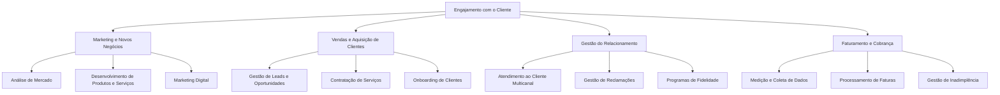

# Documentação de Business Capability: Engajamento com o Cliente (Nível 1)

Esta capacidade gerencia a jornada completa do cliente final, com foco especial na transição do consumidor passivo para o modelo de **prossumidor** (cliente que produz e consome sua própria energia via Geração Distribuída). Ela cobre as interações comerciais, faturamento, relacionamento de ouvidoria, processamento de faturas sob regras de compensação horária e atração de novas contas no Mercado Livre de Energia (ACL).

---

## 1. Arquitetura de Capacidades (Nível 1, 2 e 3)

De acordo com a taxonomia do **SAP LeanIX v4**, a camada de relacionamento e faturamento do cliente divide-se em:

---

## 2. Dicionário de Agentes de IA e Governabilidade de Dados

A tabela abaixo detalha as sugestões de agentes inteligentes focados em otimizar a experiência de atendimento e faturamento comercial:

| # | Capacidade de Nível 3 | Agente de IA Sugerido | Classificação do Agente | Inputs e Base de Conhecimento (Data Objects) | Saídas Esperadas (Outputs) |
|---|---|---|---|---|---|
| 17 | **Análise de Mercado** | Monitor de Inteligência de Mercado e Concorrência | No-code (Agent Designer) | Notícias do Setor de Energia, Movimentos Publicitários, Preços Públicos | Relatório de Tendências de Transição Energética, Análise de Diferenciação |
| 18 | **Desenvolvimento de Produtos** | Projetista de Produtos de Eficiência e Tarifas | No-code (Agent Designer) | Pesquisas de Preferências do Cliente, Perfis de Consumo (AMI) | Definições de Novos Planos Tarifários (Tarifa Branca), Serviços de Eficiência |
| 19 | **Marketing Digital** | Creative Campaign Asset Generator | No-code (Agent Designer) | Briefing de Campanha, Guias de Identidade Visual da Marca, Slogans | Copies Publicitários, Prompts Otimizados para Geração de Imagem |
| 20 | **Gestão de Leads** | Lead Scoring & Funnel Velocity Agent | Data Agent (Conversational Analytics) | Dados Cadastrais de Leads B2B, Volume de Consumo Projetado | Pontuação de Leads (Lead Scoring), Priorização do Pipeline do ACL |
| 21 | **Contratação de Serviços** | Services Procurement & SOW Manager | No-code (Agent Designer) | Briefing de Requisitos, Termos de Referência Padrão | Minutas de Escopos Técnicos (SOW) e Acordos de Nível de Serviço (SLA) |
| 22 | **Onboarding de Clientes** | Orquestrador de Onboarding Digital | No-code (Agent Designer) | Contratos Comerciais Assinados, Documentos Cadastrais de Clientes | Guia Passo a Passo de Ativação, Checklist de Validação Documental |
| 23 | **Atendimento ao Cliente** | Assistente de CX Conversacional | No-code (Agent Designer) | Histórico de Consumo, Logs de Interação Omnichannel, FAQs de Serviços | Respostas Rápidas a Dúvidas sobre Faturamento e Falta de Energia |
| 24 | **Gestão de Reclamações** | Ouvidoria & Ticket Router Inteligente | No-code (Agent Designer) | Tickets de Clientes, Transcrições de Ouvidoria, Classificações de Sentimento | Tickets Classificados por Gravidade, Roteamento para Áreas |
| 25 | **Programas de Fidelidade** | Analista de Retenção e Engajamento de Clientes | Data Agent (Conversational Analytics) | Coortes de Comportamento de Clientes, Histórico de Churn, Uso de Programas | Modelos Preditivos de Churn, Sugestões de Campanhas de Retenção |
| 26 | **Medição e Coleta de Dados** | Validador de Telemetria e Medidores Inteligentes | ADK (Custom Agent) | Leituras de Medidores Inteligentes (AMI), Logs de Telemetria | Dados de Telemetria Validados (VEE), Alertas de Inconsistências |
| 27 | **Processamento de Faturas** | Calculador e Conciliador de Créditos e Faturas | Data Agent (Conversational Analytics) | Dados de Medição de Injeção e Consumo, Regras de Compensação (SCEE) | Cálculo de Créditos de Energia e Emissão de Faturas Transparentes |
| 28 | **Gestão de Inadimplência** | Dunning Communication & Credit Scorer Agent | Data Agent (Conversational Analytics) | Histórico de Atrasos, Perfil de Risco do Cliente, Réguas de Cobrança | Scripts de Cobrança com Ajuste de Tom Emocional, Priorização |

---

## 3. Exemplos Práticos de Uso de IA no Engajamento com o Cliente

### Cenário 1: Gestão Inteligente e Mitigação de Churn no ACL (Capacidade 2.3.3)
*   **Aplicação de IA:** **Analista de Retenção e Engajamento de Clientes (Data Agent)**.
*   **Exemplo de Uso:** O algoritmo analisa as variações de consumo e o histórico de renovação de contratos bilaterais de clientes industriais (B2B). Caso detecte um padrão de redução de demanda associado a interações com sentimentos negativos no CRM, o agente emite um alerta de risco de cancelamento ao gerente de contas chaves (Key Account Manager) e propõe uma oferta personalizada de tarifas baseada no perfil histórico do cliente.

### Cenário 2: Faturamento do Prossumidor - Microgeração Distribuída (Capacidade 2.4.2)
*   **Aplicação:** **Calculador e Conciliador de Créditos e Faturas (Data Agent)**.
*   **Exemplo de Uso:** O agente processa a curva de carga bidirecional enviada síncronamente pela plataforma AMI. Ele valida os créditos de geração excedente injetados na rede pelo prossumidor, calcula as deduções tarifárias (TUSD/TE) e emite a fatura detalhada e transparente contendo a memória de cálculo de abatimentos aplicada, salvando o arquivo estruturado diretamente no sistema comercial (CIS).

---

## Citations
1. [APQC Process Classification Framework for Utilities] - Estruturação de processos comerciais de faturamento (Meter-to-Cash) e atendimento no setor elétrico.
2. [Gemini Enterprise for Customer Experience (CX) Architecture Guidelines] - Padrões de suporte e faturamento de soluções de valor agregado.
