# Documentação de Business Capability: Corporativo e Suporte ao Negócio (Nível 1)

Esta capacidade constitui a base administrativa, tecnológica, jurídica e de suprimentos que sustenta as atividades finalísticas da companhia. Ela foca em garantir eficiência operacional, conformidade regulatória perante os órgãos reguladores (ANEEL, ONS, CCEE) e o suporte tecnológico essencial para a convergência das redes de TI (Corporativa) e TO (Tecnologia da Operação).

---

## 1. Arquitetura de Capacidades (Nível 1, 2 e 3)

De acordo com a taxonomia do **SAP LeanIX v4**, a camada corporativa é dividida nas seguintes sub-capacidades estruturais:

```mermaid
graph TD
    BC1[Corporativo e Suporte ao Negócio]
    
    BC1 --> BC2_1[Gestão Estratégica e Financeira]
    BC1 --> BC2_2[Gestão de Pessoas e Cultura]
    BC1 --> BC2_3[Gestão Jurídica e de Compliance]
    BC1 --> BC2_4[Gestão de TI]
    BC1 --> BC2_5[Gestão da Cadeia de Suprimentos]
    
    BC2_1 --> BC3_11[Planejamento Estratégico]
    BC2_1 --> BC3_12[Gestão de Portfólio de Investimentos]
    BC2_1 --> BC3_13[Contabilidade e Fechamento]
    BC2_1 --> BC3_14[Gestão de Tesouraria]
    
    BC2_2 --> BC3_21[Aquisição de Talentos]
    BC2_2 --> BC3_22[Treinamento e L&D]
    BC2_2 --> BC3_23[Remuneração e Benefícios]
    BC2_2 --> BC3_24[Experiência do Colaborador]
    
    BC2_3 --> BC3_31[Gestão de Contratos]
    BC2_3 --> BC3_32[Conformidade Regulatória]
    BC2_3 --> BC3_33[Risco Corporativo]
    
    BC2_4 --> BC3_41[Arquitetura de TI e Dados]
    BC2_4 --> BC3_42[Segurança Cibernética TI/OT]
    BC2_4 --> BC3_43[Infraestrutura e Nuvem]
    
    BC2_5 --> BC3_51[Gestão de Fornecedores]
    BC2_5 --> BC3_52[Compras Estratégicas]
    BC2_5 --> BC3_53[Estoques e Logística]
```

---

## 2. Dicionário de Agentes de IA e Governabilidade de Dados

A tabela abaixo descreve as sugestões de agentes de IA para cada capacidade de Nível 3, mapeando seus padrões arquiteturais, dados de entrada (com base em nosso dicionário de **Data Objects**) e resultados esperados:

| # | Capacidade de Nível 3 | Agente de IA Sugerido | Classificação do Agente | Inputs e Base de Conhecimento (Data Objects) | Saídas Esperadas (Outputs) |
|---|---|---|---|---|---|
| 1 | **Planejamento Estratégico** | Diretor de Estratégia e Metas de Transição | No-code (Agent Designer) | Diretrizes de Transição Energética (3Ds), Planos Plurianuais, Benchmarks de Mercado | Relatório de Metas Estratégicas, Planos de Ação e Diagnóstico de Gaps |
| 2 | **Gestão de Portfólio de Investimentos** | Modelador de Cenários e Portfólio CAPEX | Data Agent (Conversational Analytics) | Projetos de CAPEX, Modelos Financeiros, WACC, Estimativas de LCOE | Simulações de Fluxo de Caixa Descontado (DCF), Ranking de Rentabilidade (VPL, TIR) |
| 3 | **Contabilidade e Fechamento Financeiro** | Close Checklist Orchestrator & Anomalias | Data Agent (Conversational Analytics) | Razão Contábil, Balancetes de Verificação, Lançamentos Diários | Alertas de Lançamentos Anômalos, Checklist de Fechamento Mensal |
| 4 | **Gestão de Tesouraria** | Previsor de Liquidez e Fluxo de Caixa | Data Agent (Conversational Analytics) | Saldos Bancários, Contas a Pagar/Receber, Projeções de Faturamento | Previsões de Fluxo de Caixa, Alertas de Liquidez de Curto Prazo |
| 5 | **Aquisição de Talentos** | Tech Recruiter & Resume Screener | No-code (Agent Designer) | Currículos (PDF), Perfis de Cargos, Critérios de Avaliação | Parecer de Aderência Candidato-Vaga, Roteiro de Entrevista Técnica |
| 6 | **Desenvolvimento e Treinamento** | Curador de Trilhas de Aprendizado e L&D | No-code (Agent Designer) | Matriz de Habilidades, Catálogo de Cursos Corporativos, Planos de Carreira | Recomendações de Trilhas de Estudo, Planos de Desenvolvimento (PDI) |
| 7 | **Remuneração e Benefícios** | Benefits Assistant & Total Rewards Advisor | No-code (Agent Designer) | Manuais de Benefícios, Políticas de Total Rewards, Acordos Coletivos | Checklists de Solicitação (Reembolso, Licenças), Respostas a Dúvidas |
| 8 | **Gestão de Contratos** | Contract Compliance & Clause Auditor | No-code (Agent Designer) | Minutas Contratuais, Modelos de Contratos, Diretrizes de Compliance | Relatório de Riscos Contratuais (Redline), Alertas de Cláusulas Abusivas |
| 9 | **Conformidade Regulatória** | Monitor de Mudanças Regulatórias ANEEL | No-code (Agent Designer) | Diário Oficial da União, Resoluções da ANEEL, Despachos do ONS | Relatório de Impacto Regulatório, Alertas de Mudanças e Obrigações Legais |
| 10 | **Gestão de Risco Corporativo** | Avaliador de Riscos e Resiliência Operacional | Data Agent (Conversational Analytics) | Inventário de Riscos, Diretrizes ESG, Registros de Não-Conformidades | Relatório Consolidado de Risco Operacional e Planos de Mitigação |
| 11 | **Arquitetura de TI e de Dados** | System Dependency Mapper & API Governance | ADK (Custom Agent) | Catálogos de APIs, Diagramas de Arquitetura, Repositórios Git | Mapa de Dependências Sistêmicas, Relatório de Conformidade de TI |
| 12 | **Segurança Cibernética (TI/OT)** | SIEM Alert Triage & Defender TI/OT | ADK (Custom Agent) | Logs de Acesso a Servidores, Logs de Redes SCADA/TO, Alertas SIEM | Triagem de Alertas de Segurança, Alertas de Comportamento Anômalo |
| 13 | **Gestão de Infraestrutura de TI** | Cloud Cost Optimizer & IaC Drift Detector | ADK (Custom Agent) | Faturas de Provedores Cloud, Configurações de IaC, Telemetria de Servidores | Recomendações de Otimização de Custos (FinOps), Alertas de Desvios IaC |
| 14 | **Gestão de Fornecedores** | Supplier Scorecard & Performance Analyzer | Data Agent (Conversational Analytics) | Dados de Homologação, Histórico de Entregas, Questionários de Qualidade | Scorecards de Performance de Fornecedores, Ranking e Parecer de Homologação |
| 15 | **Compras Estratégicas (Procurement)** | RFx Builder & Sourcing Orchestrator | No-code (Agent Designer) | Memorial Descritivo Bruto, Requisições de Compras, Histórico de Licitações | Editais de Licitação Estruturados (RFI/RFP/RFQ), Templates de Proposta |
| 16 | **Gestão de Estoques e Logística** | MRO Inventory & Logistics Optimizer | Data Agent (Conversational Analytics) | Níveis de Estoque de MRO, Dados de Demanda Histórica, Lead Time de Peças | Sugestões de Reposição de Estoque, Planos de Abastecimento Regional |

---

## 3. Exemplos Práticos de Uso de IA no Suporte Corporativo

### Cenário 1: Auditoria Regulatória de Compras e Sourcing (Capacidade 1.5.2)
*   **Aplicação de IA:** **RFx Builder & Sourcing Orchestrator (No-code / Agent Designer)**.
*   **Exemplo de Uso:** O engenheiro de suprimentos fornece uma descrição técnica básica e informal em linguagem natural sobre a necessidade de comprar transformadores de distribuição reserva. O agente analisa o histórico de editais, formata o documento seguindo as diretrizes da Lei nº 14.133/2021, garante termos neutros para livre concorrência de fabricantes e gera o edital definitivo (RFP/RFQ) em formato PDF.

### Cenário 2: SOC Inteligente para Convergência TI/OT (Capacidade 1.4.2)
*   **Aplicação:** **SIEM Alert Triage & Defender TI/OT (ADK / Custom Agent)**.
*   **Exemplo de Uso:** Operando na borda entre a rede de TI corporativa e os barramentos de TO de subestações de alta tensão, o agente intercepta logs de switches e tráfego de rede SCADA (protocolo DNP3). Ele correlaciona anomalias de conexões e, caso detecte um padrão indicativo de brute-force ou ataque lateral, gera uma ação síncrona isolando as portas lógicas e enviando um alerta crítico de prioridade máxima ao CISO da empresa.

---

## Citations
1. [Resolução Normativa ANEEL nº 964/2021] - Estabelece as obrigatoriedades de conformidade regulatória e adoção de políticas de cibersegurança cibernética no setor elétrico.
2. [SAP LeanIX Best Practices for Business Capability Modeling] - Diretrizes de mapeamento de capacidades corporativas de suporte.
