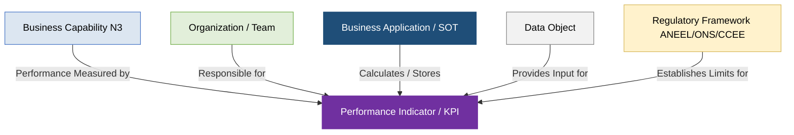

# Catálogo Unificado de Indicadores de Desempenho - Setor Elétrico Brasileiro (Padrão SAP LeanIX v4)

Este documento estabelece o **Catálogo Mestre de Indicadores de Desempenho (KPIs e Métricas)** da **PowerUp OKC (Open Knowledge Catalog)**. Toda a modelagem e mapeamento de relações segue estritamente as melhores práticas globais do metamodelo da **SAP LeanIX v4** aplicadas à indústria de utilities elétricas, conectando as dimensões estratégicas, organizacionais, de dados e tecnológicas.

---

## 1. Diretrizes de Governança de Indicadores no SAP LeanIX v4

De acordo com as boas práticas de Arquitetura Empresarial (EA), os indicadores e métricas não devem ser tratados como silos isolados de BI. No SAP LeanIX v4, a governança operacional é ativada por meio das seguintes conexões e metadados:

*   **Relação com Business Capabilities (Nível 3):** Cada indicador mede explicitamente a performance e eficácia de uma capacidade de negócio específica (ex: *Qualidade do Serviço - DEC/FEC* mapeado para a capacidade de *Operação da Rede de Distribuição*).
*   **Associação de Ownership (Organizations):** Define-se a unidade de negócio (*Business Unit*) ou equipe (*Team*) responsável pelo acompanhamento e cumprimento do limite regulatório (ex: *COD* para DEC/FEC, *Mesa de Trading* para VaR, *Controladoria* para adimplemento de ativos).
*   **Linhagem de Tecnologia (Applications):** Identifica a aplicação transacional core (*System of Record/Operation*) responsável pelo cálculo mestre ou coleta oficial do indicador (SOT - *System of Truth*).
*   **Conformidade e Dados (Data Objects):** Especifica quais objetos de dados lógicos são utilizados como entrada (*inputs*) para o processamento do indicador.
*   **Limites e Padrões Regulatórios (ANEEL/ONS/CCEE):** Alinha os indicadores aos parâmetros vigentes exigidos nos Procedimentos de Distribuição (PRODIST Módulo 8), Procedimentos de Rede do ONS ou Procedimentos de Comercialização da CCEE.

---

## 2. Tabela Unificada de Indicadores de Desempenho (TI & TO)

Abaixo está o catálogo unificado consolidando os principais indicadores de desempenho regulatórios e operacionais da indústria de energia elétrica brasileira:

| ID | Nome do Indicador | Sigla | Domínio (Nível 1) | Unidade | Limite / Padrão Regulatório | Descrição / Metodologia de Medição | Business Capability Associada (Nível 3) | Application de Suporte / SOT | Equipe Responsável (LeanIX Who) | Data Object de Entrada |
| :--- | :--- | :--- | :--- | :--- | :--- | :--- | :--- | :--- | :--- | :--- |
| **IND-001** | Duração Equivalente de Interrupção por UC | **DEC** | Qualidade do Serviço (Distribuição) | Horas (anual) | Definido por conjunto pela ANEEL | Tempo médio de interrupção individual por consumidor faturado em longa duração (>= 3 minutos). | cap-l3-operacao-da-rede-de-distribuicao | ADMS (OMS) | COD (Centro de Operações) | Evento de Interrupção (DEC/FEC) |
| **IND-002** | Frequência Equivalente de Interrupção por UC | **FEC** | Qualidade do Serviço (Distribuição) | Interrupções | Definido por conjunto pela ANEEL | Frequência média de interrupções de longa duração por consumidor faturado no conjunto. | cap-l3-operacao-da-rede-de-distribuicao | ADMS (OMS) | COD (Centro de Operações) | Evento de Interrupção (DEC/FEC) |
| **IND-003** | Duração de Interrupção Individual | **DIC** | Qualidade do Serviço (Distribuição) | Horas | Limite mensal do consumidor (Anexo 8.B) | Tempo total de interrupção de longa duração sofrido individualmente por uma unidade consumidora. | cap-l3-processamento-de-faturas | CIS / Billing | Dept. de Faturamento / CRM | Leitura de Medição, Fatura |
| **IND-004** | Frequência de Interrupção Individual | **FIC** | Qualidade do Serviço (Distribuição) | Interrupções | Limite mensal do consumidor (Anexo 8.B) | Quantidade total de interrupções de longa duração sofridas individualmente pelo consumidor. | cap-l3-processamento-de-faturas | CIS / Billing | Dept. de Faturamento / CRM | Leitura de Medição, Fatura |
| **IND-005** | Duração Máxima de Interrupção Contínua | **DMIC** | Qualidade do Serviço (Distribuição) | Horas | Limite mensal do consumidor (Anexo 8.B) | Maior duração de uma única interrupção contínua sofrida individualmente pelo consumidor no mês civil. | cap-l3-processamento-de-faturas | CIS / Billing | Dept. de Faturamento / CRM | Leitura de Medição, Fatura |
| **IND-006** | Duração de Interrupção em Dia Crítico | **DICRI** | Qualidade do Serviço (Distribuição) | Horas | 8h (Urbana) ou 21h/24h (Não Urbana) | Tempo total de interrupção ocorrido individualmente na UC durante a ocorrência de um Dia Crítico. | cap-l3-operacao-da-rede-de-distribuicao | ADMS (OMS) | COD (Centro de Operações) | Evento de Interrupção (DEC/FEC) |
| **IND-007** | Duração de Interrupção em Emergência | **DISE** | Qualidade do Serviço (Distribuição) | Horas | 24h (Urbana) ou 48h (Não Urbana) | Duração total de interrupção ocorrida individualmente em Situação de Emergência oficial declarada. | cap-l3-operacao-da-rede-de-distribuicao | ADMS (OMS) | COD (Centro de Operações) | Evento de Interrupção (DEC/FEC) |
| **IND-008** | Duração Relativa da Transgressão de Tensão Precária | **DRP** | Qualidade do Produto (Distribuição) | % | Máximo: 3.0% | Percentual de tempo em que a tensão esteve na faixa precária (amostragem de 1.008 leituras de 10 minutos). | cap-l3-gestao-de-perdas | Oracle MDM | Dept. de Faturamento / COD | Leitura de Medição, Evento VEE |
| **IND-009** | Duração Relativa da Transgressão de Tensão Crítica | **DRC** | Qualidade do Produto (Distribuição) | % | Máximo: 0.5% | Percentual de tempo em que a tensão esteve na faixa crítica, gerando compensações graves se violado. | cap-l3-gestao-de-perdas | Oracle MDM | Dept. de Faturamento / COD | Leitura de Medição, Evento VEE |
| **IND-010** | Fator de Desequilíbrio de Tensão | **FD95%** | Qualidade do Produto (Distribuição) | % | 3.0% (Vn<=2.3kV) / 2.0% (>2.3kV) | Desbalanceamento das amplitudes trifásicas superado em apenas 5% das leituras. | cap-l3-operacao-da-rede-de-distribuicao | ADMS (SCADA) | COD (Centro de Operações) | Status e Alarmes (SCADA) |
| **IND-011** | Distorção Harmônica Total de Tensão | **DTT95%** | Qualidade do Produto (Distribuição) | % | 10.0% (Vn<=2.3kV) / 8.0% (MT) | Deformação acumulada da onda de tensão em relação à senóide fundamental (múltiplas harmônicas). | cap-l3-operacao-da-rede-de-distribuicao | ADMS (SCADA) | COD (Centro de Operações) | Status e Alarmes (SCADA) |
| **IND-012** | Frequência Equivalente de Reclamação por 1.000 UCs | **FER** | Qualidade Comercial (Distribuição) | Reclamações / 1.000 UCs | Definido pelo grupo de distribuidoras | Frequência com que são registradas reclamações procedentes a cada 1.000 unidades faturadas. | cap-l3-gestao-de-reclamacoes | CRM | Atendimento e Relacionamento | Reclamação de Cliente, Tickets |
| **IND-013** | Duração Equivalente de Reclamação | **DER** | Qualidade Comercial (Distribuição) | Horas | Parâmetro de monitoramento | Tempo médio ponderado para que a distribuidora apresente a solução definitiva para reclamações. | cap-l3-gestao-de-reclamacoes | CRM | Atendimento e Relacionamento | Reclamação de Cliente, Tickets |
| **IND-014** | Nível de Serviço do Teleatendimento | **INS** | Qualidade Comercial (Distribuição) | % | INS >= 85% em até 30s | Razão entre chamadas atendidas em até 30 segundos e o total de chamadas recebidas pelas centrais. | cap-l3-atendimento-ao-cliente-multicanal | CRM | Atendimento e Relacionamento | Reclamação de Cliente, Tickets |
| **IND-015** | Desempenho Global de Continuidade | **DGC** | Qualidade do Serviço (Distribuição) | Índice | Menor ou igual a 1.0 | Índice anual comparativo que consolida DEC/FEC contra metas para o Ranking de Continuidade da ANEEL. | cap-l3-conformidade-regulatoria | BI / ERP | Tarifas e Receita | Evento de Interrupção, Faturas |
| **IND-016** | Inadimplência de Faturamento | **Inadimplência** | Comercial / Financeiro (Distribuição) | % | Limite interno de TCO | Monitoramento do atraso de pagamentos (Aging List) em relação ao faturamento bruto total. | cap-l3-gestao-de-inadimplencia | CIS / FI-CA | Faturamento e Cobrança | Pagamento, Contas a Receber |
| **IND-017** | Percentual de Perdas Não Técnicas | **Perdas** | Distribuição / Comercial | % | Limite regulatório definido ANEEL | Diferença entre a perda total medida e a perda técnica simulada (furtos, fraudes e desvios). | cap-l3-gestao-de-perdas | Oracle MDM / GIS | Faturamento e Cobrança / COD | Balanço de Energia, Perdas Técnicas |
| **IND-018** | Disponibilidade Física por Unidade Geradora | **DISPF** | Operacional de Geração (G&T) | % | Base contratual / ONS | Mede a disponibilidade de tempo ativo operacional para geração de energia de cada UGE instalada. | cap-l3-operacao-de-usinas | GMS | Centro de Operações (COG) | Dados de Geração em Tempo Real |
| **IND-019** | Taxa Equivalente de Indisponibilidade Forçada | **TEIFa** | Operacional de Geração (G&T) | % | Padrão regulatório ONS | Taxa equivalente de tempo em que a usina de despacho centralizado ficou indisponível por falha. | cap-l3-manutencao-de-ativos-de-geracao | GMS / SAGER | Centro de Operações (COG) | Dados de Geração, OMs |
| **IND-020** | Taxa de Indisponibilidade Programada | **TEIP** | Operacional de Geração (G&T) | % | Padrão regulatório ONS | Percentual de tempo em que a usina de despacho centralizado ficou inativa devido a paradas planejadas. | cap-l3-manutencao-de-ativos-de-geracao | GMS / SAGER | Centro de Operações (COG) | Dados de Geração, OMs |
| **IND-021** | Disponibilidade de Linhas de Transmissão | **DISP (LT)** | Operacional de Transmissão (G&T) | % | Metas contratuais ANEEL | Taxa de disponibilidade de tempo operativo das LTs de Rede Básica de alta tensão (>= 230kV). | cap-l3-manutencao-de-linhas-e-subestacoes | EMS / EAM | Centro de Transmissão (COT) | Linha de Transmissão (LT), OMs |
| **IND-022** | Controle de Carregamento de Transformadores | **CCAT** | Confiabilidade de Transmissão | % ou Amperes | Limite térmico do transformador | Monitoramento contínuo da corrente operativa de transformadores de Rede Básica para evitar sobrecarga. | cap-l3-operacao-do-sistema-de-transmissao | EMS | Centro de Transmissão (COT) | Transformador (Equipamento) |
| **IND-023** | Controle de Carregamento de LTs | **CCAL** | Confiabilidade de Transmissão | % ou Amperes | Ampacidade física do condutor | Monitoramento do carregamento e ampacidade física das LTs para evitar sobrecarga térmica de cabos. | cap-l3-operacao-do-sistema-de-transmissao | EMS | Centro de Transmissão (COT) | Linha de Transmissão (LT) |
| **IND-024** | Desempenho da Frequência em Regime Permanente | **DFP** | Qualidade de Energia (Sistêmico) | % de tempo | Faixa operacional: 59.9Hz a 60.1Hz | Monitoramento contínuo da estabilidade de frequência elétrica de regime permanente no SIN. | cap-l3-operacao-do-sistema-de-transmissao | EMS | Centro de Transmissão (COT) | Fluxo de Potência (Transmissão) |
| **IND-025** | Pontualidade de Providências pós-Distúrbios | **PCPA** | Processos Operacionais (ONS) | % de metas | Prazo regulatório do ONS | Percentual de conformidade e pontualidade no atendimento às recomendações emitidas após distúrbios. | cap-l3-conformidade-regulatoria | ServiceNow | Regulação e Mercado | Lançamento (Release), Mudança |

---

## 3. Alinhamento com a Metodologia de Tomada de Decisão (Gartner TIME)

A integração desse portfólio de indicadores com a governança de software (TIME - *Tolerate, Invest, Migrate, Eliminate*) permite correlacionar o desempenho de negócios à eficiência tecnológica:

1.  **INVEST (Investir - Ex: MDM e ADMS):** Se os indicadores **IND-017 (Perdas Não Técnicas)** ou **IND-001 (DEC)** estiverem fora dos limites regulatórios, o comitê de tecnologia prioriza orçamento e investimentos de expansão nas plataformas correspondentes para modernização e automação inteligente (ex: algoritmos avançados de detecção de desvios AMI).
2.  **TOLERATE (Tolerar - Ex: Ferramentas de Simulação Offline):** Se os indicadores operacionais se mantêm estáveis e os custos de manutenção são baixos, as aplicações correspondentes são mantidas sem alteração de arquitetura.
3.  **MIGRATE (Migrar - Ex: ERP / CIS Legado):** Se a apuração do **IND-016 (Inadimplência)** ou os fechamentos contábeis de ativos regulados estiverem sofrendo com atrasos devido ao desempenho lento de bases de dados obsoletas, aprova-se o projeto de migração dos sistemas tradicionais core para infraestruturas modernas de nuvem (SaaS).
4.  **ELIMINATE (Eliminar - Ex: Sistemas em Silo):** Caso duas Business Units utilizem sistemas distintos e redundantes que causam divergências em reportes de indicadores (ex: dados parciais de carregamento térmico), uma das ferramentas é eliminada, unificando a SOT (Sistema da Verdade) no barramento corporativo.

---

### # Citações e Referências Normativas

1.  **PRODIST Módulo 8 (Qualidade do Fornecimento de Energia Elétrica - ANEEL):** Rege as metodologias de cálculo de DEC, FEC, DIC, FIC, DMIC, DRP e DRC das distribuidoras brasileiras.
2.  **Procedimentos de Rede do ONS (Módulo 9 - Avaliação do Desempenho Operativo):** Estabelece os requisitos de cálculo de disponibilidade física de geradores (DISPF), indisponibilidade (TEIFa, TEIP) e carregamento térmico de ativos do SIN.
3.  **Manual de Contabilidade do Setor Elétrico (MCSE - ANEEL):** Dispõe sobre o controle patrimonial, apropriação de despesas de O&M e unitização contábil regulatória na Base de Remuneração (BRR).
