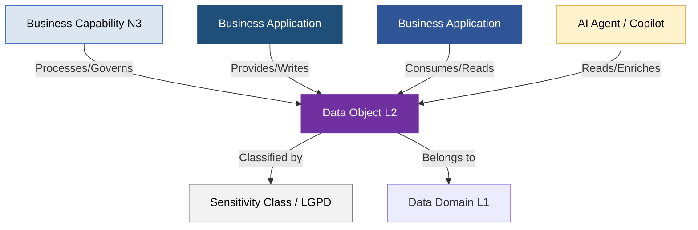

# Guia de Governança e Arquitetura de Dados (Data Objects) — Raiz do Portfólio de Dados (PowerUp OKC)

Este documento atua como o manual mestre e portal de governança para o diretório `/data-objects/` da **PowerUp Open Knowledge Catalog (PowerupOKC)**. Ele unifica e governa os catálogos de **Dados Estruturados** e **Dados Não Estruturados (Bases de Conhecimento)**, modelados em estrito alinhamento com as diretrizes do **SAP LeanIX v4** e as especificações de portabilidade do padrão **Open Knowledge Format (OKF) v0.1**.

No contexto do Setor Elétrico Brasileiro, a correta modelagem lágica e o isolamento de conceitos de dados em relação às suas implementações físicas de infraestrutura representam uma barreira crítica de segurança e uma premissa indispensável para a governança de TI corporativa, cibersegurança de Tecnologia da Operação (TO) e conformidade regulatória (ANEEL, ONS, CCEE, LGPD).

---

## 1. Princípios de Modelagem de Dados no Metamodelo SAP LeanIX v4

Seguindo as melhores práticas globais de Enterprise Architecture, o catálogo de dados da PowerUp é governado por cinco pilares metodológicos fundamentais:



1. **Hierarquia Enxuta (Breadth over Depth):** Recomenda-se modelar objetos de dados em uma hierarquia de no máximo 2 níveis (Nível 1: Domínio de Dados; Nível 2: Objeto de Dados Conceitual) para evitar complexidade excessiva de manutenção cadastral no inventário.
2. **Estabilidade a Longo Prazo:** Os objetos de dados representam conceitos abstratos de negócio e devem permanecer estáveis ao longo do tempo, independentemente de reestruturações organizacionais ou alterações de sistemas de TI ou TO. Termos como "Unidade Consumidora" ou "Contrato de Fornecimento" persistem mesmo se a distribuidora migrar de um ERP ou CIS específico para outro.
3. **Único Sistema da Verdade (System of Truth - SOT):** Cada objeto de dados deve possuir apenas uma única aplicação canônica de origem autoritativa cadastrada. No LeanIX, isso é modelado vinculando o objeto com a relação de escrita/criação ("Provides" ou "Writes") ao seu respectivo sistema, enquanto as demais aplicações que apenas o leem utilizam a relação de consumo ("Consumes" ou "Reads").
4. **Foco no Valor de Negócio (Abstração):** O repositório de arquitetura não atua como uma ferramenta de Data Lineage físico ou banco de dados CMDB detalhado. Os objetos devem refletir termos conceituais claros e familiares ao negócio (ex: "Fatura", "Leitura de Medição" ou "Ativo Regulatório"), evitando o antipadrão de importar tabelas lógicas, views SQL ou colunas físicas individuais como Fact Sheets.
5. **Harmonização e Conformidade Regulatória:** No setor elétrico brasileiro, os dados de automação de rede (SIN/SCADA), cadastro técnico georreferenciado (BDGD/ANEEL) e mercado (CCEE) devem ser mapeados em conjunto com a retaguarda corporativa (ERP), garantindo a consistência na apuração de perdas, qualidade de fornecimento (DEC/FEC) e unitização física na Base de Remuneração Regulatória (BRR).

---

## 2. Taxonomia Geral do Portfólio de Dados (Structured vs. Unstructured)

O catálogo de dados da PowerUp é logicamente dividido em dois grandes eixos físicos, otimizando o seu consumo por sistemas especialistas corporativos, analistas de negócios e novos agentes cognitivos de IA (RAG e barramentos Tooling):

```text
powerup-okc/
└── data-objects/
    ├── README.md                      # Este arquivo (Manual Mestre Raiz)
    │
    ├── structured/                    # Catálogo de Dados Estruturados (Dicionário Lógico)
    │   ├── README-DADOS-ESTRUTURADOS.md # Manual específico de engenharia estruturada e CRUD
    │   ├── do-101-ativo-tecnico.md
    │   ├── do-102-modelo-topologico.md
    │   └── ... (DO-101 a DO-181: Modelos de tabelas e esquemas elétricos)
    │
    └── unstructured/                  # Catálogo de Dados Não Estruturados (Bases de Conhecimento)
        ├── README-DADOS-NAO-ESTRUTURADOS.md # Manual específico de RAG e acervos normativos
        ├── doc-prodist-aneel.md
        ├── doc-procedimentos-rede-ons.md
        └── ... (DO-201 a DO-223: Documentos técnicos, leis e roteiros de atendimento)
```

### A. Catálogo de Dados Estruturados (`/data-objects/structured/`)
Este diretório rege o **Dicionário Lógico de Dados e Atributos Técnicos** que circulam nos barramentos de API, mensagens síncronas de integração de sistemas de TI/TO, views de BigQuery e cadastros patrimoniais transacionais.
* **Escopo:** Compreende os **81 Objetos de Dados Detalhados** do setor elétrico mapeados sob os blocos de IDs **`DO-101` a `DO-181`** (Ativo Técnico, Local de Instalação, Unidade Consumidora, Leitura de Medição, Contrato de Compra e Venda, Lançamento Contábil, Elemento PEP, etc.).
* **Estrutura Técnica por Arquivo:** Cada especificação OKF individual mapeia metadados LeanIX em YAML frontmatter, descrição de escopo elétrico regulatório, sistema da verdade canônico (SOT/Provides), dicionário detalhado de campos lógicos com tipagem de barramento e um payload de exemplo em JSON.
* **Acesse o detalhamento completo em:** `[/data-objects/structured/README-DADOS-ESTRUTURADOS.md]`

### B. Catálogo de Dados Não Estruturados (`/data-objects/unstructured/`)
Este diretório governa o **Acervo Normativo, Manuais Técnicos e Bases de Conhecimento de Texto Livre** que orientam as tomadas de decisões humanas e alimentam os motores de busca semânticos da companhia (RAG - Retrieval-Augmented Generation).
* **Escopo:** Compreende as **23 Bases de Conhecimento Documentais** mapeadas sob os blocos de IDs **`DO-201` a `DO-223`** (Resoluções e Módulos do PRODIST da ANEEL, Procedimentos de Rede do ONS, Regras de Comercialização da CCEE, Manuais de Fabricantes de Transformadores, POPs e Instruções de Segurança de Campo NR-10, PPAs e Contratos de Financiamento Project Finance, etc.).
* **Estrutura Técnica por Arquivo:** Cada especificação OKF individual mapeia metadados LeanIX em YAML frontmatter, finalidade jurídica-operacional do acervo, linhagem com aplicações de gerenciamento eletrônico de documentos (SOT), barramento de metadados em JSON para indexação em vetorizadores de IA e referências regulatórias nacionais.
* **Acesse o detalhamento completo em:** `[/data-objects/unstructured/README-DADOS-NAO-ESTRUTURADOS.md]`

---

## 3. Integração de Processos e Linhagem Cruzada TI/OT

O verdadeiro valor estratégico do catálogo reside no cruzamento e rastreabilidade síncrona de linhagem de dados entre as camadas de TI corporativa, Clientes e TO de campo. Abaixo estão descritos os três fluxos unificados mais críticos descritos nos manuais específicos:

### A. Fluxo Comercial "Meter-to-Cash" (M2C) e Geração Distribuída
1. **Ingestão:** Curvas de carga brutas coletadas por medidores inteligentes em campo são ingeridas e carregadas inicialmente no barramento de medição inteligente (AMI/HES) como leitura bruta (`DO-145`).
2. **Qualificação:** O sistema **Oracle Utilities MDM (AP-012)** aplica as regras analíticas do motor VEE (*Validation, Estimation, and Editing*), detectando picos de consumo anômalos ou alarmes de violação física de tampa. Se houver falha, gera-se um `Evento VEE` (`DO-144`) para tratamento técnico; se válido, o dado é finalizado.
3. **Faturamento:** Os dados qualificados são transferidos ao faturamento comercial **SAP Utilities IS-U (AP-011)**. O CIS consulta os dados cadastrais do prossumidor de Geração Distribuída (GD) (`DO-134`), executa o rateio síncrono de créditos tarifários e emite a **Fatura de Energia (`DO-144`)** com a TUSD/TE reguladas e impostos.
4. **Cobrança e Arrecadação:** O faturamento registra o contas a receber (`DO-157`) na sub-razão financeira **SAP FI-CA**, integrando-o aos lançamentos contábeis (`DO-160`) do razão mestre. Em atraso de pagamento, réguas automáticas disparam propostas de cobrança e avisos no call center integrado ao **Salesforce CRM (AP-010)**, culminando síncronamente na emissão de uma **Ordem de Corte (`DO-150`)** despachada para o sistema de gestão de equipes de campo **Workforce Management (WFM)**.

### B. Manutenção Preventiva/Preditiva e Restabelecimento de Ativos de TO
1. **Monitoramento IoT:** Sensores industriais de temperatura e cromatografia de óleo mineral instalados em grandes transformadores de subestações enviam dados síncronos de sensoriamento IoT (`DO-104` / `DO-122`) ao barramento de manutenção preditiva (APM).
2. **Análise Preditiva:** Modelos de Inteligência Artificial analisam as curvas e identificam desgaste térmico prematuro ou acúmulo de gases, disparando automaticamente um alerta de anomalia crítica.
3. **Planejamento no EAM:** O alerta de falha iminente é transferido ao sistema **SAP Plant Maintenance PM (AP-014)**, criando uma Nota e convertendo-a síncronamente em uma **Ordem de Manutenção (`DO-125`)** contendo os procedimentos de reparo do fabricante (`DO-212`).
4. **Logística e Despacho de Campo:** O SAP PM consulta a disponibilidade do item no mestre de materiais (`DO-170`) e efetua a reserva de isoladores de substituição no **WMS/Almoxarifado (`DO-119`)**. Em campo, a atividade é despachada para o técnico via aplicativo móvel FSM integrados a rotas topográficas e coordenadas geográficas extraídas do sistema **GIS (AP-015)** (`DO-102`).

### C. Planejamento Financeiro, Projetos de Capital e Unitização (CAPEX/BRR)
1. **Orçamentação:** O planejamento de novos investimentos estratégicos de rede define os planos plurianuais de investimento (`DO-164`) no módulo **SAP PPM**.
2. **Gestão de Projetos:** Os planos são desdobrados em projetos físicos sob o controle do **SAP Project System PS (AP-001)**, gerenciando a execução por meio de **WBS Elements (Elementos PEP - `DO-163`)** de rede.
3. **Sourcing e Compras:** O Elemento PEP atua como o coletor orçamentário mestre, servindo de base para o time de compras abrir requisições (`DO-173`) e pedidos de compras (`DO-171` / `DO-172`) na plataforma **Coupa Spend Management (AP-008)**, envolvendo fornecedores homologados (`DO-168`).
4. **Capitalização e Unitização Regulatória:** Ao fechar fisicamente a obra em campo, os custos acumulados em AuC no PEP são liquidados para imobilizados em serviço na contabilidade societária IFRS (**SAP FI-AA - `DO-151`**). Paralelamente, o sistema executa a tradução síncrona dos componentes físicos para Unidades de Adição e Retirada (UAR) no módulo de avaliação regulatória da ANEEL, unitizando os valores e compondo oficialmente a **Base de Remuneração Regulatória (BRR - `DO-152`)** para remuneração tarifária nas revisões periódicas.

---

## 4. Classificação de Sensibilidade e Governança de Dados (LGPD)

O catálogo mestre aplica um modelo estrito de classificação de segurança e sensibilidade das informações para garantir conformidade contínua junto à Autoridade Nacional de Proteção de Dados (ANPD) e às exigências de cibersegurança cibernética industrial da ANEEL (REN 964):

| Classe de Sensibilidade | Descrição e Requisitos de Segurança | Exemplos de Data Objects do Catálogo |
| :--- | :--- | :--- |
| **Confidencial** | Informações estratégicas, financeiras societárias brutas e dados de infraestrutura crítica de Tecnologia da Operação (TO). Exige criptografia AES-256/TLS 1.3, controle estrito de acessos de rede e logs de auditoria SOC ativados. | Status SCADA (`DO-103`), Telemetria e Despacho ONS (`DO-119`), Lançamentos Contábeis Razão (`DO-160`), Logs de Redes do SOC (`DO-017`). |
| **Restrito** | Dados pessoais identificáveis (PII), faturamento de contas contrato comerciais e registros cadastrais ou de consumo individual de clientes protegidos sob a LGPD. | Unidade Consumidora (`DO-134`), Fatura de Energia (`DO-144`), Cadastro de Cliente Livre (`DO-007`), Currículos e Perfis (`DO-165`), Ouvidoria e Tickets (`DO-011`). |
| **Interno** | Dados operacionais proprietários, documentações lógicas, diagramas de rede e ativos de TI de uso restrito de empregados e prestadores de serviços de campo. | Modelo Topológico (`DO-102`), Ativo de TI CMDB (`DO-175`), Catálogo de APIs (`DO-118`), Inventário MRO (`DO-119`), Projetos de Engenharia (`DO-213`). |
| **Público** | Informações oficiais, leis, atos de outorgas, tabelas de referência de preços setoriais e resoluções normativas sem restrições de divulgação ou sigilo. | Preços de Liquidação PLD da CCEE (`DO-141`), Resoluções ANEEL (`DO-014`), PRODIST (`DO-202`), PRORET (`DO-203`), Estudos de Impacto EIA/RIMA (`DO-222`). |

---

## 5. Diretórios de Apoio e links Úteis do Catálogo

Para navegar de forma profunda pelas ramificações físicas do catálogo de dados, utilize os seguintes índices e manuais específicos publicados em seu painel Studio:

* **Índice Mestre de Relações e Especificações:** `[/data-objects/index-business-objects.md]` — Portal consolidado de caminhos estáveis absolutos para cada um dos markdown individuais do repositório.
* **Manual de Engenharia de Dados Estruturados:** `[/data-objects/structured/README-DADOS-ESTRUTURADOS.md]` — Manual focado em tabelas, CRUD, linhagem técnica e estruturas de campos lógicos.
* **Manual de Governança de Conhecimento Não Estruturado:** `[/data-objects/unstructured/README-DADOS-NAO-ESTRUTURADOS.md]` — Manual de focado em acervos documentais, indexação para inteligência artificial, conformidade e RAG regulatório.
* **Matriz Mestre de Organizações (Who):** `[/organizations/index-estrutura-organizacional.md]` — Índice mestre descrevendo as Legal Entities, Business Units e os papéis de propriedade de dados das equipes (Data Product Owners).

---

### # Citações e Referências de Enterprise Architecture
1. **Procedimentos de Rede do ONS (Submódulo 15.1)** - Estabelece os requisitos de intercâmbio de dados cadastrais e telemetrias operacionais síncronas entre concessionárias e o ONS.
2. **Resolução Normativa ANEEL nº 964/2021** - Requisitos e diretrizes de cibersegurança aplicadas à proteção de Tecnologia da Operação (TO) e infraestruturas elétricas críticas do SIN.
3. **Lei Geral de Proteção de Dados (Lei nº 13.709/2018 - LGPD)** - Dispõe sobre o tratamento de dados pessoais de consumo, faturamento e interações cadastrais de clientes comerciais e residenciais por agentes delegados de serviço público.
4. **SAP LeanIX best Practice Reference Model for Utilities** - Framework mestre para representação unificada de capacidades, sistemas core de registro (SOT) e dicionários lógicos de dados abstratos estáveis.
