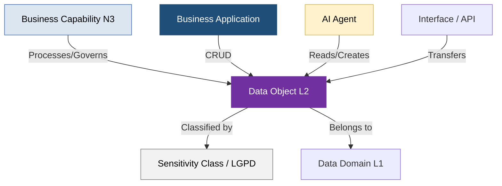

# Guia de Governança de Data Objects (Objetos de Dados) - Setor Elétrico (PowerUp OKC)

Este documento descreve o catálogo estruturado de **Data Objects (Objetos de Dados)** da **PowerUp Open Knowledge Catalog (PowerupOKC)**, modelado sob as diretrizes globais da **SAP LeanIX v4** e as particularidades regulatórias, operacionais e de conformidade do Setor Elétrico Brasileiro.

O objetivo deste guia é fornecer ao time de Arquitetura de Dados, Governança de TI/OT e Encarregados de Proteção de Dados (DPO) uma visão clara de como as entidades conceituais de dados (os **"Business/Data Objects"**) se relacionam com as capacidades de negócio, as aplicações tradicionais core e as novas soluções de Inteligência Artificial cognitivas.

---

## 1. Princípios de Modelagem de Dados no Metamodelo SAP LeanIX v4

Seguindo estritamente as melhores práticas de Enterprise Architecture, o catálogo de Data Objects adota os seguintes padrões de modelagem:

*   **Abstrato e Estável (Business-Centric):** Os Data Objects representam entidades de negócios abstratas e independentes de tecnologia física de armazenamento (como bancos de dados relacionais, NoSQL ou data lakes). Um objeto como `DO-010 Fatura de Energia` mantém-se estável ao longo de décadas, mesmo se a empresa migrar do SAP IS-U on-premises para o S/4HANA Utilities Cloud.
*   **Abordagem de Dois Níveis (Maturidade Metodológica):**
    *   **Nível 1 (Domínios de Dados):** Macro-agrupamentos lógicos correspondentes aos grandes vetores de informação da cadeia de utilidades (ex: Operações de Rede - TO, Comercial e Clientes, Corporativo e Suporte).
    *   **Nível 2 (Data Objects Conceituais):** As entidades de dados que fluem nos barramentos corporativos e de campo.
*   **Rastreabilidade e CRUD (Create, Read, Update, Delete):** Cada Data Object é mapeado em relação às aplicações de suporte técnico e de IA que os manipulam, permitindo análises detalhadas de linhagem de dados, redundância e governança de privacidade de dados (LGPD).



---

## 2. Inventário de Data Objects (Setor Elétrico)

O catálogo consolida os **20 Data Objects mestre** mapeados nas três grandes divisões lógicas da companhia, estabelecendo os donos, as capacidades que os utilizam e a classificação de sensibilidade da informação:

| ID | Objeto de Dados (Nível 2) | Domínio de Dados (Nível 1) | Descrição Técnica & Escopo no Setor Elétrico | Capacidades de Negócio Associadas | Sistemas e Agentes de IA Consumidores | Classificação de Risco (LGPD) |
| :--- | :--- | :--- | :--- | :--- | :--- | :--- |
| **DO-001** | Leituras de Telemetria (AMI) | Operações de Energia (OT) | Leituras de injeção e consumo em tempo real de medidores inteligentes de borda (AMI). | Medição e Coleta de Dados, Processamento de Faturas | Validador de Telemetria (ADK), Calculador de Faturas (Data Agent) | **Restrito (LGPD - Consumo)** |
| **DO-002** | Cadastro de Rede (GIS) | Operações de Energia (OT) | Modelagem topológica e geográfica de postes, cabos, transformadores e subestações. | Gestão de Dados da Rede, Manutenção de Equipamentos | Sincronizador de Dados da Rede e GIS (ADK), Suporte de Campo (No-code) | **Interno** |
| **DO-003** | Status e Alarmes (SCADA) | Operações de Energia (OT) | Estado físico operacional de chaves, disjuntores e religadores de subestações de alta/média tensão. | Operação da Rede, Operação do Sistema de Transmissão | Orquestrador de Outages (No-code), Controlador de Carga (ADK) | **Confidencial (Infraestrutura)** |
| **DO-004** | Dados de Sensores (IoT) | Operações de Energia (OT) | Leituras físicas de temperatura, vibração e cromaticidade de grandes transformadores e usinas. | Manutenção Preditiva, Manutenção de Ativos | Detector de Falhas Preditivas (ADK), Geração Maintenance Planner (No-code) | **Interno** |
| **DO-005** | Preço de Liquidação (PLD) | Operações de Energia (OT) | Preço horário publicado de forma síncrona pela CCEE para liquidação no mercado de curto prazo. | Análise de Mercado de Energia, Gestão de Risco | Previsor de PLD e Oferta de Energia (Data Agent), ETRM Systems | **Público** |
| **DO-006** | Dados Meteorológicos | Operações de Energia (OT) | Índices pluviométricos, vazão de bacias, velocidade dos ventos e irradiação solar projetada. | Operação de Usinas, Análise de Mercado de Energia | Previsor de PLD (Data Agent), Planejador Logístico de Insumos (Data Agent) | **Público** |
| **DO-007** | Cadastro de Cliente Livre | Clientes e Comercialização | Dados contratuais, cadastrais, CNPJ e limites de fornecimento de clientes B2B do mercado livre (ACL). | Onboarding de Clientes, Gestão de Leads | Lead Scoring Agent (Data Agent), Orquestrador de Onboarding (No-code) | **Restrito (LGPD - Cadastrais)** |
| **DO-008** | Cadastro de Prossumidor | Clientes e Comercialização | Dados técnicos e cadastrais do microgerador distribuído (solar) e regras de rateio de créditos de GD. | Onboarding de Clientes, Processamento de Faturas | Orquestrador de Onboarding (No-code), Calculador de Créditos (Data Agent) | **Restrito (LGPD - Cadastrais)** |
| **DO-009** | Histórico de Consumo e Geração | Clientes e Comercialização | Balanço acumulado de kWh consumido e injetado pelo prossumidor ao longo do ciclo faturado. | Processamento de Faturas, Atendimento ao Cliente | Calculador de Créditos (Data Agent), Assistente de CX (No-code) | **Restrito (LGPD - Consumo)** |
| **DO-010** | Fatura de Energia (CIS) | Clientes e Comercialização | Detalhamento da conta de luz com impostos (ICMS/PIS/COFINS), tarifas TUSD/TE e compensação GD. | Processamento de Faturas, Gestão de Inadimplência | Calculador de Faturas (Data Agent), Dunning & Credit Scorer (Data Agent) | **Restrito (LGPD - Financeiro)** |
| **DO-011** | Tickets e Ouvidoria | Clientes e Comercialização | Histórico de reclamações de falta de energia, erros de fatura, chats e ligações síncronas de clientes. | Atendimento Multicanal, Gestão de Reclamações | Ouvidoria & Ticket Router (No-code), Assistente CX Conversacional (No-code) | **Restrito (LGPD - Interações)** |
| **DO-012** | Lançamentos Contábeis | Corporativo e Suporte | Razão contábil, balancetes de verificação, despesas operacionais (OPEX) e investimentos (CAPEX). | Contabilidade e Fechamento, Gestão de Tesouraria | Close Checklist Orchestrator (Data Agent), Previsor de Liquidez (Data Agent) | **Confidencial (Financeiro)** |
| **DO-013** | Minutas e Contratos | Corporativo e Suporte | Contratos jurídicos de compras EPC, acordos de suprimentos, NDAs e PPAs de compra de energia. | Gestão de Contratos, Compras Estratégicas | Contract Compliance Auditor (No-code), Sourcing Orchestrator (No-code) | **Confidencial (Jurídico)** |
| **DO-014** | Resoluções da ANEEL | Corporativo e Suporte | Diretrizes regulatórias oficiais publicadas pela agência (REN 1000, REN 482) e procedimentos de rede ONS. | Conformidade Regulatória, Gestão de Risco | Monitor de Mudanças Regulatórias ANEEL (No-code) | **Público** |
| **DO-015** | Currículos e Perfis | Corporativo e Suporte | Registro de candidatos a vagas e matriz de cargos técnicos e de engenharia de campo. | Aquisição de Talentos, Treinamento | Tech Recruiter & Resume Screener (No-code), Curador de Trilhas L&D (No-code) | **Restrito (LGPD - PII)** |
| **DO-016** | Políticas de Benefícios | Corporativo e Suporte | Manuais internos de recursos humanos detalhando as regras de reembolsos, seguros de saúde e previdência. | Remuneração e Benefícios | Benefits Assistant (No-code), Pension & Investment Advisor (No-code) | **Interno** |
| **DO-017** | Logs de Acesso e SOC | Corporativo e Suporte | Logs de auditoria cibernética, tentativas de login em redes SCADA de subestações e servidores corporativos. | Segurança Cibernética (TI/OT), Gestão de TI | SIEM Alert Triage & Defender TI/OT (ADK), Cloud Cost Optimizer (ADK) | **Confidencial (Segurança)** |
| **DO-018** | Catálogo de APIs | Corporativo e Suporte | Documentação Swagger de integrações, esquemas de payloads lógicos e dependências de TI/OT. | Arquitetura de TI e de Dados | System Dependency Mapper & API Governance (ADK), Enterprise Architect | **Interno** |
| **DO-019** | Inventário MRO | Corporativo e Suporte | Níveis de estoque de componentes técnicos de campo, cabos de cobre, chaves bypass e postes de reserva. | Gestão de Estoques e Logística | MRO Inventory & Logistics Optimizer (Data Agent), Procurement Systems | **Interno** |
| **DO-020** | Cadastro de Fornecedores | Corporativo e Suporte | Certidões, histórico de performance, dados de compliance fiscal e notas de homologação de fornecedores. | Gestão de Fornecedores, Compras Estratégicas | Supplier Scorecard Analyzer (Data Agent), Coupa System | **Interno** |

---

## 3. Fluxos de Dados e Jornadas Integradas (Casos de Sucesso)

O valor prático do catálogo reside nas relações de CRUD cruzadas entre TI corporativo e TO operacional. Abaixo estão detalhados os três fluxos mais críticos em termos de governança de dados:

### A. Fluxo "Meter-to-Cash" e Jornada do Prossumidor (Geração Distribuída)

Este fluxo governa como os dados de consumo bidirecional são convertidos em receitas reguladas e faturados em conformidade com as regras fiscais de compensação:

```text
  [Medidor Físico] --(Dados Brutos: DO-001)--> [Oracle Utilities MDM] --(Limpeza VEE)--> [Leitura Validada]
                                                                                                |
                                                                                                v
  [Salesforce CRM] <----(Sincronização API: DO-008)------------------------------------ [SAP IS-U (CCS)]
         |                                                                                      |
   (Abre Caso)                                                                          (Gera DO-010: Fatura)
         |                                                                                      |
         v                                                                                      v
  [Workforce (FSM)] <---(Ordem Técnica de Ligação)-- [Sub-razão FI-CA] <--(Inadimplência)-- [DO-012: Contabilidade]
```

1.  **Ingestão da Telemetria:** Leituras brutas de injeção e consumo (`DO-001`) são ingeridas em lotes horários ou síncronos pelo **MDM**.
2.  **Validação VEE:** O MDM aplica as regras do motor VEE (*Validation, Estimation, and Editing*), gerando um `Evento VEE` caso identifique queda drástica na injeção (suspeita de defeito no inversor do prossumidor). Se o dado estiver dentro dos limites normativos, ele se torna uma **Leitura Finalizada**.
3.  **Processamento de Faturamento Comercial:** A leitura limpa é transferida para o **CIS (SAP IS-U)**. O sistema consulta as regras cadastrais do prossumidor (`DO-008`), calcula o saldo de créditos elétricos compensados e emite a **Fatura de Energia (`DO-010`)**.
4.  **Reconciliação e Cobrança:** A fatura é lançada na sub-razão financeira **FI-CA**, gerando um contas a receber integrado aos **Lançamentos Contábeis (DO-012)** do razão mestre. Em caso de atraso de pagamento, réguas de cobrança automatizadas disparam ordens de suspensão de fornecimento no barramento do sistema de gestão de equipes de campo (**FSM**).
5.  **Suporte Omnichannel:** O saldo de créditos acumulado, a fatura consolidada e o histórico de leituras são espelhados de forma síncrona na tela do **CRM (Salesforce)** sob o objeto **Caso (Case)**, permitindo que a equipe de atendimento ao prossumidor resolva contestações em tempo real.

### B. Manutenção de Campo Preditiva e Restabelecimento de Falhas de Rede (TI/OT)

Este fluxo representa a convergência física de Tecnologia da Operação (TO) e TI, na qual anomalias de sensores industriais disparam suprimentos logísticos e equipes de suporte móveis:

```text
  [Transformador de Subestação] --(Sensores: DO-004)--> [Predictive AI] --(Anomalia de Gases)--> [EAM: SAP PM]
                                                                                                      |
                                                                                              (Ordem de Manutenção)
                                                                                                      |
                                                                                                      v
  [eletricista de Campo] <--(Despacho FSM com Rotas GIS: DO-002)-- [WMS/MRO (DO-019)] <-----(Reserva de Isolador)
```

1.  **Monitoramento IoT:** Sensores de temperatura e cromatografia instalados no transformador enviam continuamente **Dados de Sensores (`DO-004`)** ao barramento de manutenção preditiva (Digital Twins).
2.  **Detecção de Falha Iminente:** Um algoritmo de Machine Learning analisa a curva de degradação e identifica superaquecimento crítico do óleo mineral, disparando um alerta de anomalia.
3.  **Planejamento no EAM:** O alerta é convertido automaticamente em uma **Nota de Manutenção** e, sequencialmente, em uma **Ordem de Manutenção** no **SAP PM (AP-018)**.
4.  **Reserva de Materiais (Logística):** A ordem de manutenção preditiva consulta o estoque de componentes sobressalentes e efetua de forma síncrona a reserva de um isolador de passagem correspondente no **WMS/MRO (`DO-019`)**.
5.  **Suporte ao Técnico de Campo:** A ordem técnica é integrada com a rota topográfica georreferenciada extraída do **GIS (`DO-002`)** e despachada para o aplicativo móvel do eletricista via sistema de **Field Service Management (ServiceNow FSM)**. Ao concluir a atividade, a ordem de manutenção é encerrada tecnicamente, alimentando o histórico de confiabilidade do ativo e debitando o isolador do estoque no ERP.

### C. Triagem e Mitigação de Incidentes de Cibersegurança Industrial

Este fluxo de governança de segurança assegura que incidentes de redes industriais de subestações (TO) sejam identificados e isolados sem impacto ao fornecimento elétrico:

1.  **Monitoramento de Logs:** Sensores de intrusion detection (IDS) em barramentos industriais de subestações alimentam continuamente o **SIEM** com **Logs de Redes e Acessos (`DO-017`)**.
2.  **Identificação de Comportamento Anômalo:** Um agente de IA focado em cibersegurança tria os alertas em tempo real e sinaliza uma tentativa de alteração de firmware não autorizada em um religador (CI de TO) vinda de um IP externo no horário de mudança de turno.
3.  **Validação de Perfil de Acesso:** O agente consulta síncronamente o **Catálogo de APIs e Dependências (`DO-018`)** e o repositório de identidade (**Microsoft Entra ID**) para checar se o IP pertence a um técnico ou contratado homologado ativo.
4.  **Mitigação Síncrona:** Ao constatar que o IP é desconhecido e o firmware violava as políticas da Resolução Normativa ANEEL nº 964, o agente emite uma **Ação Corretiva** no sistema de ITSM ServiceNow para isolar a porta de rede afetada na subestação e envia um alerta crítico para a equipe de cibersegurança e o CISO, evitando riscos de interrupção forçada da malha de transmissão.

---

## 4. Classificação de Sensibilidade e Governança de Dados (LGPD)

A classificação de sensibilidade aplicada aos Data Objects permite que o comitê de governança e segurança de dados execute o compliance rígido em conformidade com as exigências da Autoridade Nacional de Proteção de Dados (ANPD) e do Setor Elétrico Brasileiro:

```text
    [Confidencial]
    Exige criptografia em repouso e trânsito (TLS 1.3/AES-256) e auditoria de acessos de trilha.
    Ex: DO-003 Status SCADA (Segurança Nacional), DO-017 Logs do SOC, DO-012 Dados Financeiros.

    [Restrito]
    Dados vinculados a pessoas físicas (PII) ou consumo individual protegidos sob a LGPD.
    Ex: DO-001 Leituras AMI, DO-010 Faturas de Clientes, DO-015 Currículos e Contratos.

    [Interno]
    Dados proprietários da companhia para uso operacional das equipes e engenharia de campo.
    Ex: DO-002 Cadastro de Rede GIS, DO-019 Estoque MRO, DO-018 Catálogo de APIs.

    [Público]
    Informações regulatórias, meteorológicas ou de mercado livre liberadas de sigilo.
    Ex: DO-014 Resoluções ANEEL, DO-005 Preço PLD da CCEE, DO-006 Dados Meteorológicos.
```

O mapeamento exato de acessos e CRUD das tabelas em relação às Business Applications está catalogado e validado síncronamente na planilha **`organizacao-data-objects.xlsx`** disponível em seu painel **Studio** ao lado.

---

### # Citations

1.  **Procedimentos de Rede do ONS (Submódulo 15.1)** - Regula o intercâmbio de dados de telemetria em tempo real de Tecnologia da Operação (SCADA) para o controle síncrono de transmissão.
2.  **Resolução Normativa ANEEL nº 964/2021** - Estabelece os requisitos de segurança cibernética que as concessionárias de geração, transmissão e distribuição de energia devem cumprir para proteger a infraestrutura crítica.
3.  **Lei Geral de Proteção de Dados (Lei nº 13.709/2018 - LGPD)** - Dispõe sobre o tratamento de dados pessoais de consumo, faturamento e interações de clientes residenciais e comerciais nas concessionárias de utilidade pública.
