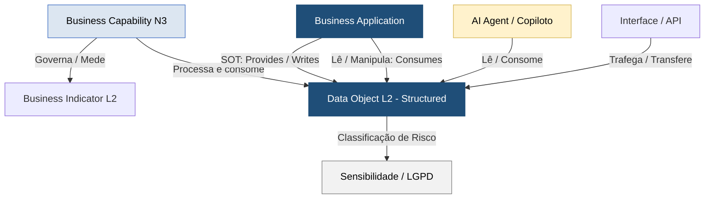

# Guia de Governança de Dados Estruturados — PowerUp OKC

Este documento constitui o manual de governança mestre e a especificação técnica para o **Catálogo de Dados Estruturados** da **PowerUp Open Knowledge Catalog (PowerupOKC)** [517]. Ele atua como a referência semântica para as equipes de Arquitetura de Dados, Engenharia de Sistemas de TI/TO, Encarregados de Proteção de Dados (DPO) e desenvolvimento de agentes inteligentes, operando sob as melhores práticas de modelagem da **SAP LeanIX v4** e as especificações oficiais do padrão **Open Knowledge Format (OKF) v0.1** [21, 518].

No setor elétrico contemporâneo, a transição para redes elétricas ativas e descentralizadas (Twin Transition) exige um dicionário de dados abstrato e estável que unifique as linguagens de Tecnologia da Informação (TI) corporativa e Tecnologia da Operação (TO) industrial de campo [20]. Este guia detalha como as entidades de dados estruturados da concessionária são governadas, padronizadas e integradas aos barramentos de serviços de negócios e inteligência analítica [4, 21].

---

## 1. Princípios de Modelagem de Dados no Metamodelo SAP LeanIX v4

Seguindo estritamente as diretrizes globais da SAP LeanIX para modelagem de dados no setor de utilidades elétricas, o portfólio de dados estruturados foi desenhado sob os seguintes pilares [20]:

*   **Abstração de Negócio (Estabilidade Conceitual):** Os Data Objects representam entidades de negócios abstratas, independentes de suas implementações físicas de tabelas SQL, schemas JSON ou tecnologias de banco de dados (relacional, NoSQL ou data lakes) [20, 24]. Um objeto como `Unidade Consumidora` ou `Fatura` permanece estável ao longo de décadas, blindando a modelagem analítica contra reestruturações físicas de sistemas core tradicionais ou mudanças de provedores [4, 23].
*   **Hierarquia Enxuta (Breadth over Depth):** Em conformidade com o padrão OKF v0.1 e a metodologia LeanIX v4, o inventário adota um modelo de dois níveis [4, 22]. O Nível 1 representa o macro-domínio funcional de dados (ex: Operações de Rede, Comercial ou Corporativo) e o Nível 2 detalha as entidades lógicas conceituais, simplificando a governança e evitando a complexidade desprovida de valor analítico [22, 24].
*   **Unicidade do Sistema de Registro (SOT - System of Truth):** Para assegurar a consistência do dado mestre e evitar divergências de integração, cada objeto do catálogo possui uma única aplicação transacional canônica designada como proprietária da origem de dados, mapeada através do privilégio de Escrita (**Provides/Writes**) [4]. Os demais sistemas e novos agentes cognitivos que lêem ou manipulam a informação são mapeados com permissão de Leitura (**Consumes**) [4, 35].
*   **Mapeamento de Integrações e Linhagem (CRUD):** As relações cruzadas de CRUD (Create, Read, Update, Delete) associam de forma explícita cada objeto às Business Applications tradicionais e interfaces de barramento de dados [21, 27]. Isso viabiliza análises de impacto céleres para fins de migrações em nuvem, fusões e aquisições e racionalização do portfólio de sistemas [21, 28].



---

## 2. Padrão de Especificação Técnica dos Arquivos (OKF v0.1)

Cada objeto de dados estruturado do catálogo possui um arquivo Markdown correspondente (localizado no diretório `/data-objects/structured/` do repositório) [522]. Cada especificação técnica é autocontida e autodescritiva, contendo duas seções obrigatórias estruturadas no padrão OKF v0.1 [518, 523]:

### A. Bloco YAML Frontmatter (Metadados Cadastrais)
Delimitado no topo do documento por `---`, ele declara os metadados de controle requeridos pelo metamodelo SAP LeanIX v4 para importação direta no repositório corporativo [521, 523, 524]:
```yaml
---
id: DO-134
name: "Unidade Consumidora (UC)"
type: "Data Object"
subtype: "Conceptual Data Object"
lifecycle:
  status: "Active"
  startDate: "2026-01-01"
dataSensitivity: "Restrito (LGPD - Dados Cadastrais)"
systemOfTruth: "/business-applications/app-cis-faturamento-comercial.md"
tags:
  - "Setor Elétrico"
  - "Clientes"
  - "Meter-to-Cash"
  - "LeanIX-v4"
---
```

### B. Corpo Markdown Estruturado (Conventional Headings)
Formatado de maneira a facilitar a varredura e a interpretação síncrona por parsers automáticos e agentes de inteligência artificial, contendo obrigatoriamente [523, 525]:
*   **Descrição de Negócio e Escopo Regulatório:** Texto conceitual detalhando o papel da entidade na operação elétrica e seu alinhamento com resoluções vigentes da ANEEL, do ONS ou da CCEE [4, 58, 77].
*   **Mapeamento de Relacionamentos:** Links de linhagem absoluta baseados no diretório-raiz ligando o objeto às suas respectivas capacidades de Nível 3 (Business Capabilities) [49, 526] e aos sistemas core relacionados [44, 501].
*   **Dicionário de Atributos (# Schema):** Tabela Markdown contendo o mapeamento lógico dos campos mestre do barramento, a tipagem e as regras de negócio [525, 526].
*   **Exemplo de Payload de Integração (# Examples):** Bloco de código delimitado em formato JSON simulando as mensagens reais trafegadas síncronamente nas APIs ou barramentos integradores da concessionária [525, 526].

---

## 3. Inventário Geral do Portfólio de Dados Estruturados

Os dados estruturados foram consolidados sob as faixas de IDs de controle **`DO-101` a `DO-181`** (para segregação clara em relação aos 20 Data Objects mestre unificados cadastrados anteriormente sob as faixas `DO-001` a `DO-020`) [2]. Abaixo está o catálogo mestre de governança, segmentado de acordo com as três grandes vertentes lógicas da companhia [3]:

### A. Subdomínio de Tecnologia da Operação, Ativos e Engenharia de Rede (TO)
Este grupo compreende os objetos que trafegam nas redes industriais, responsáveis pelo planejamento de rede de longo prazo, supervisão do despacho de geração física e manobras seguras em alta tensão sob coordenação do ONS [77, 78, 151]:

| ID | Objeto de Dado Estruturado | Descrição de Negócio e Escopo Setorial | Atributos Chave (Regulatórios/Técnicos) | System of Truth (SOT) Canônico [Provides] | Fonte Regulatória ou Processo Core |
| :--- | :--- | :--- | :--- | :--- | :--- |
| **DO-101** | Ativo (Técnico) | Equipamentos de rede (Poste, Transformador) ou de usina. CIM: PowerTransformer, ACLineSegment [2]. | ID Ativo, Tipo, Geolocalização, Dados Placa, Parâmetros Elétricos [2]. | `app-gis-georreferenciamento-redes` / `app-eam-engenharia-gestao-ativos` | ANEEL (BDGD), ONS (Submódulo 2.1) [2] |
| **DO-102** | Modelo Topológico da Rede | Conectividade lógica as-built/as-operated. Exportado do GIS para o ADMS via CIM XML [2]. | Relações nó-a-nó, status dinâmico de chaves, impedâncias de segmento [2]. | `app-gis-georreferenciamento-redes` | ANEEL (BDGD) / FLISR [2] |
| **DO-103** | Balanço de Energia | Consolidação mensal de energia injetada, faturada e passante na rede de distribuição [2]. | Sigla: BE. COD_ID, DIST, Subgrupo, Origem Energia, Consumo kWh [2]. | `app-cis-faturamento-comercial` | ANEEL: PRODIST Módulo 6 [2] |
| **DO-104** | Equipamento Distribuidora (Ativo) | Ativo físico não geográfico acoplado à unidade técnica patrimonial ( transformadores, medidores) [2]. | COD_ID, UN_TR_MT, CLAS_TEN, POT_NOM, LIG, TUC, UAR, SITCONT [2]. | `app-eam-engenharia-gestao-ativos` / `app-erp-gestao-financeira` | ANEEL: MCPSE [2] |
| **DO-105** | Evento de Interrupção (DEC/FEC) | Interrupção registrada pelo SCADA/ADMS, enviada ao CIS para cálculo de multas DIC/FIC [2]. | ID Evento, UCs afetadas, Timestamp Início/Fim, Duração, Causa [2]. | `app-adms-gestao-redes-distribuicao` | ANEEL: PRODIST Módulo 8 [2] |
| **DO-106** | Local de Instalação Distribuição | Estrutura hierárquica e posicional técnica das instalações de rede em SAP PM e GIS [2]. | Código Local, Descrição, Centro Custo, Geolocalização, Hierarquia [2]. | `app-eam-engenharia-gestao-ativos` / `app-gis-georreferenciamento-redes` | Processo de Manutenção (O&M) / EAM [2] |
| **DO-107** | Perda Técnica de Energia | Série mensal de perdas físicas calculadas/simuladas de rede em média e baixa tensão [2]. | Sigla: PT. COD_ID, DIST, Categoria Perda, Perda kWh mensais [2]. | Sistemas de Planejamento de Rede / BI | ANEEL: PRODIST Módulo 7 [2] |
| **DO-108** | Ponto Notável | Ponto georreferenciado de postes e torres conectado ao cadastro patrimonial regulatório da distribuidora [2]. | Sigla: PONNOT. COD_ID, DIST, Tipo Poste, Material, Altura, ODI [2]. | `app-gis-georreferenciamento-redes` | ANEEL: BDGD / MCPSE [2] |
| **DO-109** | Subestação da Distribuidora | Polígono de delimitação física de subestações de MT/BT para fins regulatórios e tarifários [2]. | Sigla: SUB. COD_ID, DIST, Nome, Relações com Conjunto e Barramentos [2]. | `app-gis-georreferenciamento-redes` | ANEEL: BDGD / PRODIST Módulo 3 [2] |
| **DO-110** | Unidade Geradora Distribuição | Localização e potência de usinas e microgeradores de GD conectados à rede de baixa/média tensão [2]. | Sigla: UGBT/UGMT/UGAT. COD_ID, PN_CON, CEG_GD, POT_INST, kWh [2]. | `app-gis-georreferenciamento-redes` | ANEEL: BDGD / Lei 14.300 [2] |
| **DO-111** | Unidade Transformadora | Representação físico-técnica e perdas de transformadores de rebaixamento de tensão [2]. | Sigla: UNTRMT. COD_ID, POT_NOM, PER_FER, Feeder, Subestação [2]. | `app-gis-georreferenciamento-redes` | ANEEL: BDGD / Perdas Técnicas [2] |
| **DO-112** | Conjunto de Usinas | Estrutura lógica ONS para consolidação e despacho de usinas eólicas e solares de menor porte [2]. | id_ons_conjunto, nom_conjunto, nom_subsistema, tipousina, datas [2]. | `app-g-m-s-operacao-geracao` | ONS: Procedimentos de Rede [2] |
| **DO-113** | Curva de Capacidade/Eficiência | Modelo de eficiência e limites térmicos/hidráulicos operativos de geradores em tempo real [2]. | ID UG, Variável Entrada, Potência Máxima/Mínima de Saída (MW) [2]. | `app-g-m-s-operacao-geracao` | Processo de Despacho Econômico [2] |
| **DO-114** | Dado Hidrológico | Níveis e vazões de rios e reservatórios hidrelétricos para planejamento do despacho [2]. | ID Reservatório, Timestamp, Nível, Vazão Afluente/Defluente [2]. | `app-g-m-s-operacao-geracao` (SCADA) | ONS: Procedimentos de Rede [2] |
| **DO-115** | Fluxo de Potência | Estado síncrono e dinâmica de potência ativa e reativa em linhas e transformadores [2]. | ID Linha/Trafo, Timestamp, Potência MW, Potência MVAr, Tensão, Corrente [2]. | `app-adms-gestao-redes-distribuicao` / `app-e-m-s-operacao-transmissao` | ONS: Procedimentos de Rede [2] |
| **DO-116** | Grupo de Pequenas Usinas | Agrupamento ONS para supervisão agregada de pequenas centrais (PCH, CGH e térmicas menores) [2]. | id_ons_pequenasusinas, nom_pequenasusinas, id_subsistema, tipousina [2]. | `app-g-m-s-operacao-geracao` | ONS: Procedimentos de Rede [2] |
| **DO-117** | Linha de Transmissão (LT) | Parâmetros de instalações >= 230kV de Rede Básica sob controle do ONS e contratos de concessão [2]. | nom_linhadetransmissao, cod_equipamento, comprimento, reatância, ampacidade [2]. | `app-eam-engenharia-gestao-ativos` / `app-e-m-s-operacao-transmissao` | ONS: Procedimentos de Rede / ANEEL [2] |
| **DO-118** | Medição Fasorial Sincronizada (PMU) | Leituras de fasores de tensão, corrente e ângulo de fase em altíssima frequência para estabilidade [2]. | Timestamp, ID PMU, Magnitude Tensão/Corrente, Ângulo Fase, Frequência [2]. | PIMS / WAMS Historian | ONS: Procedimentos de Rede [2] |
| **DO-119** | Programa/Despacho de Geração | Escalas horárias de despacho de geração centralizado emitidas de forma síncrona pelo ONS [2]. | ID Despacho, ID Usina/UG, Período, Potência Programada (MW), Rampa [2]. | `app-g-m-s-operacao-geracao` | ONS: Procedimentos de Rede [2] |
| **DO-120** | Reservatório Hidráulico | Parâmetros de reservatórios associados a usinas hidrelétricas para controle de EAR e otimização [2]. | ceg, nom_usina, nom_bacia, volutiltot, volmax/volmin, cotas [2]. | `app-g-m-s-operacao-geracao` | ONS: Procedimentos de Rede (EAR) [2] |
| **DO-121** | Subestação da Rede Básica | Nós físicos de alta tensão concentradores de barramentos de interligação física do SIN (>=69kV) [2]. | id_subestacao, nom_subestacao, nível_tensao (kV), num_barra, coordenadas [2]. | `app-e-m-s-operacao-transmissao` | ONS: Procedimentos de Rede [2] |
| **DO-122** | Transformador de Potência | Ativo físico industrial de alteração de níveis de tensão primária e secundária na Rede Básica [2]. | cod_equipamento, nom_transformador, pot_mva, barra_primário, barras [2]. | `app-eam-engenharia-gestao-ativos` / `app-e-m-s-operacao-transmissao` | ONS: Procedimentos de Rede (CCAT) [2] |
| **DO-123** | Unidade Geradora (Equipamento) | Turbina, gerador ou painel de usina submetido a testes ou operação comercial integrada [2]. | cod_equipamento, num_unidadegeradora, pot_efetiva (MW), data_entrada [2]. | `app-g-m-s-operacao-geracao` / `app-eam-engenharia-gestao-ativos` | ONS: Procedimentos de Rede [2] |
| **DO-124** | Usina de Geração (Instalação) | Instalação central de geração hidrelétrica, eólica, solar ou térmica outorgada e despachada [2]. | ceg (Código Único), id_ons, nom_usina, fonte, sts_aneel, pot_efetiva [2]. | `app-g-m-s-operacao-geracao` | ONS: Procedimentos de Rede / ANEEL [2] |
| **DO-125** | Ordem de Manutenção (OM) | Solicitação técnica no EAM para atividade preventiva ou corretiva. Coletor de OPEX/CAPEX [2]. | ID OM, ID Ativo, Tipo Manutenção, Descrição, Custos Planejados vs Reais [2]. | `app-eam-engenharia-gestao-ativos` (SAP PM) | Processo de Manutenção (O&M) [2] |
| **DO-126** | Plano de Manutenção | Cronograma sistemático e preventivo de atividades técnicas para manutenção do ciclo de vida [2]. | ID Plano, Descrição, Frequência, Ativos Associados, Procedimento Técnico [2]. | `app-eam-engenharia-gestao-ativos` | Processo de Manutenção (O&M) [2] |

### B. Subdomínio Comercial, Relacionamento e Faturamento (TI)
Este grupo unifica os dados comerciais, leituras brutas e purificadas por motores analíticos de medidores tradicionais ou inteligentes (AMI), contratos de varejo e livre, regras tarifárias ANEEL e processos de cobrança [102]:

| ID | Objeto de Dado Estruturado | Descrição de Negócio e Escopo Setorial | Atributos Chave (Regulatórios/Técnicos) | System of Truth (SOT) Canônico [Provides] | Fonte Regulatória ou Processo Core |
| :--- | :--- | :--- | :--- | :--- | :--- |
| **DO-127** | Pagamento | Baixa bancária e quitação financeira de faturas de energia para conciliação comercial no sub-razão [2]. | ID Pagamento, ID Fatura, Data, Valor Pago, Canal de Entrada, Status [2]. | `app-cis-faturamento-comercial` (FI-CA) | Processo de Arrecadação [2] |
| **DO-128** | Ordem de Serviço Comercial | Workflow de serviço em campo comercial (nova ligação, corte, religação) integrado ao CRM [2]. | ID OS, Tipo, ID UC, Status, Prioridade, Datas, Equipe, Materiais [2]. | `app-wms-gestao-estoques-almoxarifado` (FSM) | ANEEL: PRODIST Módulo 3 [2] |
| **DO-129** | Reclamação de Cliente | Chamado de insatisfação (falta de energia, erro de conta) aberto e roteado via canais de CRM [2]. | ID Reclamação, ID Cliente/UC, Motivo, Data, Status, Canal de Entrada [2]. | `app-crm-relacionamento-cliente` | Resoluções ANEEL (Qualidade Comercial) [2] |
| **DO-130** | Área de Atuação | Polígono que delimita a fronteira oficial da concessão de distribuição aprovada pela ANEEL [2]. | Sigla: ARAT. COD_ID, DIST, Nome, Relações N:1 com Subestação [2]. | `app-gis-georreferenciamento-redes` | ANEEL (BDGD) [2] |
| **DO-131** | Cliente (Parceiro de Negócio) | Pessoa física ou jurídica com relação comercial de varejo ou livre. CIM: Customer [2]. | ID Cliente, CPF/CNPJ, Nome, Contatos, Endereço, Grupo Faturamento [2]. | `app-crm-relacionamento-cliente` / `app-cis-faturamento-comercial` | Processo Meter-to-Cash [2] |
| **DO-132** | Conjunto de Consumidores | Delimitação territorial das UCs alimentadas por uma subestação. Base geográfica de DEC/FEC [2]. | Sigla: CONJ. COD_ID, DIST, Nome, Relações N:1 com ARAT [2]. | `app-gis-georreferenciamento-redes` | ANEEL: PRODIST Módulo 8 / BDGD [2] |
| **DO-133** | Contrato de Fornecimento | Formaliza o fornecimento de energia a uma UC específica. CIM: CustomerAgreement [2]. | ID Contrato, ID Cliente, ID UC, Datas, Tarifa, Demanda Contratada [2]. | `app-cis-faturamento-comercial` | Processo Meter-to-Cash [2] |
| **DO-134** | Unidade Consumidora (UC) | Instalação técnica com ponto de entrega de energia e medição individualizada. Conecta o técnico ao comercial [2]. | Código Único UC (15 dígitos), Endereço, Classe, Grupo Tarifário, Carga [2]. | `app-cis-faturamento-comercial` | ANEEL: PRODIST Módulo 3, BDGD [2] |
| **DO-135** | Agente | Cadastro jurídico do participante comprador/vendedor no Mercado de Curto Prazo (MCP) da CCEE [2]. | CodAgente, CNPJ, Classe Agente, sts_cadastro, Capital Social [2]. | Sistemas CCEE (SCL/DRI) | CCEE: Procedimentos de Comercialização [2] |
| **DO-136** | Conta Centralizada de Liquidação | Gestão de contas bancárias de agentes, aportes e liquidação multilateral do MCP na CCEE [2]. | CodAgente, val_garantia_financeira, saldo_debito/credito, banco [2]. | Sistemas CCEE / `app-erp-gestao-financeira` | CCEE: Procedimentos de Comercialização [2] |
| **DO-137** | Contrato de Compra e Venda | Contrato bilateral de fornecimento negociado no ACL, sujeito a registro e validação na CCEE [2]. | CodContrato, comprador/vendedor, MWh, vigência, sazonalização, modulação [2]. | Sistemas CCEE / `app-etrm-gestao-trading-comercializacao` | CCEE: Procedimentos de Comercialização [2] |
| **DO-138** | Contrato de Reserva (CER) | Contrato resultante de leilões de energia de reserva, rateado via encargo (EER) na tarifa [2]. | CodAgente, val_energia_reserva_mwh, val_encargo_eer (R$). | Sistemas CCEE | CCEE / ANEEL [2] |
| **DO-139** | Garantia Física | Volume máximo de energia comercializável de uma usina homologada pelo MME/ANEEL [2]. | ceg, val_garantia_fisica, lastro_contratado, fator_escala_mre [2]. | Sistemas CCEE | CCEE: Regras de Comercialização [2] |
| **DO-140** | Posição Mensal | Consolidação aritmética do balanço (energia contratada vs medida), definindo débito/crédito no MCP [2]. | CodAgente, val_exposicao_mwh, val_encargo_ess, saldo_mcp (R$) [2]. | Sistemas CCEE | CCEE: Processo de Contabilização [2] |
| **DO-141** | Preço de Liquidação (PLD) | Preço horário calculado pela CCEE por submercado para valorar exposições no mercado spot [2]. | submercado, data_hora, val_pld_horario (R$/MWh), val_pld_medio [2]. | Sistemas CCEE | CCEE: Regras de Comercialização (Preço Spot) [2] |
| **DO-142** | Resposta de Demanda (RD) | Gestão de ofertas de redução voluntária de consumo por grandes indústrias para estabilidade do SIN [2]. | CodAgente, val_capacidade_reducao, val_mwh_reduzido, compensação [2]. | Sistemas CCEE / ONS | ONS / CCEE [2] |
| **DO-143** | Venda de Excedentes (MCSD/MVE)| Processamento de sobras ou desvios de energia entre geradores e distribuidores no ACR [2]. | CodAgente, val_mwh_oferta/demanda, tipo_processo, mwh_cedido [2]. | Sistemas CCEE | CCEE: Procedimentos de Comercialização [2] |
| **DO-144** | Fatura (Conta de Energia) | Documento contendo o demonstrativo financeiro detalhado de consumo, tarifas TUSD/TE e tributos [2]. | ID Fatura, ID Contrato/UC, Período, Vencimento, Valor, Impostos, Bandeiras [2]. | `app-cis-faturamento-comercial` | ANEEL: PRODIST Módulo 6 [2] |
| **DO-145** | Leitura de Medição | Registro físico de consumo/injeção submetido a regras analíticas de VEE no MDM antes de faturado [2]. | ID Leitura, ID Medidor, Timestamp, Valor, Tipo Leitura, Status VEE [2]. | `app-mdm-gestao-medicao` | ANEEL: PRODIST Módulo 5 [2] |
| **DO-146** | Medidor | Equipamento físico ativo instalado na UC, representando um ativo operacional comercial [2]. | ID Medidor (Nº de Série), Modelo, Tipo (AMI/Tradicional), Geolocalização [2]. | `app-cis-faturamento-comercial` / `app-mdm-gestao-medicao` | ANEEL: PRODIST Módulo 5 [2] |
| **DO-147** | Contrato de Comercialização | Formalização jurídica e registro comercial do PPA na CCEE para validação de garantias e lastros [2]. | ID Contrato, Partes, Montante Energia (MCBem), Vigência, Submercado [2]. | Sistemas CCEE (SCL) | CCEE (Procedimentos de Comercialização) [2] |
| **DO-148** | Medição para Faturamento (SMF) | Telemetrias coletadas remotamente a cada 5 minutos pelo SCDE/CCEE para fins de liquidação [2]. | Código Ponto Medição, Leituras Brutas, Timestamp, Energia Ativa/Reativa [2]. | SCDE (CCEE) | CCEE (Procedimentos de Comercialização) [2] |
| **DO-149** | Preço de Liquidação das Diferenças| Preço spot horário de referência setorial, integrado ao TRM para análises financeiras e de hedging [2]. | Data/Hora, Submercado, Valor PLD (R$/MWh) [2]. | Sistemas CCEE | CCEE: Preço Spot [2] |
| **DO-150** | Resultado da Liquidação (MCP) | Resultado financeiro líquido apurado pela CCEE após o processamento da contabilização mensal [2]. | ID Agente, Mês Referência, Valor Total a Liquidar, Encargos (ESS) [2]. | Sistemas CCEE (DRI) | CCEE (Processo de Contabilização) [2] |

### C. Subdomínio de Suporte Corporativo, Finanças, RH e TI (Retaguarda)
Este grupo compreende os objetos que sustentam as atividades administrativas, contabilidade societária, apropriação física de CAPEX elétrico (SAP PS/Elementos PEP), compras estratégicas de rede e governança integrada de TI/TO [8, 9, 113]:

| ID | Objeto de Dado Estruturado | Descrição de Negócio e Escopo Setorial | Atributos Chave (Regulatórios/Técnicos) | System of Truth (SOT) Canônico [Provides] | Fonte Regulatória ou Processo Core |
| :--- | :--- | :--- | :--- | :--- | :--- |
| **DO-151** | Ativo Fixo (Contábil) | Bens físicos em serviço capitalizados. Regido sob padrões internacionais de controladoria (IFRS) [2]. | ID Ativo, Descrição, Data Aquisição, Valor Histórico, Vida Útil [2]. | `app-erp-gestao-financeira` (FI-AA) | Contabilidade Societária / IFRS [2] |
| **DO-152** | Ativo Regulatório (BRR) | Bem imobilizado que compõe a Base de Remuneração Regulatória (BRR), auditado sob regras de amortização da ANEEL [2]. | ID Ativo Regulatório, Código UAR, Valor Novo Reposição (VNR), QRR [2]. | `app-erp-gestao-financeira` (Módulo Regulatório) | ANEEL: MCPSE, Revisão Tarifária [2] |
| **DO-153** | Business Partner | Entidade externa unificada (cliente ou fornecedor) cadastrada no ERP para integridade transacional [2]. | BP ID, CPF/CNPJ, Razão Social, Endereço Fiscal, Condições Pagamento [2]. | `app-erp-gestao-financeira` / `app-crm-relacionamento-cliente` | Processo Procure-to-Pay / Order-to-Cash [2] |
| **DO-154** | Centro de Custo | Acumulador básico de despesas operacionais (OPEX) do PMSO mapeado na contabilidade analítica [2]. | Código Centro Custo, Nome, Responsável, Centro Lucro Associado [2]. | `app-erp-gestao-financeira` (SAP CO) | ANEEL: PRORET PMSO / Controle OPEX [2] |
| **DO-155** | Centro de Lucro | Unidade do ERP que rastreia despesas, receitas e rentabilidade por segmento operacional (G, T, D, C) [2]. | Código Centro Lucro, Segmento de Energia, Responsável, Hierarquia [2]. | `app-erp-gestao-financeira` (SAP CO) | Contabilidade Geral / Relatórios Segmentados [2] |
| **DO-156** | Contas a Pagar | Obrigações financeiras de curto/longo prazo com fornecedores ou empreiteiras de obras de rede [2]. | ID Título, ID Fornecedor, ID Fatura, Valor, Vencimento, Status [2]. | `app-erp-gestao-financeira` (SAP FI-AP) | Processo de Tesouraria / Liquidação CAPEX [2] |
| **DO-157** | Contas a Receber | Direitos de crédito originados do varejo ou comercialização bilateral livre de energia [2]. | ID Título, Conta Contrato, BP ID, Valor Principal, Juros, Tributos [2]. | `app-cis-faturamento-comercial` (FI-CA) / `app-erp-gestao-financeira` | Ciclo Comercial M2C / IFRS 9 / PRODIST M6 [2] |
| **DO-158** | Entidade Legal | Razão social societária legalmente constituída (Holding e suas subsidiárias de G, T, D, C) [2]. | Company Code, CNPJ, Razão Social, Regime Tributário, Moeda [2]. | `app-erp-gestao-financeira` | Estrutura Societária / Consolidação [2] |
| **DO-159** | Fiscal Period | Divisão temporal contábil para lançamento de transações societárias e regulatórias setoriais [2]. | Período Contábil, Exercício, Variante, Status do Período [2]. | `app-erp-gestao-financeira` | Fechamento Contábil e Fiscal [2] |
| **DO-160** | Lançamento Contábil | Registro de uma movimentação financeira societária ou regulatória na contabilidade do razão [2]. | ID Lançamento, Data, Conta Débito/Crédito, Valor, Centro de Custo [2]. | `app-erp-gestao-financeira` (SAP FI-GL) | Contabilidade Geral [2] |
| **DO-161** | Plano de Contas | Estrutura contábil padronizada e integrada ao Plano de Contas Auxiliar da ANEEL (MCSE) [2]. | Código Conta, Nome, Tipo de Conta, Código de Mapeamento TUC [2]. | `app-erp-gestao-financeira` (SAP FI-GL) | Contabilidade Geral / ANEEL: MCSE [2] |
| **DO-162** | Programa | Agrupamento de projetos de investimentos de capital (CAPEX) regulados ou ambientais [2]. | ID Programa, Nome, Direcionador, Orçamento, Datas, Diretoria [2]. | `app-erp-gestao-financeira` (SAP PPM) | ANEEL: P&D, Eficiência (PEE) / Planejamento [2] |
| **DO-163** | WBS Element | Elemento PEP do SAP PS que atua como coletor técnico-financeiro de custos de obras de rede antes da unitização [2]. | ID Elemento PEP, ID Projeto Pai, Orçamento Alocado, Custos AuC [2]. | `app-erp-gestao-financeira` (SAP PS) | ANEEL: PRORET Unitização de Ativos / BRR [2] |
| **DO-164** | Projeto de Investimento | Projeto de capitalização física de rede (EAP) que acumula e direciona custos no SAP PS [2]. | ID Projeto, Descrição, Orçamento, Cronograma, Status, Custos AIC [2]. | `app-erp-gestao-financeira` (SAP PS) | Ciclo de Vida do Ativo / CAPEX [2] |
| **DO-165** | Colaboradores Externos | Empreiteiras e profissionais temporários dependentes de controle de qualificações de campo (NR10/NR35) [2]. | ID Colaborador, Nome, CNPJ Prestadora, Certificações de Segurança [2]. | `app-hris-sistema-rh` (SAP SuccessFactors) / VMS | Gestão de Terceiros / Normas Regulamentadoras [2] |
| **DO-166** | Funcionário | Dados cadastrais e organizacionais de profissionais próprios da concessionária [2]. | ID Empregado, CPF, Cargo, Lotação, Centro Custo, Treinamento NR [2]. | `app-hris-sistema-rh` (SuccessFactors) | Processos de Recursos Humanos / Hire-to-Retire [2] |
| **DO-167** | Time | Grupos funcionais ou multidisciplinares de trabalho (squads de TI/TO, COD, O&M) [2]. | ID Time, Nome, Unidade Organizacional, Líder, OKRs, Centro Custo [2]. | `app-hris-sistema-rh` (SuccessFactors) | Gestão de Equipes / Desempenho e Metas [2] |
| **DO-168** | Fornecedor | Cadastro fiscal, dados bancários e SLA de fornecedores de materiais de rede ou sobressalentes [2]. | ID Fornecedor, CNPJ, Razão Social, Endereço, Avaliação SLA [2]. | `app-erp-gestao-financeira` (SAP MM) | Processo de Compras / SRM [2] |
| **DO-169** | Invoice | Nota fiscal de compra ou prestação de obras de rede submetida a conciliação de 3 vias (3-way match) [2]. | ID Nota Fiscal, ID Fornecedor, ID Pedido Compra, Valor, Impostos [2]. | `app-erp-gestao-financeira` / `app-srm-gestao-compras-sourcing` | Procure-to-Pay / Conciliação de Ativos [2] |
| **DO-170** | Mestre de Materiais | Cadastro e especificações técnicas de materiais catalogados como Unidade de Cadastro (UC) ou COM [2]. | Código Material, Descrição, Unidade Medida, Classificação ANEEL [2]. | `app-erp-gestao-financeira` (SAP MM) | Processo de Compras / Gestão de Inventário [2] |
| **DO-171** | Pedido de Compra | Documento que formaliza a aquisição técnica, vinculando custos de aquisição a Elementos PEP [2]. | ID Pedido, Fornecedor, Material, Quantidade, Alocação Elemento PEP [2]. | `app-erp-gestao-financeira` (SAP MM) | Processo de Compras / SRM [2] |
| **DO-172** | Purchase Order | Pedido formal gerado síncronamente no Coupa para aquisição de transformadores, postes ou cabos [2]. | PO Number, ID Fornecedor, Código Material, Valor, Classificação PEP [2]. | `app-srm-gestao-compras-sourcing` (Coupa) | Procure-to-Pay / Rastreabilidade de CAPEX [2] |
| **DO-173** | Purchase Requisition | Requisição interna gerada pelas áreas operacionais para iniciar o sourcing de materiais de rede [2]. | PR Number, Área Solicitante, Material, Quantidade, Elemento PEP [2]. | `app-srm-gestao-compras-sourcing` (Coupa) | Início do Processo de Suprimentos / CAPEX [2] |
| **DO-174** | Artigo de Solução | Artigos de conhecimento e runbooks técnicos usados síncronamente na triagem e solução local de falhas de TI/TO [2]. | ID Artigo, Título, Categoria, Solução de Contorno, Problema Vinculado [2]. | `app-itsm-gestao-servicos-ti` (ServiceNow) | Gestão de Conhecimento (KCS / ITIL v4) [2] |
| **DO-175** | Ativo de TI (Asset) | Ciclo de vida financeiro, contratual e administrativo de hardwares e licenças críticas de TI/TO [2]. | ID Ativo, Tipo, Nº Série, Fornecedor, Custo Aquisição, Garantia, Centro Custo [2]. | `app-itsm-gestao-servicos-ti` / `app-erp-gestao-financeira` | Gestão de Ativos de TI (ITAM / ITIL v4) [2] |
| **DO-176** | Item de Configuração (CI) | Componente de infraestrutura lógica/física de redes corporativas (TI) ou industriais SCADA (TO) [2]. | ID CI, Classe (Purdue), Status, Firmware, IP, Geolocalização, Relações [2]. | `app-itsm-gestao-servicos-ti` (ServiceNow CMDB) | Gestão de Configurações (SACM / ITIL v4) / ANEEL 964 [2] |
| **DO-177** | Item de Serviço | Oferta de catálogo de serviços, permissões ou licenças pré-aprovadas para provisionamento automático [2]. | ID Item, Nome, Descrição, Categoria, SLA de Entrega, Workflow [2]. | `app-itsm-gestao-servicos-ti` (ServiceNow Catalog) | Gestão de Catálogo / Provisionamento de Acessos [2] |
| **DO-178** | Lançamento (Release) | Coorcedenação e implantação conjunta de correções, mudanças ou firmwares em sistemas industriais [2]. | ID Lançamento, Versão Software, Status, Mudanças Integradas, CIs Afetados [2]. | `app-itsm-gestao-servicos-ti` | Gestão de Liberações (Release and Deployment - ITIL) [2] |
| **DO-179** | Mudança (Change) | Workflow de planejamento e mitigação de riscos (CAB) para modificação controlada em sistemas TI/TO [2]. | ID Mudança, Tipo, Risco, Status, CI Alvo, Plano Backout, Janela Manutenção [2]. | `app-itsm-gestao-servicos-ti` (Change Management) | Gestão de Mudanças (ITIL) / ANEEL 964 / DORA [2] |
| **DO-180** | Problema (Problem) | Investigação de causa raiz de indisponibilidades recorrentes em sistemas industriais ou barramentos [2]. | ID Problema, Categoria, Status, Causa Raiz, Workaround, Tickets Vinculados [2]. | `app-itsm-gestao-servicos-ti` (Problem Management) | Gestão de Problemas / Resiliência Crítica (DORA) [2] |
| **DO-181** | Ticket (Incidente) | Registro mestre que documenta uma interrupção não planejada em sistemas (Incidente) ou requisição [2]. | ID Ticket, Tipo, Solicitante, Prioridade, Status, CI, SLA, Impacto DORA [2]. | `app-itsm-gestao-servicos-ti` (Incident Management) | Gestão de Incidentes (ITIL) / Resiliência Digital [2] |

---

## 4. Linhagem de Dados e Integração de Processos (TI/TO Core)

O valor prático de um catálogo unificado de dados estruturados reside no cruzamento síncrono e assíncrono de informações de retaguarda (TI) e operações físicas (TO) [21, 503]. Abaixo estão detalhadas as linhagens lógicas e os diagramas de transações que suportam os três processos críticos da concessionária de energia [98, 163]:

### A. Ciclo "Meter-to-Cash" (M2C) de Medição Inteligente (AMI)
Este fluxo rege o ciclo de vida comercial da distribuidora no Ambiente de Contratação Regulada (ACR) e na compensação de créditos tarifários de microgeradores distribuídos (GD) [102, 199]:

```text
  [Medidor Inteligente] --(Dados Brutos: DO-145)--> [Oracle Utilities MDM] --(Motor VEE: DO-145)--> [Leitura Finalizada]
                                                                                                           |
                                                                                                           v
  [Salesforce CRM] <-----(Sincronização: DO-131/134)--------------------------------------------- [SAP IS-U (CCS)]
         |                                                                                                 |
    (Abre Caso)                                                                                  (Gera DO-144: Fatura)
         |                                                                                                 |
         v                                                                                                 v
  [Workforce (FSM)] <----(Ordem de Corte: DO-128)----- [SAP FI-CA (Dunning)] <---(Não Pago)------- [Sub-razão Contábil]
```

1.  **Ingestão de Medição:** O medidor inteligente de campo (`DO-146`) captura o consumo bidirecional horitário e envia síncronamente os dados ao sistema **MDM** através do repositório de Medição Inicial (IMD - `DO-145`) [144, 145].
2.  **Purificação de Dados (VEE):** O **MDM** executa o motor analítico de regras VEE, checando por quedas abruptas de tensão ou picos anômalos [145]. Constatada a qualidade, os dados lógicos são gravados na série histórica final de **Leitura de Medição (`DO-145`)**, e eventuais anomalias de fraude disparam um **Evento VEE** [138, 144].
3.  **Processamento de Faturas:** A leitura limpa é enviada para o **CIS (SAP IS-U/CCS)** [145]. O sistema consulta as regras tarifárias homologadas pela ANEEL (`DO-133` e `DO-134`), calcula a TUSD/TE aplicável, executa a compensação de créditos contratuais do prossumidor e emite a **Fatura de Energia (`DO-144`)** [103, 105].
4.  **Reconciliação e Arrecadação:** A fatura é integrada ao contas a receber da sub-razão financeira **SAP FI-CA**, atualizando os **Lançamentos Contábeis (`DO-160`)** [118]. Quando o cliente efetua a quitação, o arquivo bancário liquida o **Pagamento (`DO-127`)** no CIS [99].
5.  **Régua de Cobrança e Corte:** Caso a fatura vença sem pagamento, ela se torna um **Item em Aberto** [162]. O processo automático de Dunning do FI-CA identifica a inadimplência, emite o **Aviso de Cobrança** e, persistindo o débito, emite de forma automática a **Ordem de Corte (`DO-128`)** [162].
6.  **Despacho de Campo e Suporte Omnichannel:** A ordem de corte é enviada ao sistema de gestão de equipes de campo (**WFM**) para execução física de suspensão de fornecimento no poste [162]. Todo o histórico, faturas e status financeiros são espelhados síncronamente no **CRM (Salesforce)** sob o objeto **Caso (Case)**, permitindo que analistas de atendimento atuem com visão 360° para renegociação e suspensão de ordens de campo antes de sua execução [101, 162].

### B. Manutenção de Campo Corretiva/Preditiva e Restabelecimento de Falhas de Rede
Este processo integra a Tecnologia da Operação (SCADA/ADMS de TO) com os ERPs corporativos de gerenciamento de ativos (TI) para agilizar o suporte a bleautes e a manutenção preditiva de transformadores de potência [76, 122, 123]:

```text
  [Transformador de Potência] --(Sensores IoT: DO-104)--> [Plataforma APM / ML] --(Previsão de Falha)--> [SAP PM (EAM)]
                                                                                                              |
                                                                                                    (Gera Notificação / OM)
                                                                                                              |
                                                                                                              v
  [Eletricista de Campo] <--(Equipes FSM / Rotas GIS: DO-101/102)-- [SAP MM (DO-170)] <-------------(Reserva de Sobressalentes)
```

1.  **Monitoramento Ativo:** Grandes transformadores de Rede Básica (`DO-122`) ou transformadores de postes da distribuidora (`DO-111`) enviam continuamente telemetria industrial de temperatura e gases dissolvidos no óleo (**Dados de Sensores - `DO-104`**) à plataforma analítica de APM [111, 166].
2.  **Detecção Preditiva de Anomalias:** Algoritmos de Machine Learning no APM cruzam as curvas térmicas reais com a ampacidade nominal de placa do transformador [113, 166]. Se identificada uma tendência de superaquecimento crítico, o sistema emite um alerta de anomalia síncrona [166].
3.  **Planejamento de Reparo (EAM):** O alerta de campo é capturado e cria de forma automatizada uma Notificação de Manutenção no **SAP PM (EAM)**, que é qualificada pelo planejador e convertida em uma **Ordem de Manutenção Preditiva (`DO-125`)** [116, 166].
4.  **Reserva Logística Automática (Suprimentos):** A Ordem de Manutenção detalha as ferramentas e peças necessárias para o reparo (como isoladores de passagem ou óleo mineral) [170]. O SAP PM consulta síncronamente o **Mestre de Materiais (`DO-170`)** no **WMS** e efetua a reserva imediata dos componentes no estoque mínimo mantido nos almoxarifados técnicos (**Inventário MRO - `DO-119`**) [116, 170].
5.  **Despacho Móvel e Geolocalização (GIS):** O sistema de manutenção associa os dados de conectividade lógica do **Modelo Topológico da Rede (`DO-102`)** e a localização geográfica do transformador no **Cadastro GIS (`DO-101`)**, despachando a Ordem de Serviço de Campo para o tablet do eletricista via sistema de **Field Service Management (FSM)** [2, 171]. 
6.  **Apuração de Ocorrências de Rede (DEC/FEC):** Se ocorrer uma falha física antes da manutenção que derrube o alimentador, os alarmes industriais são capturados em milissegundos pelo sistema SCADA/ADMS [105]. O ADMS roda o algoritmo **FLISR** (Recomposição Automática de Rede) para isolar síncronamente a seção e reestabelecer o fornecimento aos consumidores passantes por rotas alternativas de alimentação, gravando o **Evento de Interrupção (`DO-105`)** para apuração regulatória de DEC e FEC junto à ANEEL [154, 156, 203].

### C. Planejamento Financeiro, Projetos de Capital e Unitização Regulatória (CAPEX / BRR)
Este fluxo descreve como os custos de obras de expansão física de geração e transmissão do SIN são capturados contábil e fiscalmente até se tornarem ativos reconhecidos para remuneração tarifária pela ANEEL [108, 164]:

```text
  [Diretoria Geral / PMO] --(Planejamento: DO-162)--> [SAP PPM] --(Projetos de Capital)--> [SAP PS / Elementos PEP: DO-163]
                                                                                                          |
                                                                                               (Gera Requisições no Coupa)
                                                                                                          |
                                                                                                          v
  [Homologação ANEEL / BRR] <--(Unitização: DO-152)-- [SAP FI-AA] <----(Invoice: DO-169)------- [Sourcing / Pedidos de Compra]
```

1.  **Orçamentação Estratégica:** A diretoria de engenharia e planejamento de ativos define o cronograma e o orçamento anual de investimentos de capital da concessionária no **SAP PPM**, gerando o **Plano de Investimento (Programa - `DO-162`)** [165].
2.  **Detalhamento Técnico de Obras:** Os grandes investimentos físicos em subestações ou novas linhas de transmissão são desdobrados como cronogramas e estruturas lógicas de execução (EAP) no **SAP PS (Project System)** [165]. O controle financeiro e a apropriação de despesas do projeto são centralizados em **Elementos PEP (WBS Elements - `DO-163`)** [163, 165].
3.  **Contratação Segura de Empreiteiras (Sourcing):** As necessidades de materiais de grande escala (como bobinas de cabos condutores de alta tensão) e serviços de engenharia EPC (Engineering, Procurement, and Construction) disparam Requisições de Compra (`DO-173`) síncronas para a plataforma **Coupa (BSM)** [112, 173].
4.  **Rastreabilidade Contábil das Aquisições:** Após a homologação e escolha do fornecedor parceiro no Coupa, são gerados os **Pedidos de Compra (`DO-172`)** vinculados de forma direta ao ID do Elemento PEP contábil do projeto no SAP [112]. Ao entregar o componente físico, a **Invoice (`DO-169`)** do fornecedor sofre o processo de conciliação de 3 vias (*3-way match*) antes de ser faturada [112].
5.  **Capitalização Contábil (OPEX para CAPEX):** Durante o comissionamento técnico da obra, todos os custos reais acumulados no Elemento PEP são capitalizados no módulo de contabilidade patrimonial societária (**SAP FI-AA**) sob o formato de Ativo em Andamento (AuC) [108].
6.  **Unitização Regulatória (BRR / ANEEL):** Concluído o projeto, os engenheiros e contadores realizam o processo regulatório de **unitização física e financeira** [108, 165]. O valor total do Ativo em Andamento é transferido para o registro final de **Ativo Regulatório (`DO-152`)**, sendo mapeado de acordo com o código da Unidade de Adição e Retirada (UAR) da ANEEL [108, 152]. Este registro passa a compor oficialmente a Base de Remuneração Regulatória (BRR) da companhia, gerando a receita financeira protegida por depreciação regulatória ao longo das Revisões Tarifárias Periódicas (RTP) [73, 108, 152].

---

## 5. Classificação de Sensibilidade, Segurança e Conformidade (LGPD)

Para atender estritamente aos requisitos de conformidade com a Lei Geral de Proteção de Dados (LGPD - Lei nº 13.709/2018) junto à ANPD e às regras de cibersegurança cibernética estabelecidas pela ANEEL na Resolução Normativa nº 964/2021, todos os Data Objects estruturados receberam uma classe lógica de risco e segurança recomendada [21, 25]:

```text
  [Confidencial]
  • Escopo: Informações estratégicas societárias ou logs de controle industrial físico de TO cuja violação coloca em risco a estabilidade do SIN (Segurança Nacional).
  • Requisitos: Criptografia rígida de ponta a ponta (repouso e trânsito - AES-256 e TLS 1.3), controle granular por IAM e auditoria estrita de acessos de trilha.
  • Exemplos: DO-103 Status SCADA, DO-115 Fluxo de Potência, DO-121 Subestações, DO-176 Itens de Configuração (CI) e Logs de Redes Industriais [2].

  [Restrito]
  • Escopo: Dados pessoais identificáveis (PII) de clientes varejo/livres, dados de consumo de energia de UCs e registros financeiros internos protegidos sob a LGPD.
  • Requisitos: Anonimização ou pseudonimização em bases de testes, termos de consentimento ativos de privacidade, e restrição de acesso por privilégio mínimo.
  • Exemplos: DO-134 Unidade Consumidora (UC), DO-144 Fatura (Conta de Energia), DO-145 Leitura de Medição e DO-166 Funcionário [2].

  [Interno]
  • Escopo: Dados proprietários e técnicos da concessionária, planos de engenharia e parametrização de TI/TO úteis para o dia a dia operacional das equipes de campo.
  • Requisitos: Armazenamento em repositórios controlados (SharePoint, ServiceNow, Confluence), acessíveis apenas para funcionários e terceiros credenciados.
  • Exemplos: DO-101 Ativo Técnico, DO-125 Ordens de Manutenção (OM), DO-170 Mestre de Materiais e DO-174 Artigos de Solução [2].

  [Público]
  • Escopo: Séries históricas de domínio público, dados meteorológicos ou informações regulatórias sem necessidade de sigilo ou controle de acesso.
  • Requisitos: Disponibilização livre para a sociedade, analistas de mercado e pesquisadores através do portal de dados abertos.
  • Exemplos: DO-141 Preços de Liquidação (PLD CCEE) e dados públicos da ANEEL (SIGA) [2, 63].
```

---

### # Citations e Referências Regulatórias

1.  **Resolução Normativa ANEEL nº 954/2021 (BDGD):** Define os requisitos técnicos, formatos de arquivo (shapefiles) e dicionário de dados georreferenciados para envio da Base de Dados Geográfica da Distribuidora (BDGD) [65, 70].
2.  **Módulo 5 e 8 dos Procedimentos de Distribuição (PRODIST - ANEEL):** Rege as regras de medição comercial (processo VEE), qualidade de produto (limites de níveis de tensão) e qualidade de serviço (apuração de DEC e FEC) [62, 72].
3.  **Manual de Contabilidade do Setor Elétrico (MCSE - ANEEL):** Dispõe sobre o controle patrimonial, Plano de Contas Auxiliar padronizado, unitização de ativos regulatórios e controle de imobilizados físicos do setor de utilidades elétricas [108].
4.  **Procedimentos de Rede do ONS (Submódulo 2.7 e Módulo 9):** Estabelece os requisitos para intercâmbio de dados cadastrais, ampacidade de Linhas de Transmissão e conformidade técnica operativa das instalações conectadas ao SIN [71, 78, 118].
5.  **Lei Geral de Proteção de Dados (Lei nº 13.709/2018 - LGPD):** Normatiza o tratamento de informações de identificação pessoal e consumo individual nas concessionárias de utilidade pública [25].
