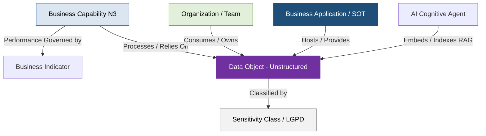

# Guia de Governança de Dados Não Estruturados (Bases de Conhecimento) - Setor Elétrico (PowerUp OKC)

Este documento descreve o catálogo e o manual de governança para as **Bases de Conhecimento, Documentos Regulatórios, Manuais e Acervos Jurídicos** da **PowerUp Open Knowledge Catalog (PowerupOKC)**, estruturado sob as diretrizes globais da **SAP LeanIX v4** e as especificações de portabilidade do padrão **Open Knowledge Format (OKF) v0.1**.

O objetivo deste guia é fornecer ao time de Arquitetura de Dados, Governança de TI/OT, Engenharia de Software e Encarregados de Proteção de Dados (DPO) uma visão clara de como os ativos de dados não estruturados são modelados, integrados a sistemas transacionais lógicos e consumidos por arquiteturas de inteligência artificial generativa (como RAG - Retrieval-Augmented Generation e agentes cognitivos).

---

## 1. Princípios de Modelagem de Dados Não Estruturados no SAP LeanIX v4

Seguindo estritamente as melhores práticas de Enterprise Architecture do LeanIX v4, o catálogo de dados não estruturados adota os seguintes padrões de modelagem:

*   **Abstração e Modelagem Enxuta (Breadth over Depth):** O LeanIX não é um sistema de Gerenciamento Eletrônico de Documentos (GED) ou um repositório físico de arquivos. Os artefatos não estruturados são modelados como Fact Sheets do tipo `Data Object` (ou vinculados como metadados a `Resources` e `Applications`) e representam **acervos, normas ou bases de conhecimento consolidadas de negócios**, nunca arquivos individuais de trabalho (ex: modelamos o objeto conceitual *PRODIST - Procedimentos de Distribuição da ANEEL*, e não o PDF *modulo_8_v4_final.pdf*).
*   **Mapeamento de 'System of Truth' (SOT):** Cada base de conhecimento ou tipo documental de negócio possui apenas uma aplicação transacional ou repositório canônico mapeado como sua fonte mestre da verdade com a relação *Provides* (escrita/criação), enquanto as demais atuam com permissão *Consumes* (leitura). Isso impede a dispersão ou duplicação do conhecimento corporativo entre silos departamentais.
*   **Conexão de Metamodelo de Ponta a Ponta (Who/What/How):** A governança é ativada através da conexão das pontas lógicas do metamodelo: relaciona-se a base de conhecimento (`Data Object`) à aplicação que a hospeda (`Application` - ex: *ServiceNow Knowledge*), à equipe que a consome (`Organization / Team` - ex: *Centro de Operações da Distribuição - COD*) e à capacidade de negócio que ela suporta (`Business Capability N3` - ex: *Gestão de Interrupções*).
*   **Diferenciação entre Documentos Mestres e Transacionais:** 
    1.  *Documentos de Referência / Mestres (sim):* Representam normas, regulamentos, padrões estáveis de engenharia e guias corporativos (ex: Procedimentos de Rede do ONS, Manuais de Equipamentos, Roteiros de Atendimento).
    2.  *Documentos Transacionais (nao):* Representam registros, relatórios de anomalias ou contratos específicos resultantes de eventos operacionais ou acordos temporários de mercado (ex: PPAs específicos, RAPs de blecautes, Relatórios de Auditoria).



---

## 2. Inventário de Data Objects Não Estruturados (Setor Elétrico)

O catálogo consolida os **23 Data Objects Não Estruturados mestre** da companhia (mapeados sob a faixa de IDs `DO-201` a `DO-223`), estabelecendo suas classificações, repositórios de origem, capacidades de negócio que apoiam e níveis de sensibilidade perante a LGPD:

| ID | Documento / Base de Conhecimento | Subdomínio (Nível 1) | Doc. Mestre | Descrição de Negócio e Conteúdo Crítico | Capability Nível 3 Associada | Repositório da Verdade (SOT / App) | Classe de Risco (LGPD) |
| :--- | :--- | :--- | :--- | :--- | :--- | :--- | :--- |
| **DO-201** | Leis e Decretos Setoriais | Regulatório e Planejamento | sim | Conjunto de leis federais e decretos que definem o regime jurídico do setor (Diretrizes de outorga, Lei 10.848 - ACR/ACL, Lei 14.300 - GD). | Conformidade Regulatória | Diário Oficial da União (DOU) / Biblioteca ANEEL | **Público** |
| **DO-202** | PRODIST - Procedimentos de Distribuição | Regulatório e Planejamento | sim | Normas técnicas e comerciais da ANEEL para redes de distribuição < 230kV (Módulos de Planejamento, Medição, Perdas, DEC/FEC). | Conformidade Regulatória | Biblioteca Reguladora da ANEEL | **Público** |
| **DO-203** | PRORET - Procedimentos de Regulação Tarifária | Regulatório e Planejamento | sim | Metodologias tarifárias da ANEEL (Revisões Tarifárias, cálculo de WACC, OPEX eficiente - PMSO, e Base de Remuneração BRR). | Conformidade Regulatória | Biblioteca Reguladora da ANEEL | **Público** |
| **DO-204** | Procedimentos de Rede do ONS | Regulatório e Planejamento | sim | Regras e critérios do ONS para operação, programação e coordenação da geração e transmissão conectadas ao SIN. | Operação do Sistema de Transmissão | Acervo Digital do ONS (Manual MPO) | **Público** |
| **DO-205** | Regras e Procedimentos CCEE | Regulatório e Planejamento | sim | Módulos e cadernos normativos da CCEE que estabelecem regras de medição contábil, contabilização e liquidação financeira do MCP. | Análise de Mercado de Energia | Acervo de Regras da CCEE | **Público** |
| **DO-206** | Documentação de Leilões de Energia | Regulatório e Planejamento | sim | Editais, notas técnicas e minutas de CCEAR para contratação regulada de novos projetos de expansão de geração/transmissão. | Planejamento da Expansão da Rede | Sistema de Licitações da ANEEL / EPE | **Público** |
| **DO-207** | Documentação de Consultas Públicas | Regulatório e Planejamento | nao | Processos de audiências públicas conduzidos pela ANEEL, contendo Análises de Impacto Regulatório (AIR) e defesas técnicas. | Conformidade Regulatória | Sistema de Consultas da ANEEL | **Público** |
| **DO-208** | Planos de Longo Prazo do Setor | Regulatório e Planejamento | sim | Planejamento decenal (PDE) e nacional (PNE) de expansão de energia elétrica e planos de transmissão (PAR) de médio prazo. | Planejamento da Expansão da Rede | Biblioteca Digital da EPE / ONS | **Público** |
| **DO-209** | Formulário de Referência (FRE) | Corporativo e Governança | nao | Relatório anual auditado exigido pela CVM para companhias abertas, detalhando finanças, governança e fatores de risco setoriais. | Gestão de Risco Corporativo | Canal de RI / SAP CLM / Sistema CVM | **Público** |
| **DO-210** | Estatuto Social e Regimentos Internos | Corporativo e Governança | sim | Regras de governança de primeiro nível que definem alçadas de decisão, limites de CAPEX/endividamento e comitês de risco. | Gestão de Risco Corporativo | GED de Governança / Junta Comercial | **Confidencial** |
| **DO-211** | Relatórios de Auditoria e Compliance | Corporativo e Governança | nao | Pareceres formais das Três Linhas de Defesa que avaliam conformidade de processos (ex: unitização, faturamento) e regras SOX. | Gestão de Risco Corporativo | SAP GRC / ServiceNow GRC | **Confidencial** |
| **DO-212** | Manuais de Operação de Equipamentos | Técnico e Operacional | sim | Manuais e especificações de placas fornecidas por fabricantes para transformadores, disjuntores e relés da rede de TO. | Manutenção de Redes e Equipamentos | SAP PM / EAM / Biblioteca de Engenharia | **Interno** |
| **DO-213** | Projetos de Engenharia e Memoriais | Técnico e Operacional | sim | Memoriais descritivos, diagramas unifilares CAD, plantas e testes de comissionamento de subestações e linhas. | Planejamento do Ciclo de Vida dos Ativos | AutoCAD / GED Engenharia / SAP PS | **Interno** |
| **DO-214** | Relatórios de Perturbações (RAPs) | Técnico e Operacional | nao | Registro e análise pós-operativa de ocorrências graves no SIN (oscilografias, Sequence of Events), recomendando correções. | Operação do Sistema de Transmissão | SAGER (ONS) / SCADA / Sistema AOT | **Interno** |
| **DO-215** | Instruções de Operação e Contingência | Técnico e Operacional | sim | Procedimentos operativos para manobras de emergência em tempo real, planos de contingência climática e esquemas de corte de carga. | Operação da Rede de Distribuição | ADMS (OMS) / Central de Operações COD | **Interno** |
| **DO-216** | Procedimentos Operacionais Padrão (POPs) | Técnico e Operacional | sim | Guias granulares para equipes de campo (aterramento de segurança, regras de ouro, NR-10) detalhando execução de O&M de rede. | Manutenção de Redes e Equipamentos | Departamento de Manutenção / SAP PM / EHS | **Interno** |
| **DO-217** | Documentação de Sistemas e TDDs | Técnico e Operacional | sim | Manuais de configuração de TI/TO, esquemas Swagger de APIs e especificações de protocolos industriais (DNP3, IEC 61850). | Arquitetura de TI e de Dados | Confluence / ServiceNow / Jira | **Interno** |
| **DO-218** | Dicionário de Dados para a BDGD | Técnico e Operacional | sim | Manual técnico da ANEEL que padroniza os atributos, tabelas e conectividades topológicas para envio de dados das redes ao SIG-R. | Gestão de Dados da Rede | GIS / Portal ANEEL (PRODIST Mód. 10) | **Interno** |
| **DO-219** | Contratos de Compra e Venda (PPAs) | Jurídico e Contratual | nao | Acordos bilaterais livre (ACL) ou regulado (CCEAR), detalhando montantes (MWm), sazonalização, reajustes e garantias. | Negociação de Contratos | SAP CLM / ETRM Interno / CCEE SCL | **Confidencial** |
| **DO-220** | Contratos de Uso e Conexão (CUST/CUSD) | Jurídico e Contratual | nao | Contratos de acesso físico às redes de transmissão ou distribuição, regulando MUST/MUSD contratado e tarifas TUSD/TUST. | Negociação de Contratos | SAP CLM / GED Regulatório / ONS Mód. 8 | **Confidencial** |
| **DO-221** | Contratos de Financiamento | Jurídico e Contratual | nao | Covenants financeiros (DSCR), step-in rights e garantias fiduciárias de projetos estruturados de usinas e linhas. | Gestão de Tesouraria | SAP CLM / Arquivo de Contratos | **Confidencial** |
| **DO-222** | Estudos Ambientais (EIA / RIMA) | Jurídico e Contratual | sim | Diagnósticos de fauna/flora, relatórios de impactos físicos e planos de monitoramento sócio-ambiental de usinas e LTs. | Planejamento do Ciclo de Vida dos Ativos | GED Ambiental / Órgãos IBAMA/Estaduais | **Público** |
| **DO-223** | Roteiros de Atendimento e FAQ de Clientes | Relacionamento com Cliente | sim | Árvores de decisão e scripts de call center em conformidade com as regras de atendimento da Resolução Normativa ANEEL nº 1.000. | Atendimento ao Cliente Multicanal | Salesforce CRM (Knowledge) | **Restrito (LGPD)** |

---

## 3. Arquitetura Cognitiva e Casos de Uso (IA & RAG Corporativo)

O catálogo de dados não estruturados serve como a **base semântica e de conhecimento (Product-ready)** indispensável para alimentar a arquitetura de **RAG (Retrieval-Augmented Generation)** e os novos **AI Agents** cognitivos da PowerUp. 

Abaixo estão detalhados os três casos de uso mais críticos em termos de governança e interligação de sistemas:

### A. RAG Regulatório de Auditoria e Pareceres (ANEEL / CCEE / ONS)

Este caso de uso automatiza o monitoramento de conformidade regulatória, respondendo síncronamente a consultas complexas das áreas jurídica, comercializadora e de faturamento sobre mudanças de regras e penalidades setoriais:

```text
  [ANEEL / CCEE / ONS] --(Publicações Web: DO-202, DO-203, DO-205)--> [RAG Ingestion Pipeline]
                                                                                |
                                                                       (Indexa Chunks no BigQuery)
                                                                                |
                                                                                v
  [Mesa de Trading / Regulação] <--(Respostas Citadas)-- [Agente Regulação] <--> [Vertex AI Embeddings]
         |
  (Analisa Impacto)
         |
         v
  [SAP CLM / ETRM] <---(Gera Alerta de Risco de Desvio Contratual)
```

1.  **Ingestão Regulatória Automatizada:** Periodicamente, um pipeline de dados consulta os portais e diários oficiais. Quando novas resoluções do **PRODIST (`DO-202`)** ou regras da **CCEE (`DO-205`)** são publicadas, o arquivo é quebrado em fragmentos (*chunks*), seus embeddings vetoriais são extraídos e armazenados no repositório analítico de alta performance (**Vertex AI Vector Search / BigQuery**).
2.  **Operação do Agente de IA:** Um agente cognitivo (ex: *Monitor de Mudanças Regulatórias ANEEL*) permite que advogados e especialistas de regulação consultem em linguagem natural: *"Como a nova alteração nas regras de compensação de Geração Distribuída afeta nosso faturamento de prossumidores?"*.
3.  **Geração Grounded com Citação:** O agente varre o banco vetorial, recupera o trecho exato da resolução e gera uma resposta explicativa em linguagem natural, citando formalmente o documento de origem (ex: *"De acordo com o PRODIST Módulo 8, Seção X..."*), eliminando riscos de alucinações.
4.  **Ação de Mitigação de Risco:** Caso seja identificada uma mudança tarifária que afete PPAs vigentes, o agente gera síncronamente uma notificação de risco legal integrado ao **SAP CLM**, disparando workflows de revisão e repactuação de tarifas para o time de trading.

### B. Assistente Técnico Virtual de Campo (O&M e Engenharia de Proteção)

Este caso de uso provê suporte inteligente aos técnicos e engenheiros de campo em tempo real, mitigando erros operativos e acelerando o restabelecimento de falhas físicas de subestações de alta e média tensão (TO):

```text
  [Relé de Proteção / Disjuntor] --(Evento de Falha: DO-214 / DO-215)--> [ADMS Spectrum (OMS)]
                                                                                   |
                                                                          (Gera Alerta no ServiceNow)
                                                                                   |
                                                                                   v
  [Técnico de Campo Mobile] <--(Diagnóstico Preditivo e Runbook)-- [Agente Técnico de Campo]
              ^                                                                    |
              |                                                           (Consulta Manuais: DO-212)
              +-----------------(Gera Ordem de Reparo com Peças no SAP PM) <---------+
```

1.  **Gatilho do Alarme de Falha:** Um disjuntor de média tensão atua após um curto-circuito na rede. O sistema **SCADA/ADMS** registra o evento e envia de forma automatizada o código de falha e os logs para o **ServiceNow (ITSM)**, gerando um incidente de TO.
2.  **Consulta Assistida de Manuais de Engenharia:** O técnico de campo, ao receber o chamado em seu tablet, invoca o *Agente Técnico de Campo*. O agente utiliza o código do modelo de fabricação do equipamento extraído do registro do **EAM/SAP PM** para buscar síncronamente na base de **Manuais de O&M (`DO-212`)** e **Instruções de Operação (`DO-215`)**.
3.  **Recomendação de Procedimento de Segurança:** O agente traduz a alta complexidade do manual do fabricante em um roteiro enxuto passo a passo de como rearmar ou diagnosticar o equipamento com segurança física, destacando as regras de aterramento e isolamento necessárias (**POPs - `DO-216`**, como regras de NR-10).
4.  **Resolução Integrada e Peças:** Se for detectada a necessidade de substituição de uma peça física (ex: relé auxiliar), o agente efetua a consulta ao catálogo de materiais do SAP PM, identificando o código do componente e gerando síncronamente a reserva de materiais no almoxarifado (**WMS**), permitindo que o técnico execute a troca sem atrasos.

### C. Triagem e Roteamento de Tickets de Ouvidoria (CX Omnichannel)

Este fluxo operacional integra o tratamento de reclamações de clientes de primeiro e segundo níveis ao arcabouço normativo setorial, garantindo conformidade com os tempos limites de resposta exigidos pela regulação de distribuição:

1.  **Abertura do Ticket:** Um cliente abre uma contestação formal de faturamento de energia em massa por suspeita de erro de cobrança tarifária. O ticket é catalogado no **CRM (Salesforce)** sob o objeto **Caso (Case)**.
2.  **Análise de Conformidade Regulatória:** O *Ouvidoria & Ticket Router Inteligente* (agente cognitivo) analisa a transcrição e os dados estruturados do caso contra as diretrizes vigentes na **Resolução Normativa ANEEL nº 1.000 (`DO-223`)**.
3.  **Avaliação de Risco e Roteamento:** O agente calcula o tempo regulatório de atendimento (SLA regulado). Reclamações que citam órgãos externos como o BACEN, PROCON ou a Ouvidoria da ANEEL são classificadas automaticamente como **Risco Crítico** e roteadas com prioridade absoluta para a diretoria comercial.
4.  **Geração de Resposta Empática Assistida:** O agente consulta as políticas internas do banco de dados e as alçadas de retenção permitidas no manual de clientes, redigindo de forma assistida um rascunho de e-mail de resposta altamente empático e resolutivo. A mensagem é enviada ao atendente, justificando as compensações com base nos artigos da REN 1.000, assegurando a conformidade e mitigando multas regulatórias.

---

## 4. Classificação de Sensibilidade e Governança de Dados (LGPD)

A governança dos Data Objects Não Estruturados exige uma classificação rígida de segurança, limitando o acesso a bases de conhecimento críticas e dados protegidos por lei:

```text
    [Confidencial (Risco Alto)]
    Bases de conhecimento estruturais, regimentos de tomada de decisão e contratos societários estratégicos.
    Exige restrição de acesso por privilégios mínimos (Role-Based Access Control) e trilhas de auditoria de acessos.
    Ex: DO-210 Estatuto Social (Decisões Estratégicas), DO-211 Relatórios de Auditoria SOX, DO-219/DO-221 Contratos EPC/PPAs e Project Finance.

    [Restrito (LGPD - PII)]
    Documentos, roteiros de atendimento e históricos que contenham informações de identificação pessoal (PII) ou consumo de clientes.
    Exige mascaramento de dados (data masking) e criptografia em trânsito e repouso.
    Ex: DO-223 Roteiros e FAQs de Atendimento (Histórico e scripts vinculados a UCs e identidades).

    [Interno (Uso Corporativo)]
    Manuais de engenharia, projetos civis e diagramas lógicos necessários para a operação das equipes de campo e TI/TO.
    Exige armazenamento em repositórios controlados (GED Engenharia, Confluence).
    Ex: DO-212 Manuais de Equipamentos, DO-213 Memoriais de Obras, DO-215 Instruções de Operação FLISR, DO-217 Documentação de APIs/Protocolos TI/TO.

    [Público (Uso Geral)]
    Resoluções oficiais de agências governamentais, procedimentos do ONS e cadernos de regras de mercado abertos.
    Ex: DO-201/DO-202/DO-203 Leis e Procedimentos ANEEL (PRODIST/PRORET), DO-204 MPO ONS, DO-205 Procedimentos CCEE, DO-222 Estudos de Impacto Ambiental.
```

---

## 5. Citações e Referências Regulatórias

1.  **Resolução Normativa ANEEL nº 1.000/2021:** Estabelece as regras de prestação de serviços públicos de distribuição de energia elétrica, servindo como base única para a redação dos FAQs e roteiros de atendimento.
2.  **Procedimentos de Distribuição da ANEEL (PRODIST):** Normatiza os processos técnicos de conexão, medição, cálculo de perdas e indicadores de qualidade (DEC/FEC).
3.  **Procedimentos de Rede do ONS (Manual MPO):** Rege os critérios e runbooks operativos em regime de contingência ou normalidade para usinas e linhas de transmissão de alta tensão do SIN.
4.  **Lei Geral de Proteção de Dados (Lei nº 13.709/2018 - LGPD):** Dispõe sobre o tratamento e a governança de dados pessoais coletados nas interações comerciais das concessionárias de energia.
