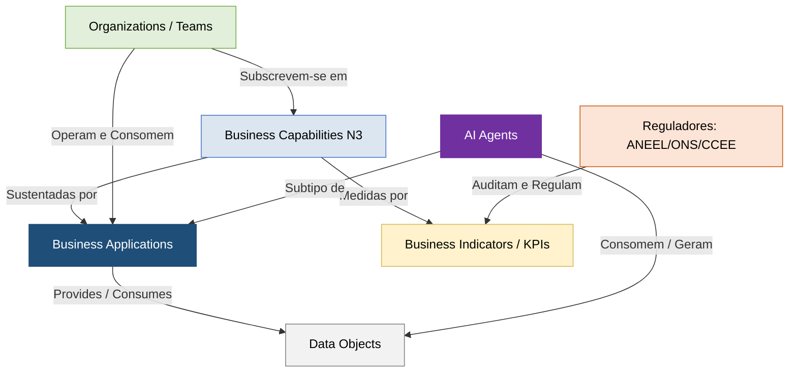

# Portal Mestre da Base de Conhecimento — PowerUp OKC

Seja bem-vindo ao **PowerUp Open Knowledge Catalog (PowerUp OKC)**. Este repositório é o portal centralizado e a única fonte da verdade de arquitetura corporativa e engenharia de conhecimento da companhia, modelado de forma integrada sob as melhores práticas da **SAP LeanIX v4** e as especificações de portabilidade do padrão **Open Knowledge Format (OKF) v0.1** [cite: 18, 522].

Este catálogo foi projetado para cruzar e unificar a representação conceitual de negócios (camada finalística), a estrutura departamental e física (camada organizacional), o inventário lógico de software (camada de aplicações tradicionais e cognitivas) e o acervo semântico de informações estruturadas e bases de conhecimento permanentes (camada de dados), qualificando toda a cadeia de valor por meio do monitoramento síncrono de indicadores regulatórios setoriais (ANEEL, ONS e CCEE) [cite: 18, 513].

---

## 🗺️ Mapa do Metamodelo Integrado (SAP LeanIX v4)

A arquitetura do nosso catálogo é completamente interconectada no padrão **Common Service Data Model (CSDM)**, garantindo a linhagem e o rastreamento síncrono de impactos entre TI e Tecnologia da Operação (TO) [cite: 19]. 

O fluxo abaixo representa como cada camada do repositório se relaciona para gerar inteligência operacional de ponta a ponta:

---

## 🗂️ Taxonomia de Pastas e progressive disclosure

Seguindo o padrão de **progressive disclosure (revelação progressiva)** exigido pelo OKF v0.1, a estrutura do repositório é autoexplicativa e modular [cite: 20]. Cada diretório possui um arquivo `index.md` dedicado (livre de frontmatter) que atua como sumário de navegação com links absolutos baseados no diretório-raiz, permitindo que analistas humanos e agentes cognitivos descubram as especificações de forma sistemática [cite: 20, 27]:

### 1. [Capacidades de Negócio](/business-capabilities/index.md)
O mapa estratégico que reúne as **43 capabilities específicas de Nível 3** da companhia elétrica, divididas por blocos de valor finalísticos e operacionais [cite: 518]:
*   [Corporativo e Suporte ao Negócio](/business-capabilities/index-business-capabilities-1-corporativo-suporte.md) — Gestão financeira, recursos humanos, compliance, compras e segurança cibernética [cite: 20].
*   [Engajamento com o Cliente](/business-capabilities/index-business-capabilities-2-engajamento-cliente.md) — Comercial de varejo, marketing, medição inteligente, faturamento e inadimplência [cite: 20].
*   [Operações de Energia (Core)](/business-capabilities/index-business-capabilities-3-operacoes-energia.md) — Geração de energia, transmissão de alta tensão, distribuição física de rede e trading de energia [cite: 20].

### 2. [Estrutura Organizacional](/organizations/index.md)
A camada de governança e atribuição de responsabilidade ("Who") do ecossistema, mapeando as subsidiárias, diretorias e times operacionais de campo [cite: 20]:
*   [Legal Entities (Subsidiárias com CNPJ)](/organizations/index-organizations-legal-entities.md) — As 4 empresas constituídas do grupo (*Holding*, *G&T*, *Distribuição* e *Comercializadora*) [cite: 522].
*   [Business Units (Diretorias e Divisões)](/organizations/index-organizations-business-units.md) — Os 16 órgãos orçamentários responsáveis pela condução e aprovação do CAPEX e OPEX [cite: 521, 522].
*   [Teams (Equipes e Centros de Controle de TO)](/organizations/index-organizations-teams.md) — Os 20 squads operacionais, regionais e centros de despacho físico (como o *COD*, *COG*, *COT* e *Almoxarifados*) [cite: 521, 522].
*   *Nota de Governança:* Pessoas e posições físicas de cargos (como os 62 cargos do catálogo `POS-001` a `POS-062`) não são representados como Fact Sheets no inventário principal para mitigar a inflação de dados, sendo mapeados como **Subscrições (*Subscriptions*)** atreladas de forma síncrona às suas respectivas equipes (*Teams*) [cite: 522].

### 3. [Sistemas e Aplicações Core](/business-applications/index.md)
O inventário lógico de software que representa como as capacidades de negócios são automatizadas de forma transacional ("How") [cite: 20]:
*   [Business Applications](/business-applications/index-business-applications-v2.md) — As 16 aplicações de negócios lógicas padronizadas de utilities (ERP, CIS, CRM, MDM, SCADA, GIS, EAM, ETRM, etc.) [cite: 513]. Mapeia de forma explícita as melhores práticas da SAP LeanIX v4, mantendo os fornecedores de mercado (Salesforce, SAP S/4HANA, Hitachi, Siemens) e as instâncias físicas de TI representados separadamente na camada de infraestrutura [cite: 513, 515].

### 4. [Catálogo e Governança de Agentes de IA](/ai-agents/index.md)
A camada cognitiva que documenta os assistentes digitais que colaboram ativamente com a força de trabalho para otimizar processos de negócios [cite: 19]:
*   [AI Agents](/ai-agents/index-ai-agents.md) — As especificações técnicas completas dos **71 agentes de IA do portfólio** (`IAA-001` a `IAA-071`), divididos em frentes funcionais de TI, DP, Sourcing, Jurídico, Finanças e Vendas [cite: 1, 20]. Cada ativo detalha suas *System Instructions*, modelos de fundação (`Gemini 3.5 Flash/Pro` mapeados separadamente como *IT Components*), gatilhos e ferramentas de integração autorizados [cite: 1, 21].

### 5. [Catálogo de Dados (Data Objects)](/data-objects/index.md)
O dicionário lógico de dados e o acervo semântico permanente de conhecimento da companhia ("What") [cite: 20]:
*   [Dados Estruturados](/data-objects/index-data-objects-structured.md) — O dicionário lógico de dados contendo os atributos, tipos e SOT das **81 tabelas lógicas estruturadas** de ativos de rede, clientes de varejo e liquidações setoriais perante a CCEE (IDs `DO-101` a `DO-181`) [cite: 3, 20].
*   [Dados Não Estruturados](/data-objects/index-data-objects-unstructured.md) — O acervo semântico consolidado de **23 bases de conhecimento documentais permanentes** (como PRODIST, Procedimentos de Rede do ONS, manuais e POPs - IDs `DO-201` a `DO-223`), vitais para evitar alucinações de IA em processos baseados em RAG [cite: 527, 528].

### 6. [Indicadores de Desempenho (Business Indicators)](/business-indicators/index.md)
O painel de monitoramento e controle que qualifica a eficácia operacional do grupo de utilidades [cite: 20]:
*   [Business Indicators](/business-indicators/index-business-indicators-v2.md) — O inventário unificado contendo as apurações, limites e fórmulas matemáticas dos **25 principais KPIs regulatórios** e internos de qualidade do fornecimento de serviço, qualidade do produto, confiabilidade operativa e eficiência comercial (IDs `IND-001` a `IND-025`) [cite: 8, 10, 11, 20].

### 7. [Relações e Linhagem Cruzada](/relations/index.md)
As matrizes de dependência técnica que consolidam as relações matriciais e a linhagem de ponta a ponta do ecossistema [cite: 20]:
*   [Matriz CRUD de Dados por Aplicações](/relations/matriz-crud-dados.md) — Mapeia quais sistemas possuem privilégios de Escrita (System of Truth - SOT/Provides) ou Leitura (Consumes) sobre os 81 Data Objects estruturados [cite: 2, 3, 20].
*   [Matriz de Responsabilidade (RACI)](/relations/matriz-responsabilidade-teams.md) — Correlaciona as equipes funcionais (*Teams*) às Capabilities e aos KPIs de controle de forma síncrona [cite: 20].

---

## 🛠️ Diretrizes de Governança do Repositório (OKF v0.1)

Para assegurar a integridade, portabilidade e compatibilidade do catálogo com pipelines de integração contínua (Git CI/CD), todas as alterações de metadados devem seguir rigorosamente as regras abaixo [cite: 27]:

1.  **Caminhos Absolutos Estáveis:** Todos os hiperlinks entre documentos devem utilizar caminhos absolutos baseados no diretório-raiz (e.g., `[/pasta/arquivo.md]`), o que impede a quebra de links se arquivos forem movidos entre subpastas do Git [cite: 27].
2.  **Uso de Metadados YAML (Frontmatter):** Cada especificação técnica individual de primeiro nível (aplicação, indicador, organização, dados e capability) deve iniciar com o cabeçalho YAML contendo o campo obrigatório `type` [cite: 27, 542].
3.  **Índices Livres de Frontmatter:** Arquivos do tipo `index.md` de subpastas não contêm blocos YAML frontmatter, servindo exclusivamente como sumários textuais limpos de progressive disclosure [cite: 27]. O único arquivo de índice autorizado a portar metadados em cabeçalho é este arquivo raiz (especificando a versão mestre do OKF) [cite: 544].
4.  **Desacoplamento de Componentes (Clean Core):** Lógicas de negócio não devem ser misturadas com instâncias físicas ou fornecedores [cite: 21, 515]. Módulos proprietários são abstraídos como IT Components independentes vinculados à aplicação lógica correspondente [cite: 21].

---

### # Fontes Regulatórias e Bibliotecas de Apoio
1.  **Procedimentos de Distribuição da ANEEL (PRODIST):** Normas oficiais de medição física, perdas, níveis de tensão e indicadores de qualidade (Módulos 3, 5, 7 e 8) [cite: 28].
2.  **Procedimentos de Rede do ONS:** Critérios e requisitos mínimos de projeto, planejamento, estudos elétricos offline e despacho centralizado de geração [cite: 28].
3.  **SAP LeanIX EAS Metamodel Best Practices (v4):** Guias metodológicos globais de Enterprise Architecture para modelagem lógica de negócios, componentes físicos e orquestrações [cite: 28].
