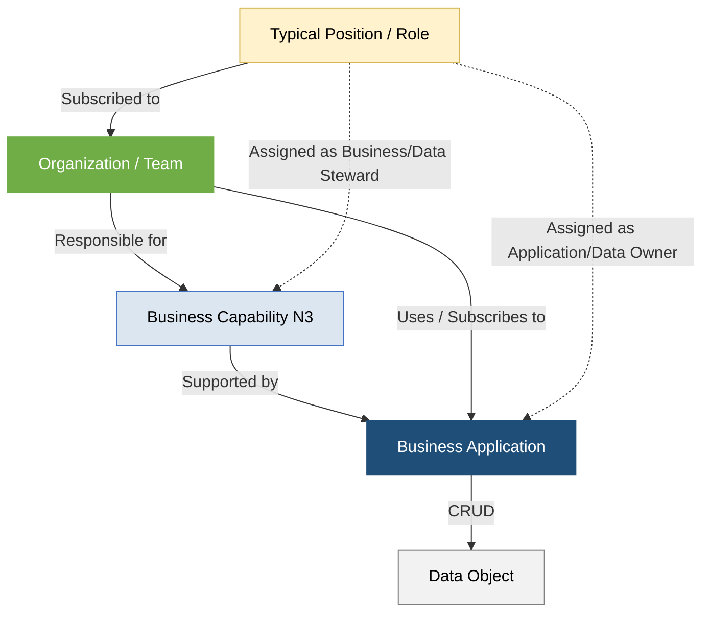

# Guia de Governança da Estrutura Organizacional - Setor Elétrico (PowerUp OKC)

Este documento descreve o catálogo estruturado da camada **Organizacional (Who)** da **PowerUp Open Knowledge Catalog (PowerupOKC)**, modelado em estrita conformidade com as diretrizes do metamodelo v4 da **SAP LeanIX** e as particularidades regulatórias e operacionais do Setor Elétrico Brasileiro.

O objetivo deste guia é orientar os times de Governança de TI/TO, Arquitetura Corporativa (EA) e Gestão de Pessoas sobre como os papéis, responsabilidades, unidades de negócio e divisões geográficas se acoplam às capacidades empresariais (Capabilities), aos sistemas de registro/operação (Applications) e aos produtos de dados (Data Objects) da companhia.

---

## 1. Princípios de Modelagem Organizacional no SAP LeanIX v4

Seguindo as melhores práticas globais de Enterprise Architecture, o catálogo de organizações adota as seguintes premissas de modelagem para evitar a complexidade excessiva e garantir a alta qualidade dos dados:

*   **Hierarquia Enxuta (Breadth over Depth):** Recomenda-se uma profundidade máxima de **3 níveis hierárquicos** (Nível 1: Legal Entity -> Nível 2: Business Unit -> Nível 3: Team), mantendo uma estrutura simples e de fácil manutenção por parte dos pontos focais.
*   **Segmentação por Subtypes:** Isolamos de forma explícita os tipos de estruturas organizacionais utilizando os quatro subtypes suportados no LeanIX v4:
    1.  `Legal Entity`: Razões sociais autônomas dotadas de CNPJ (Holding e as subsidiárias operacionais de Geração, Transmissão, Distribuição e Comercialização).
    2.  `Business Unit`: Diretorias e divisões executivas funcionais (Operações, Comercial, Financeira, Recursos Humanos, Suprimentos).
    3.  `Team`: Equipes operacionais de campo, squads ágeis ou centros de controle finalísticos (COD, COG, COT, Back-Office de Energia, Mesa de Trading).
    4.  `Region`: Áreas de concessão geográfica ou macro-zonas de atuação (Região Metropolitana e Região Interior).
*   **O Antipadrão de Cargos/Usuários como Fact Sheets:** Em conformidade com o LeanIX, cargos, posições individuais ou nomes de pessoas físicas (ex: *Eletricista João*, *Trader Roberto*) **NÃO** devem ser cadastrados como Fact Sheets organizacionais. Isso causa inflação incontrolável do inventário e inviabiliza a manutenção via Git.
*   **Posições como Subscrições (Subscriptions):** Os cargos típicos da indústria (como as 62 posições catalogadas de `POS-001` a `POS-062`) são modelados como **Subscrições (*Subscriptions*)** vinculadas diretamente às Business Units ou Teams. Os colaboradores herdam **Subscription Roles** estruturados (como *Application Owner*, *Business Owner*, *Data Owner*, *Data Steward* e *Technical Contact*) sobre as aplicações e capacidades que seu respectivo time utiliza.

---

## 2. Inventário Hierárquico do Portfólio Organizacional

O portfólio consolida as unidades organizacionais estruturadas que regem as operações corporativas e de Tecnologia da Operação (TO) de campo:

### A. Camada de Sociedades (Legal Entities)
*   **Holding de Energia S.A. (`HOLDING`):** Controladora societária focada na governança executiva, finanças integradas, estratégia de longo prazo, compliance legal e compras estratégicas.
*   **Geração e Transmissão S.A. (`GET_S.A.`):** Subsidiária responsável pela coordenação operativa de usinas de geração e expansão e manutenção da infraestrutura de alta tensão integrada à Rede Básica do SIN.
*   **Distribuição Energia S.A. (`DIS_S.A.`):** Subsidiária responsável pela distribuição física de energia de média e baixa tensão aos consumidores regulados e prossumidores.
*   **Comercialização S.A. (`COM_S.A.`):** Comercializadora focada no trading de energia física/financeira e estruturação de produtos de fornecimento para o Mercado Livre (ACL).

### B. Camada Executiva (Business Units)
*   **Diretorias da Holding:** Divisões funcionais unificadas de retaguarda (Finanças e RI, Gente e Gestão, Estratégia, Novos Negócios e TI, Jurídico e Compliance, Regulação e Mercado, Suprimentos).
*   **Diretorias GET S.A.:** Diretoria Geral de G&T, Diretoria Administrativo Financeira (Unitização Contábil), Diretoria Executiva de O&M (Operações Industriais).
*   **Diretorias DIS S.A.:** Diretoria Geral de Distribuição, Diretoria Comercial DIS (Canais e Perdas), Diretora Executiva de Operações DIS (Rede de Campo).

### C. Camada de Execução Operacional e Centros de Controle (Teams)
Equipes finalísticas que de fato operam as capacidades elétricas e sistemas especialistas de TI/TO:
*   **COD (Centro de Operações da Distribuição):** Opera a rede de distribuição urbana de média/baixa tensão em regime 24/7. Responsável pelo ADMS, GIS e WFM.
*   **COT (Centro de Operações da Transmissão):** Supervisiona e comanda subestações e linhas de Rede Básica em coordenação direta síncrona com o ONS. Opera o sistema EMS.
*   **COG (Centro de Operações da Geração):** Responsável pela otimização e controle remoto do despacho físico de potência de usinas hidráulicas e térmicas. Opera o sistema GMS.
*   **Mesa de Trading:** Executa a originação e fechamento de contratos bilaterais no ACL, monitorando limites de risco e volatilidade do PLD horário.
*   **Back-Office de Energia:** Realiza a conciliação física de faturamento, validação contábil do SMF e processamento das liquidações mensais perante a CCEE.
*   **Equipe de Manutenção de Campo (DIS):** Eletricistas e encarregados técnicos de rua despachados de forma dinâmica via Workforce Management (WFM) para atendimento a emergências de falta de energia e manobras locais.
*   **Equipes de Manutenção de Ativos (GET):** Técnicos especialistas em ensaios de isolamento de grandes transformadores, vistorias termográficas de linhas de transmissão e testes de relés de proteção.
*   **Departamento de Faturamento (DIS):** Analistas de retaguarda comercial que executam ciclos em massa de faturamento, conciliação contábil de contas contrato (FI-CA) e réguas de cobrança (dunning).

---

## 3. Matriz de Atribuição e Casos Práticos de Integração (RACI de TI/TO)

O acoplamento das organizações com as capabilities e aplicações tradicionais core habilita cenários reais de governança e integridade operacional:

### Caso Prático A: Operação Técnica de Distribuição e Indicadores DEC/FEC (Meter-to-Cash)
*   **Responsabilidade Organizacional:** O **COD (Team)** detém o *ownership* operacional sobre a capacidade de `cap-l3-operacao-da-rede-de-distribuicao`.
*   **Acoplamento de Sistemas (How):** O COD opera as plataformas de **ADMS (AP-013)** (supervisão de religadores e OMS de interrupções) e **GIS (AP-015)** (visualização espacial de vãos de cabos e topologia de transformadores).
*   **Linhagem de Dados (What):** Os operadores do COD recebem o fluxo de **Cadastro de Rede GIS (`DO-002`)** para planejar manobras lógicas de isolamento e emitem síncronamente o **Evento de Interrupção (`DO-105`)** no momento do desligamento de religadores. Esse objeto de dados é consumido pelo **Departamento de Faturamento (Team)** para calcular as faturas finais de compensação de DIC/FIC e compilar os XMLs regulatórios da ANEEL.

### Caso Prático B: Manutenção Preditiva e Logística Integrada de Ativos Físicos (G&T)
*   **Responsabilidade Organizacional:** A equipe de **Manutenção de Ativos (GET) (Team)** é responsável pela capacidade de `cap-l3-manutencao-preditiva` e pelo ciclo de vida físico de ativos de subestações de alta tensão.
*   **Acoplamento de Sistemas (How):** Utilizam o sistema **EAM SAP PM (AP-014)** integrado a sensores industriais e analíticos do **GMS (AP-008)**.
*   **Linhagem de Dados (What):** Anomalias térmicas registradas em **Dados de Sensores IoT (`DO-004`)** geram notas de manutenção preventivas síncronas. Para a execução, o SAP PM aciona o estoque gerenciado pelo time de **Suprimentos (Business Unit)**, efetuando a reserva eletrônica automática do **Inventário de Peças Sobressalentes MRO (`DO-019`)** no sistema **WMS (AP-009)**. Caso o item esteja abaixo do estoque mínimo, o sistema notifica o time de **Compras Estratégicas (Team)** para iniciar um processo de cotação com os fornecedores homologados no sistema de **Procurement/Ariba (AP-008)**.

### Caso Prático C: Gestão e Controle de Acessos a Infraestrutura Crítica de TO (Cibersegurança)
*   **Responsabilidade Organizacional:** O **Escritório de Dados & TI (Team / GRC)** é responsável pela conformidade regulatória cibernética e governança de acessos a subestações (Resolução Normativa ANEEL nº 964/2021).
*   **Acoplamento de Sistemas (How):** Utilizam as ferramentas de segurança corporativas integradas ao **ITSM/SOC (AP-007)**.
*   **Linhagem de Dados (What):** O SOC coleta os **Logs de Redes e Acessos (`DO-017`)** de servidores industriais em subestações. Se uma tentativa de login não autorizada ocorrer fora do expediente em um computador de campo (Purdue Model), o sistema cruza as credenciais com o mestre de **Funcionários/Posições (`DO-166`)** no **HCM/SuccessFactors (AP-013)**. Caso o técnico não possua a certificação técnica obrigatória de segurança (NR10) ou esteja de férias conforme o calendário, a conta é bloqueada preventivamente e um incidente crítico é disparado para a equipe tática do SOC para mitigação.

---

## 4. Classificação de Acessos e Matriz de Riscos (LGPD)

Do ponto de vista de governança e privacidade de dados, as unidades organizacionais herdam perfis estritos de segurança de acessos em conformidade com as exigências da ANPD e regras internas:

1.  **Acesso Confidencial (Infraestrutura Crítica & Finanças):**
    *   *Quem acessa:* COG, COT, COD, Mesa de Trading, Controladoria e Tesouraria.
    *   *Objetos manipulados:* Status SCADA, Curvas de Carga AMI lidas em barramentos de alta tensão, Razão Contábil, Posições de Hedge e logs de redes industriais.
2.  **Acesso Restrito (Dados Pessoais - LGPD):**
    *   *Quem acessa:* Departamento de Faturamento, Equipes de Atendimento ao Cliente, Recursos Humanos.
    *   *Objetos manipulados:* Dados cadastrais de clientes e prossumidores, faturas e contas de luz detalhadas, currículos, salários e históricos funcionais.
3.  **Acesso Interno (Uso Operacional Geral):**
    *   *Quem acessa:* Equipes de Campo, Engenharia, Planejamento de Projetos de Redes.
    *   *Objetos manipulados:* Cadastro técnico GIS de postes e cabos, manuais de O&M de fabricantes, memoriais descritivos e inventários de peças MRO de almoxarifados.

---

### # Citações e Referências de EA

1.  **SAP LeanIX - Organization Modeling Best Practices:** Orienta a correta estruturação do catálogo organizador, divisão de Legal Entities e a mitigação da redundância técnica de portfólios no Gartner TIME Framework.
2.  **Resolução Normativa ANEEL nº 964/2021 (Cibersegurança de TO):** Normatiza os controles de segregação de responsabilidades de acessos entre equipes administrativas de TI e equipes técnicas de Tecnologia da Operação.
3.  **PRODIST Módulo 8 (Qualidade do Serviço - ANEEL):** Define as responsabilidades operacionais atribuídas aos centros de controle COD para fins de monitoramento e envio de indicadores regulatórios.
